# WILEY

- The data for TOP, CCF, CAS, JCR, and IF are sourced from [easyScholar](https://www.easyscholar.cc/).

## AAIL

|Publishers|Full/Homepage|Abbr/About|Acronym/Issues|Period/DBLP|Top/Early|CCF|CAS|JCR|IF|Keywords/Google|
|-         |-            |-         |-             |-          |-        |-  |-  |-  |- |-              |
|[WILEY](https://www.wiley.com/)|[Applied AI Letters](https://onlinelibrary.wiley.com/journal/26895595)|[Appl. AI Lett.](https://onlinelibrary.wiley.com/page/journal/26895595/homepage/overview)|[AAIL](https://onlinelibrary.wiley.com/loi/26895595)|2020 -|False|||||[Artificial Intelligence](https://www.google.com/search?q=Artificial+Intelligence)|

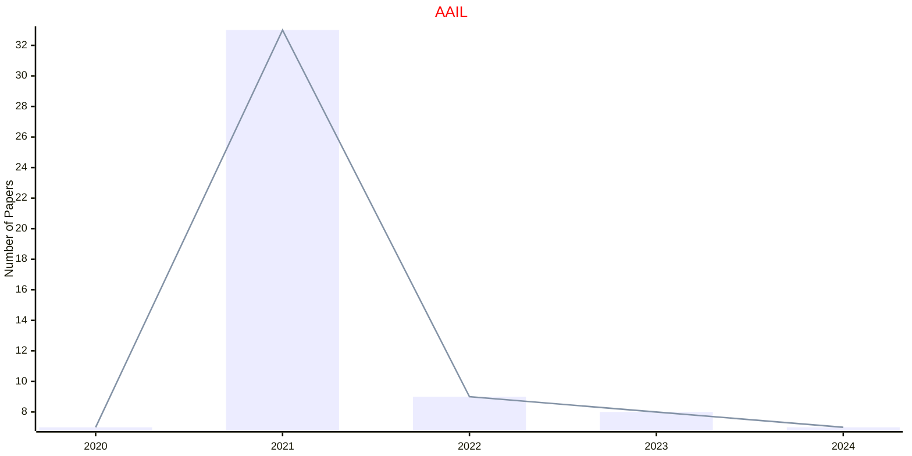

## ACISC

|Publishers|Full/Homepage|Abbr/About|Acronym/Issues|Period/DBLP|Top/Early|CCF|CAS|JCR|IF|Keywords/Google|
|-         |-            |-         |-             |-          |-        |-  |-  |-  |- |-              |
|[WILEY](https://www.wiley.com/)|[Applied Computational Intelligence and Soft Computing](https://onlinelibrary.wiley.com/journal/4795)|[Appl. Comput. Intell. Soft Comput.](https://onlinelibrary.wiley.com/page/journal/4795/homepage/overview)|[ACISC](https://onlinelibrary.wiley.com/loi/4795)|2009 -|False||4||3.0|[Artificial Intelligence](https://www.google.com/search?q=Artificial+Intelligence)|

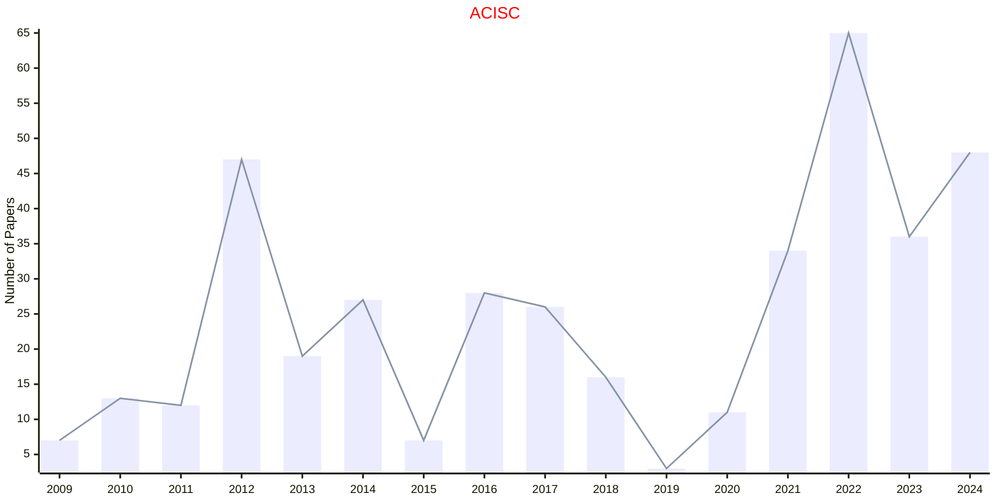

## ADVS

|Publishers|Full/Homepage|Abbr/About|Acronym/Issues|Period/DBLP|Top/Early|CCF|CAS|JCR|IF|Keywords/Google|
|-         |-            |-         |-             |-          |-        |-  |-  |-  |- |-              |
|[WILEY](https://www.wiley.com/)|[Advanced Science](https://advanced.onlinelibrary.wiley.com/journal/21983844)|[Adv. Sci.](https://advanced.onlinelibrary.wiley.com/hub/journal/21983844/productinformation.html)|[ADVS](https://advanced.onlinelibrary.wiley.com/loi/21983844)|2014 -|True||1|Q1|15.6|[Multidisciplinary](https://www.google.com/search?q=Multidisciplinary)|

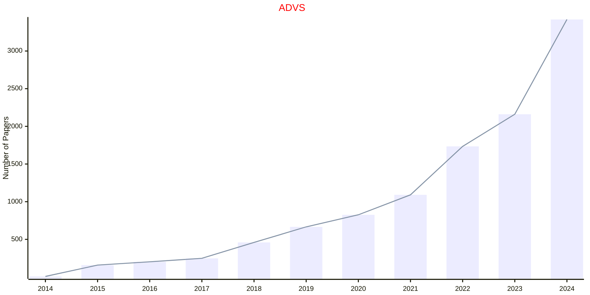

## AIM

|Publishers|Full/Homepage|Abbr/About|Acronym/Issues|Period/DBLP|Top/Early|CCF|CAS|JCR|IF|Keywords/Google|
|-         |-            |-         |-             |-          |-        |-  |-  |-  |- |-              |
|[WILEY](https://www.wiley.com/)|[AI Magazine](https://onlinelibrary.wiley.com/journal/23719621)|[AI Mag.](https://onlinelibrary.wiley.com/page/journal/23719621/homepage/productinformation.html)|[AIM](https://onlinelibrary.wiley.com/loi/23719621)|1980 -|False||4|Q2|3.8|[Artificial Intelligence](https://www.google.com/search?q=Artificial+Intelligence)|

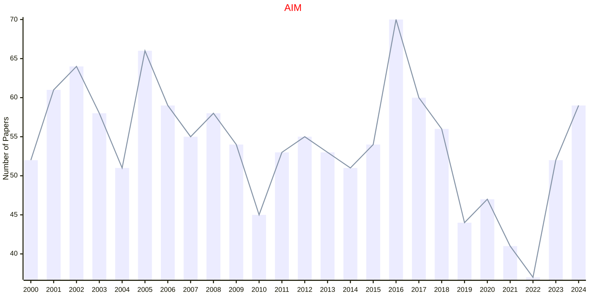

## AISY

|Publishers|Full/Homepage|Abbr/About|Acronym/Issues|Period/DBLP|Top/Early|CCF|CAS|JCR|IF|Keywords/Google|
|-         |-            |-         |-             |-          |-        |-  |-  |-  |- |-              |
|[WILEY](https://www.wiley.com/)|[Advanced Intelligent Systems](https://advanced.onlinelibrary.wiley.com/journal/26404567)|[Adv. Intell. Syst.](https://advanced.onlinelibrary.wiley.com/hub/journal/26404567/productinformation.html)|[AISY](https://advanced.onlinelibrary.wiley.com/loi/26404567)|2019 -|False||3|Q1|7.7|[Intelligent Systems](https://www.google.com/search?q=Intelligent+Systems)|

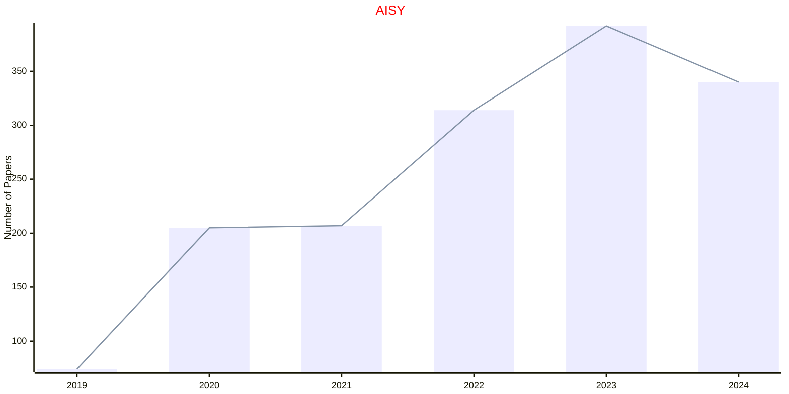

## ANGEW

|Publishers|Full/Homepage|Abbr/About|Acronym/Issues|Period/DBLP|Top/Early|CCF|CAS|JCR|IF|Keywords/Google|
|-         |-            |-         |-             |-          |-        |-  |-  |-  |- |-              |
|[WILEY](https://www.wiley.com/)|[Angewandte Chemie International Edition](https://onlinelibrary.wiley.com/journal/15213773)|[Angew. Chem. Int. Edit.](https://onlinelibrary.wiley.com/page/journal/15213773/homepage/productinformation.html)|[ANGEW](https://onlinelibrary.wiley.com/loi/15213773)|1962 -|True||1|Q1|16.4|[Chemistry](https://www.google.com/search?q=Chemistry)|

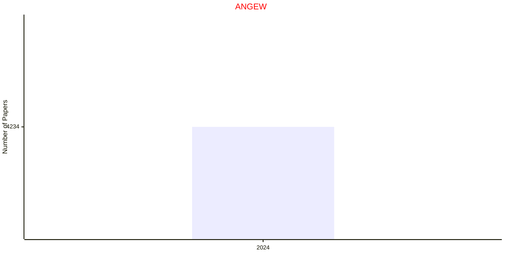

## BIMJ

|Publishers|Full/Homepage|Abbr/About|Acronym/Issues|Period/DBLP|Top/Early|CCF|CAS|JCR|IF|Keywords/Google|
|-         |-            |-         |-             |-          |-        |-  |-  |-  |- |-              |
|[WILEY](https://www.wiley.com/)|[Biometrical Journal](https://onlinelibrary.wiley.com/journal/15214036)|[Bio. J.](https://onlinelibrary.wiley.com/page/journal/15214036/homepage/productinformation.html)|[BIMJ](https://onlinelibrary.wiley.com/loi/15214036)|1959 -|False||3|Q1|2.0|[Life Sciences](https://www.google.com/search?q=Life+Sciences); [Statistical Methods](https://www.google.com/search?q=Statistical+Methods)|

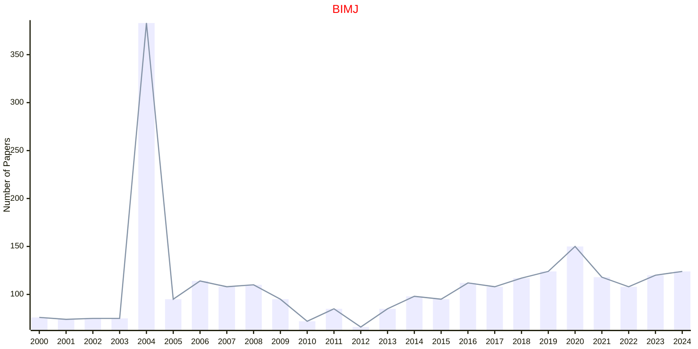

## CAAITIT

|Publishers|Full/Homepage|Abbr/About|Acronym/Issues|Period/DBLP|Top/Early|CCF|CAS|JCR|IF|Keywords/Google|
|-         |-            |-         |-             |-          |-        |-  |-  |-  |- |-              |
|[WILEY](https://www.wiley.com/)|[CAAI Transactions on Intelligence Technology](https://onlinelibrary.wiley.com/journal/24682322)|[CAAI Trans. Intell. Technol.](https://ietresearch.onlinelibrary.wiley.com/hub/journal/24682322/homepage/productinformation.html)|[CAAITIT](https://ietresearch.onlinelibrary.wiley.com/loi/24682322)|2017 -|True||1|Q1|6.4|[Artificial Intelligence](https://www.google.com/search?q=Artificial+Intelligence)|

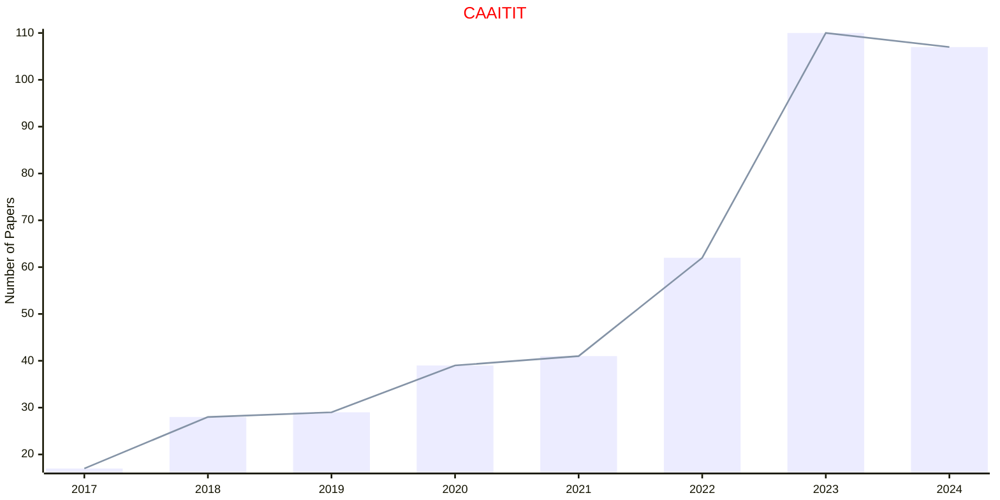

## COIN

|Publishers|Full/Homepage|Abbr/About|Acronym/Issues|Period/DBLP|Top/Early|CCF|CAS|JCR|IF|Keywords/Google|
|-         |-            |-         |-             |-          |-        |-  |-  |-  |- |-              |
|[WILEY](https://www.wiley.com/)|[Computational Intelligence](https://onlinelibrary.wiley.com/journal/14678640)|[Comput. Intell.](https://onlinelibrary.wiley.com/page/journal/14678640/homepage/productinformation.html)|[COIN](https://onlinelibrary.wiley.com/loi/14678640)|1985 -|False|C|4|Q3|2.1|[Computational Intelligence](https://www.google.com/search?q=Computational+Intelligence)|

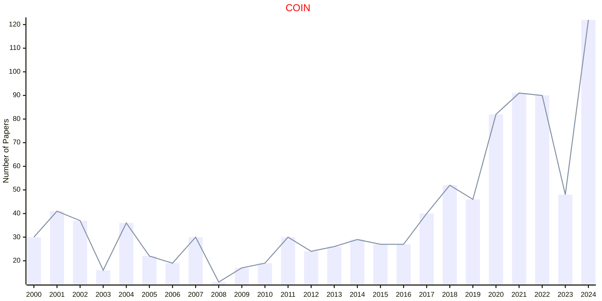

## EXSY

|Publishers|Full/Homepage|Abbr/About|Acronym/Issues|Period/DBLP|Top/Early|CCF|CAS|JCR|IF|Keywords/Google|
|-         |-            |-         |-             |-          |-        |-  |-  |-  |- |-              |
|[WILEY](https://www.wiley.com/)|[Expert Systems](https://onlinelibrary.wiley.com/journal/14680394)|[Expert Syst.](https://onlinelibrary.wiley.com/page/journal/14680394/homepage/productinformation.html)|[EXSY](https://onlinelibrary.wiley.com/loi/14680394)|1984 -|False|C|4|Q2|2.7|[Knowledge Engineering](https://www.google.com/search?q=Knowledge+Engineering)|

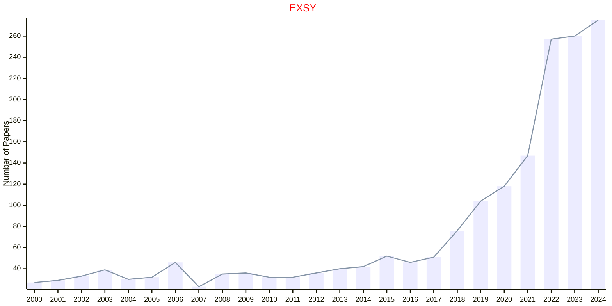

## IETCV

|Publishers|Full/Homepage|Abbr/About|Acronym/Issues|Period/DBLP|Top/Early|CCF|CAS|JCR|IF|Keywords/Google|
|-         |-            |-         |-             |-          |-        |-  |-  |-  |- |-              |
|[WILEY](https://www.wiley.com/)|[IET Computer Vision](https://ietresearch.onlinelibrary.wiley.com/journal/17519640)|[IET Comput. Vis.](https://ietresearch.onlinelibrary.wiley.com/hub/journal/17519640/homepage/productinformation.html)|[IETCV](https://ietresearch.onlinelibrary.wiley.com/loi/17519640)|2013 -|False|C|4|Q4|1.4|[Computer Vision](https://www.google.com/search?q=Computer+Vision)|

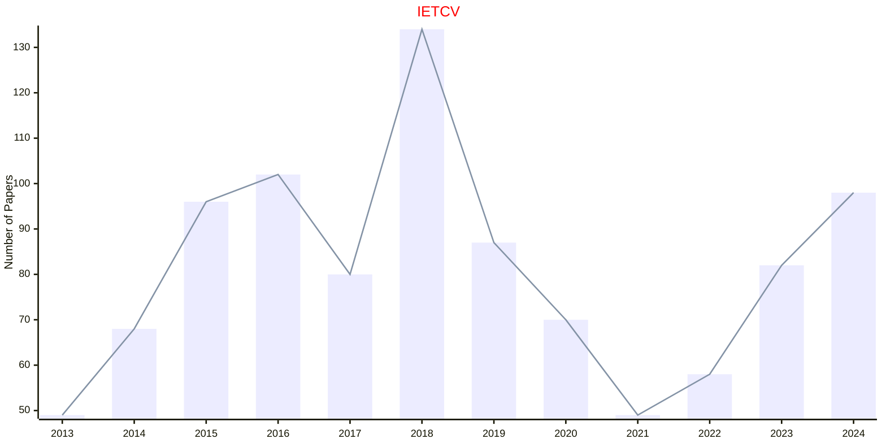

## IETIP

|Publishers|Full/Homepage|Abbr/About|Acronym/Issues|Period/DBLP|Top/Early|CCF|CAS|JCR|IF|Keywords/Google|
|-         |-            |-         |-             |-          |-        |-  |-  |-  |- |-              |
|[WILEY](https://www.wiley.com/)|[IET Image Processing](https://ietresearch.onlinelibrary.wiley.com/journal/17519667)|[IET Image Process.](https://ietresearch.onlinelibrary.wiley.com/hub/journal/17519667/homepage/productinformation.html)|[IETIP](https://ietresearch.onlinelibrary.wiley.com/loi/17519667)|2013 -|False|C|4|Q3|2.0|[Image Processing](https://www.google.com/search?q=Image+Processing)|

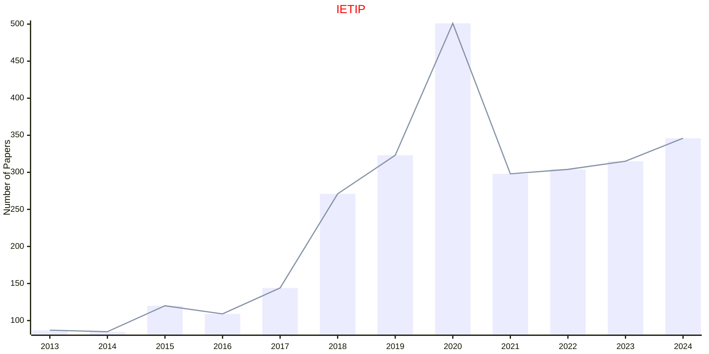

## IJIS

|Publishers|Full/Homepage|Abbr/About|Acronym/Issues|Period/DBLP|Top/Early|CCF|CAS|JCR|IF|Keywords/Google|
|-         |-            |-         |-             |-          |-        |-  |-  |-  |- |-              |
|[WILEY](https://www.wiley.com/)|[International Journal of Intelligent Systems](https://onlinelibrary.wiley.com/journal/ijis)|[Int. J. Intell. Syst.](https://onlinelibrary.wiley.com/page/journal/ijis/homepage/productinformation.html)|[IJIS](https://onlinelibrary.wiley.com/loi/ijis)|1986 -|False|C|3|Q2|4.5|[Intelligent Systems](https://www.google.com/search?q=Intelligent+Systems)|

### Remarks

IJIS: 1986-2022 in WILEY and IJIS: 2023-Today in HINDAWI

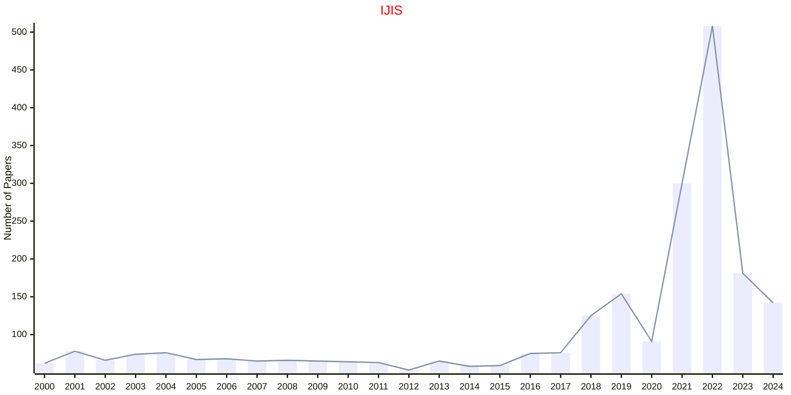

## IJNME

|Publishers|Full/Homepage|Abbr/About|Acronym/Issues|Period/DBLP|Top/Early|CCF|CAS|JCR|IF|Keywords/Google|
|-         |-            |-         |-             |-          |-        |-  |-  |-  |- |-              |
|[WILEY](https://www.wiley.com/)|[International Journal for Numerical Methods in Engineering](https://onlinelibrary.wiley.com/journal/10970207)|[Int. J. Numer. Meth. Eng.](https://onlinelibrary.wiley.com/page/journal/10970207/homepage/productinformation.html)|[IJNME](https://onlinelibrary.wiley.com/loi/10970207)|1969 -|False||3|Q1|2.9|[Computational Engineering](https://www.google.com/search?q=Computational+Engineering)|

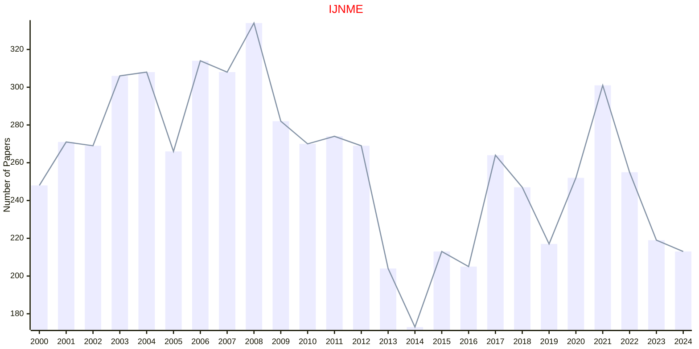

## INSR

|Publishers|Full/Homepage|Abbr/About|Acronym/Issues|Period/DBLP|Top/Early|CCF|CAS|JCR|IF|Keywords/Google|
|-         |-            |-         |-             |-          |-        |-  |-  |-  |- |-              |
|[WILEY](https://www.wiley.com/)|[International Statistical Review](https://onlinelibrary.wiley.com/journal/17515823)|[Int. Stat. Rev.](https://onlinelibrary.wiley.com/page/journal/17515823/homepage/productinformation.html)|[INSR](https://onlinelibrary.wiley.com/loi/17515823)|1997 -|False||4|Q1|2.4|[Statistics](https://www.google.com/search?q=Statistics)|

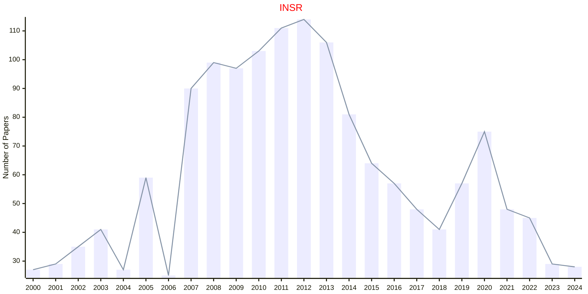

## JCC

|Publishers|Full/Homepage|Abbr/About|Acronym/Issues|Period/DBLP|Top/Early|CCF|CAS|JCR|IF|Keywords/Google|
|-         |-            |-         |-             |-          |-        |-  |-  |-  |- |-              |
|[WILEY](https://www.wiley.com/)|[Journal of Computational Chemistry](https://onlinelibrary.wiley.com/journal/1096987x)|[J. Comput. Chem.](https://onlinelibrary.wiley.com/page/journal/1096987x/homepage/productinformation.html)|[JCC](https://onlinelibrary.wiley.com/loi/1096987x)|1980 -|False||3|Q2|4.2|[Computational Chemistry](https://www.google.com/search?q=Computational+Chemistry)|

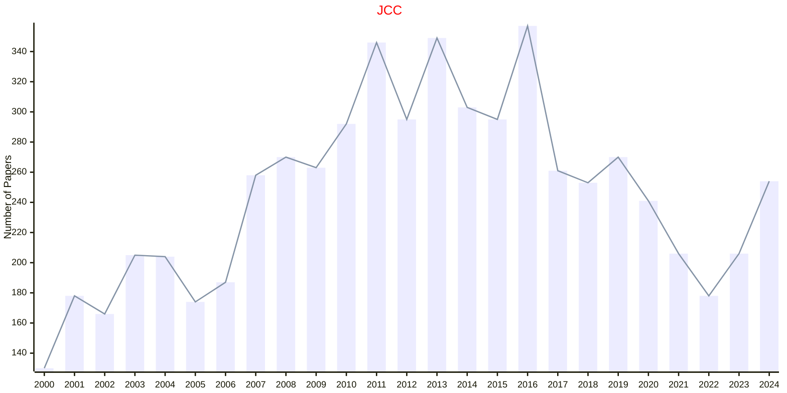

## JOM

|Publishers|Full/Homepage|Abbr/About|Acronym/Issues|Period/DBLP|Top/Early|CCF|CAS|JCR|IF|Keywords/Google|
|-         |-            |-         |-             |-          |-        |-  |-  |-  |- |-              |
|[WILEY](https://www.wiley.com/)|[Journal of Operations Management](https://onlinelibrary.wiley.com/journal/18731317)|[J. Oper. Manag.](https://onlinelibrary.wiley.com/page/journal/18731317/homepage/overview)|[JOM](https://onlinelibrary.wiley.com/loi/18731317)|1980 -|False||2|Q1|11.4|[Management](https://www.google.com/search?q=Management); [Operations](https://www.google.com/search?q=Operations)|

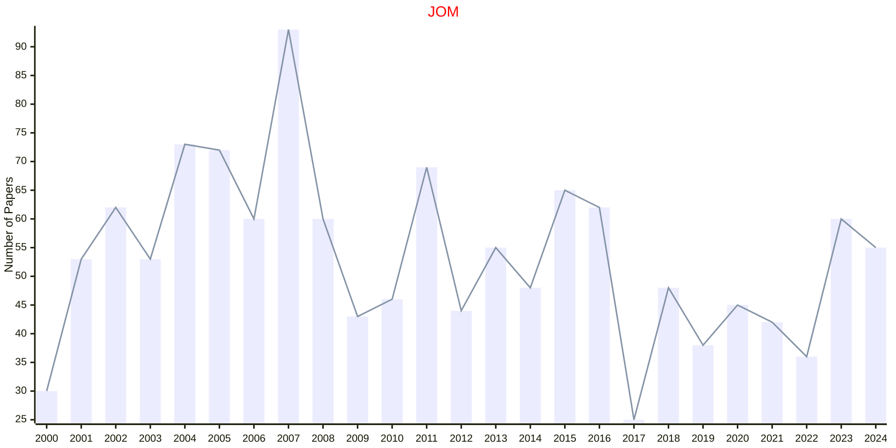

## JTSA

|Publishers|Full/Homepage|Abbr/About|Acronym/Issues|Period/DBLP|Top/Early|CCF|CAS|JCR|IF|Keywords/Google|
|-         |-            |-         |-             |-          |-        |-  |-  |-  |- |-              |
|[WILEY](https://www.wiley.com/)|[Journal of Time Series Analysis](https://onlinelibrary.wiley.com/journal/14679892)|[J. Time Series Anal.](https://onlinelibrary.wiley.com/page/journal/14679892/homepage/productinformation.html)|[JTSA](https://onlinelibrary.wiley.com/loi/14679892)|1980 -|False||4|Q3|1.1|[Time Series](https://www.google.com/search?q=Time+Series)|

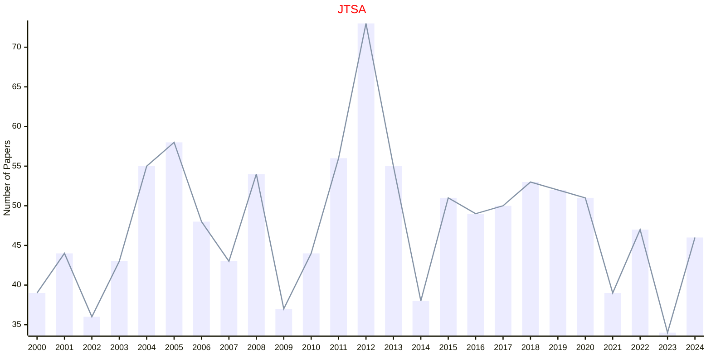

## MMAS

|Publishers|Full/Homepage|Abbr/About|Acronym/Issues|Period/DBLP|Top/Early|CCF|CAS|JCR|IF|Keywords/Google|
|-         |-            |-         |-             |-          |-        |-  |-  |-  |- |-              |
|[WILEY](https://www.wiley.com/)|[Mathematical Methods in the Applied Sciences](https://onlinelibrary.wiley.com/journal/10991476)|[Math. Meth. Appl. Sci.](https://onlinelibrary.wiley.com/page/journal/10991476/homepage/productinformation.html)|[MMAS](https://onlinelibrary.wiley.com/loi/10991476)|1979 -|False||4|Q1|1.9|[Applied Mathematics](https://www.google.com/search?q=Applied+Mathematics)|

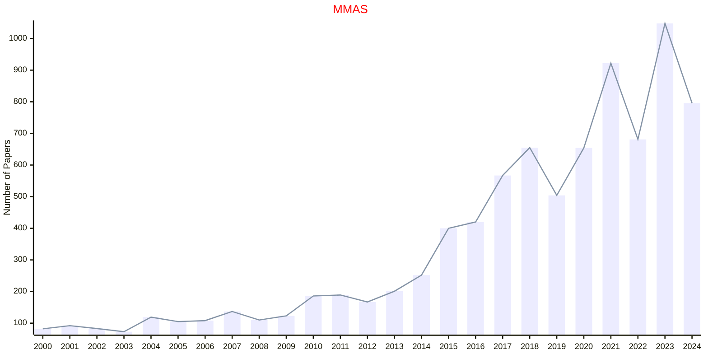

## SADM

|Publishers|Full/Homepage|Abbr/About|Acronym/Issues|Period/DBLP|Top/Early|CCF|CAS|JCR|IF|Keywords/Google|
|-         |-            |-         |-             |-          |-        |-  |-  |-  |- |-              |
|[WILEY](https://www.wiley.com/)|[Statistical Analysis and Data Mining](https://onlinelibrary.wiley.com/journal/19321872)|[Stat. Anal. Data Mining](https://onlinelibrary.wiley.com/page/journal/19321872/homepage/productinformation.html)|[SADM](https://onlinelibrary.wiley.com/loi/19321872)|2008 -|False||4|||[Data Mining](https://www.google.com/search?q=Data+Mining); [Statistical Analysis](https://www.google.com/search?q=Statistical+Analysis)|

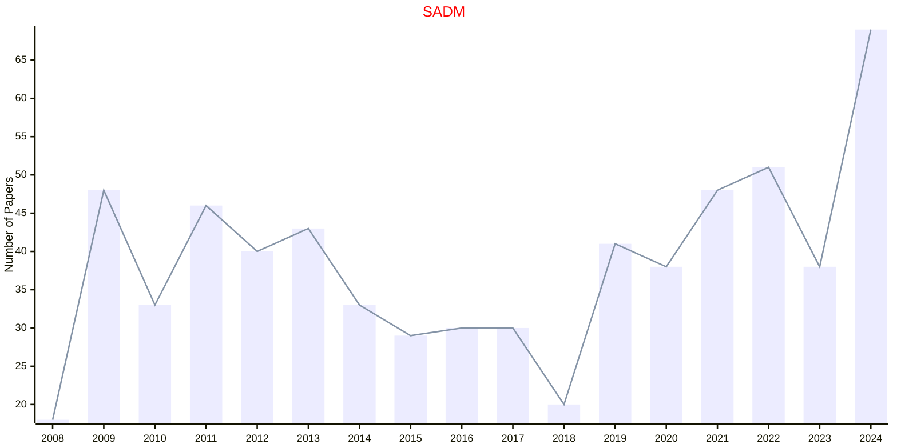

## SIM

|Publishers|Full/Homepage|Abbr/About|Acronym/Issues|Period/DBLP|Top/Early|CCF|CAS|JCR|IF|Keywords/Google|
|-         |-            |-         |-             |-          |-        |-  |-  |-  |- |-              |
|[WILEY](https://www.wiley.com/)|[Statistics in Medicine](https://onlinelibrary.wiley.com/journal/10970258)|[Stat. Med.](https://onlinelibrary.wiley.com/page/journal/10970258/homepage/productinformation.html)|[SIM](https://onlinelibrary.wiley.com/loi/10970258)|1982 -|False||3|Q1|2.6|[Medicine](https://www.google.com/search?q=Medicine); [Statistics](https://www.google.com/search?q=Statistics)|

```mermaid
---
config:
    xyChart:
        width: 1200
        height: 600
    themeVariables:
        xyChart:
            titleColor: "#ff0000"
---
xychart-beta
    title "SIM"
    x-axis [2000, 2001, 2002, 2003, 2004, 2005, 2006, 2007, 2008, 2009, 2010, 2011, 2012, 2013, 2014, 2015, 2016, 2017, 2018, 2019, 2020, 2021, 2022, 2023, 2024]
    y-axis "Number of Papers"
    bar [311, 340, 303, 296, 307, 324, 326, 396, 470, 283, 310, 319, 359, 404, 387, 289, 390, 343, 323, 389, 308, 426, 350, 310, 349]
    line [311, 340, 303, 296, 307, 324, 326, 396, 470, 283, 310, 319, 359, 404, 387, 289, 390, 343, 323, 389, 308, 426, 350, 310, 349]
```

## SJOS

|Publishers|Full/Homepage|Abbr/About|Acronym/Issues|Period/DBLP|Top/Early|CCF|CAS|JCR|IF|Keywords/Google|
|-         |-            |-         |-             |-          |-        |-  |-  |-  |- |-              |
|[WILEY](https://www.wiley.com/)|[Scandinavian Journal Of Statistics](https://onlinelibrary.wiley.com/journal/14679469)|[Scand. J. Stat.](https://onlinelibrary.wiley.com/page/journal/14679469/homepage/productinformation.html)|[SJOS](https://onlinelibrary.wiley.com/loi/14679469)|1997 -|False||4|Q3|1.2|[Statistics](https://www.google.com/search?q=Statistics)|

```mermaid
---
config:
    xyChart:
        width: 1200
        height: 600
    themeVariables:
        xyChart:
            titleColor: "#ff0000"
---
xychart-beta
    title "SJOS"
    x-axis [2000, 2001, 2002, 2003, 2004, 2005, 2006, 2007, 2008, 2009, 2010, 2011, 2012, 2013, 2014, 2015, 2016, 2017, 2018, 2019, 2020, 2021, 2022, 2023, 2024]
    y-axis "Number of Papers"
    bar [48, 45, 48, 52, 45, 43, 52, 48, 45, 46, 43, 48, 51, 48, 72, 69, 78, 47, 46, 56, 52, 55, 66, 79, 68]
    line [48, 45, 48, 52, 45, 43, 52, 48, 45, 46, 43, 48, 51, 48, 72, 69, 78, 47, 46, 56, 52, 55, 66, 79, 68]
```

## WIDM

|Publishers|Full/Homepage|Abbr/About|Acronym/Issues|Period/DBLP|Top/Early|CCF|CAS|JCR|IF|Keywords/Google|
|-         |-            |-         |-             |-          |-        |-  |-  |-  |- |-              |
|[WILEY](https://www.wiley.com/)|[WIREs Data Mining and Knowledge Discovery](https://onlinelibrary.wiley.com/journal/19424795)|[WIREs Data Mining Knowl. Discov.](https://wires.onlinelibrary.wiley.com/hub/journal/19424795/about/productinformation)|[WIDM](https://wires.onlinelibrary.wiley.com/loi/19424795)|2011 -|False|||||[Data Mining](https://www.google.com/search?q=Data+Mining); [Knowledge Discovery](https://www.google.com/search?q=Knowledge+Discovery)|

```mermaid
---
config:
    xyChart:
        width: 1200
        height: 600
    themeVariables:
        xyChart:
            titleColor: "#ff0000"
---
xychart-beta
    title "WIDM"
    x-axis [2011, 2012, 2013, 2014, 2015, 2016, 2017, 2018, 2019, 2020, 2021, 2022, 2023, 2024]
    y-axis "Number of Papers"
    bar [46, 37, 28, 26, 19, 14, 24, 40, 45, 50, 38, 44, 30, 47]
    line [46, 37, 28, 26, 19, 14, 24, 40, 45, 50, 38, 44, 30, 47]
```

