# WS

- The data for TOP, CCF, CAS, JCR, and IF are sourced from [easyScholar](https://www.easyscholar.cc/).

## IET

|Publishers|Full/Homepage|Abbr/About|Acronym/Issues|Period/DBLP|Top/Early|CCF|CAS|JCR|IF|Keywords/Google|
|-         |-            |-         |-             |-          |-        |-  |-  |-  |- |-              |
|[WS](https://worldscientific.com/)|[Innovation and Emerging Technologies](https://worldscientific.com/worldscinet/iet)|[Innov. Emerg. Technol.](https://worldscientific.com/page/iet/aims-scope)|[IET](https://worldscientific.com/loi/iet)|2013 -|False||4||1.1|[Multidisciplinary](https://www.google.com/search?q=Multidisciplinary)|

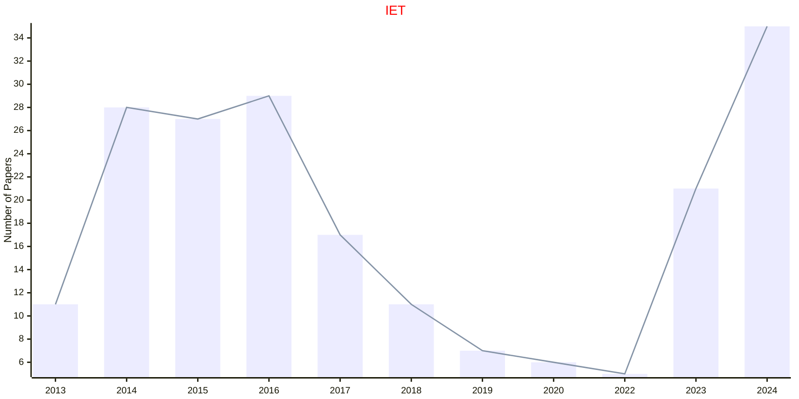

## IJAIRR

|Publishers|Full/Homepage|Abbr/About|Acronym/Issues|Period/DBLP|Top/Early|CCF|CAS|JCR|IF|Keywords/Google|
|-         |-            |-         |-             |-          |-        |-  |-  |-  |- |-              |
|[WS](https://worldscientific.com/)|[International Journal of Artificial Intelligence and Robotics Research](https://worldscientific.com/worldscinet/ijairr)|[Int. J. Artif. Intell. Robot. Res.](https://worldscientific.com/page/ijairr/aims-scope)|[IJAIRR](https://worldscientific.com/loi/ijairr)|2024 -|False|||||[Artificial Intelligence](https://www.google.com/search?q=Artificial+Intelligence); [Robotics and UAV](https://www.google.com/search?q=Robotics+and+UAV)|

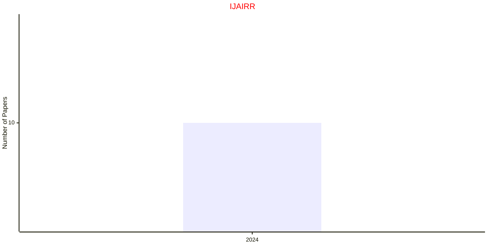

## IJAIT

|Publishers|Full/Homepage|Abbr/About|Acronym/Issues|Period/DBLP|Top/Early|CCF|CAS|JCR|IF|Keywords/Google|
|-         |-            |-         |-             |-          |-        |-  |-  |-  |- |-              |
|[WS](https://worldscientific.com/)|[International Journal on Artificial Intelligence Tools](https://worldscientific.com/worldscinet/ijait)|[Int. J. Aritf. Intell. Tools](https://worldscientific.com/page/ijait/aims-scope)|[IJAIT](https://worldscientific.com/loi/ijait)|1992 -|False||4|Q4|0.9|[Artificial Intelligence](https://www.google.com/search?q=Artificial+Intelligence)|

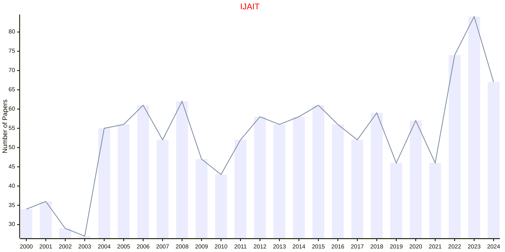

## IJCIA

|Publishers|Full/Homepage|Abbr/About|Acronym/Issues|Period/DBLP|Top/Early|CCF|CAS|JCR|IF|Keywords/Google|
|-         |-            |-         |-             |-          |-        |-  |-  |-  |- |-              |
|[WS](https://worldscientific.com/)|[International Journal of Computational Intelligence and Applications](https://worldscientific.com/worldscinet/ijcia)|[Int. J. Comput. Intell. Appl.](https://worldscientific.com/page/ijcia/aims-scope)|[IJCIA](https://worldscientific.com/loi/ijcia)|2001 -|False|C|4||1.5|[Computational Intelligence](https://www.google.com/search?q=Computational+Intelligence); [Evolutionary Computation](https://www.google.com/search?q=Evolutionary+Computation)|

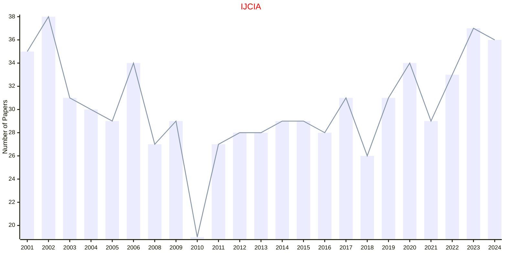

## IJDSMS

|Publishers|Full/Homepage|Abbr/About|Acronym/Issues|Period/DBLP|Top/Early|CCF|CAS|JCR|IF|Keywords/Google|
|-         |-            |-         |-             |-          |-        |-  |-  |-  |- |-              |
|[WS](https://worldscientific.com/)|[International Journal of Data Science in the Mathematical Sciences](https://worldscientific.com/worldscinet/ijdsms)|[Int. J. Data Sci. Math. Sci.](https://worldscientific.com/page/ijdsms/aims-scope)|[IJDSMS](https://worldscientific.com/loi/ijdsms)|2023 -|False|||||[Data Science](https://www.google.com/search?q=Data+Science); [Mathematics](https://www.google.com/search?q=Mathematics)|

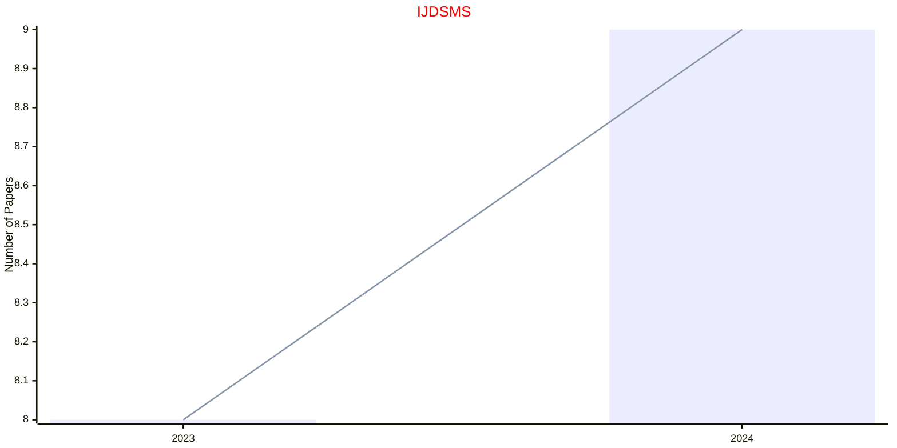

## IJFCS

|Publishers|Full/Homepage|Abbr/About|Acronym/Issues|Period/DBLP|Top/Early|CCF|CAS|JCR|IF|Keywords/Google|
|-         |-            |-         |-             |-          |-        |-  |-  |-  |- |-              |
|[WS](https://worldscientific.com/)|[International Journal of Foundations of Computer Science](https://worldscientific.com/worldscinet/ijfcs)|[Int. J. Found. Comput. Sci](https://worldscientific.com/page/ijfcs/aims-scope)|[IJFCS](https://worldscientific.com/loi/ijfcs)|1990 -|False||4|Q4|0.6|[Computer Science](https://www.google.com/search?q=Computer+Science)|

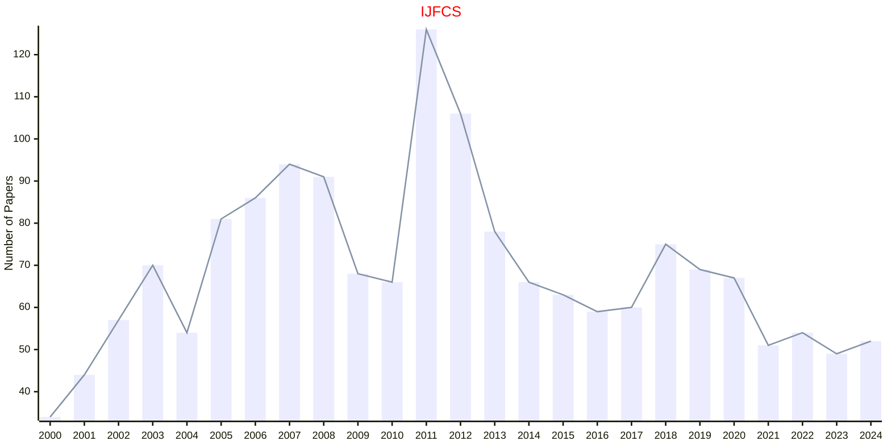

## IJITDM

|Publishers|Full/Homepage|Abbr/About|Acronym/Issues|Period/DBLP|Top/Early|CCF|CAS|JCR|IF|Keywords/Google|
|-         |-            |-         |-             |-          |-        |-  |-  |-  |- |-              |
|[WS](https://worldscientific.com/)|[International Journal of Information Technology & Decision Making](https://worldscientific.com/worldscinet/ijitdm)|[Int. J. Inf. Tech. Decis.](https://worldscientific.com/page/ijitdm/aims-scope)|[IJITDM](https://worldscientific.com/loi/ijitdm)|2002 -|False||4|Q3|1.9|[Information Technology](https://www.google.com/search?q=Information+Technology)|

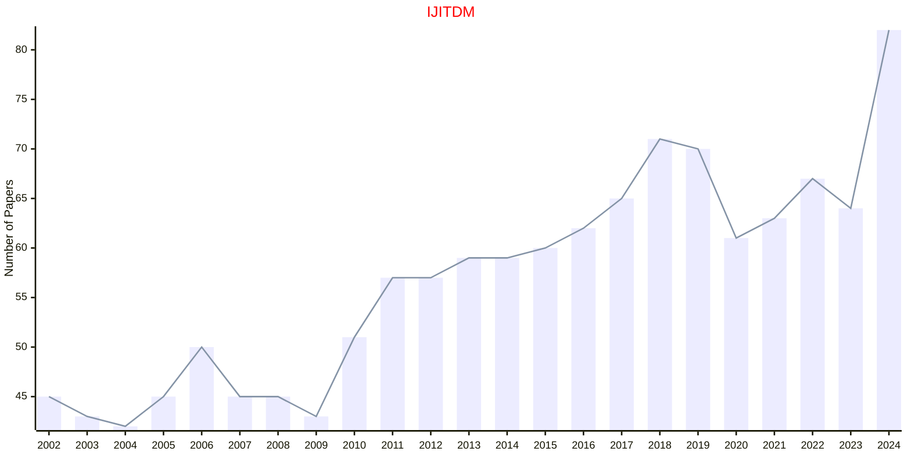

## IJNS

|Publishers|Full/Homepage|Abbr/About|Acronym/Issues|Period/DBLP|Top/Early|CCF|CAS|JCR|IF|Keywords/Google|
|-         |-            |-         |-             |-          |-        |-  |-  |-  |- |-              |
|[WS](https://worldscientific.com/)|[International Journal of Neural Systems](https://worldscientific.com/worldscinet/ijns)|[Int. J. Neural Syst.](https://worldscientific.com/page/ijns/aims-scope)|[IJNS](https://worldscientific.com/loi/ijns)|1989 -|True|C|1|Q1|5.4|[Neural Networks](https://www.google.com/search?q=Neural+Networks)|

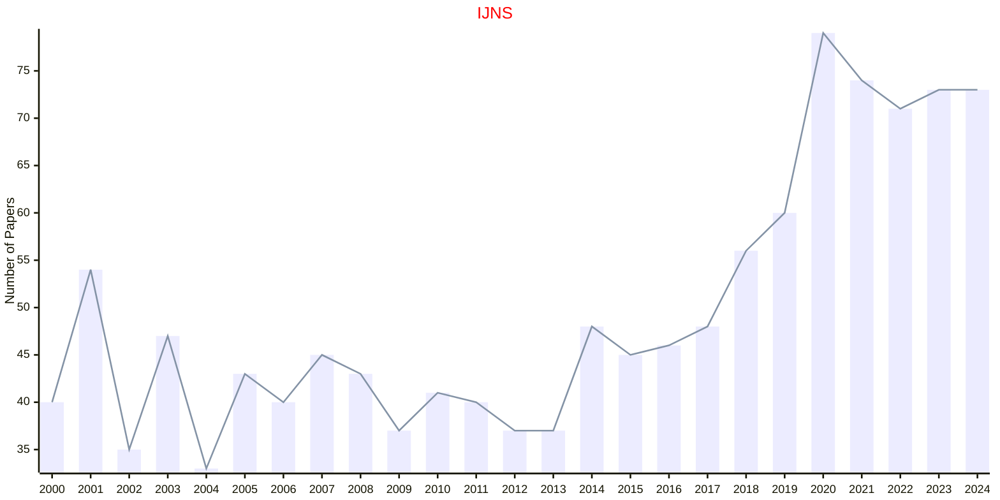

## IJPRAI

|Publishers|Full/Homepage|Abbr/About|Acronym/Issues|Period/DBLP|Top/Early|CCF|CAS|JCR|IF|Keywords/Google|
|-         |-            |-         |-             |-          |-        |-  |-  |-  |- |-              |
|[WS](https://worldscientific.com/)|[International Journal of Pattern Recognition and Artificial Intelligence](https://worldscientific.com/worldscinet/ijprai)|[Int. J. Pattern Recognit. Artif. Intell.](https://worldscientific.com/page/ijprai/aims-scope)|[IJPRAI](https://worldscientific.com/loi/ijprai)|1987 -|False|C|4|Q4|0.9|[Pattern Recognition](https://www.google.com/search?q=Pattern+Recognition)|

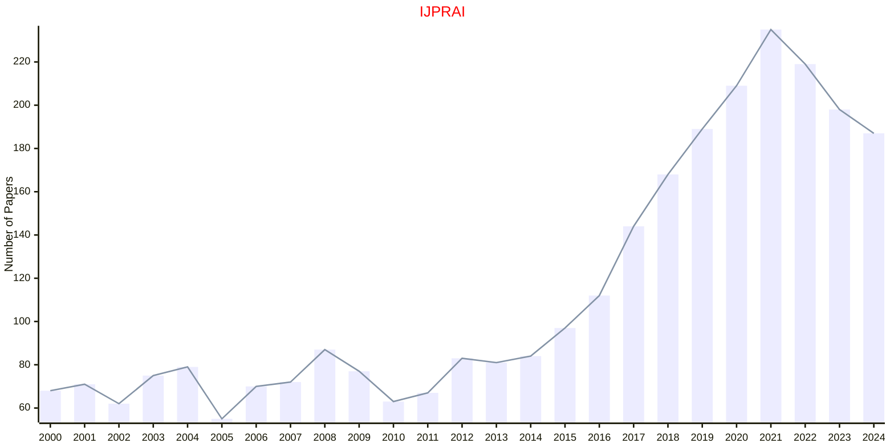

## IJSEKE

|Publishers|Full/Homepage|Abbr/About|Acronym/Issues|Period/DBLP|Top/Early|CCF|CAS|JCR|IF|Keywords/Google|
|-         |-            |-         |-             |-          |-        |-  |-  |-  |- |-              |
|[WS](https://worldscientific.com/)|[International Journal of Software Engineering and Knowledge Engineering](https://worldscientific.com/worldscinet/ijseke)|[Int. J. Soft. Eng. Knowl. Eng.](https://worldscientific.com/page/ijseke/aims-scope)|[IJSEKE](https://worldscientific.com/loi/ijseke)|1991 -|False|C|4|Q4|0.7|[Software Engineering](https://www.google.com/search?q=Software+Engineering)|

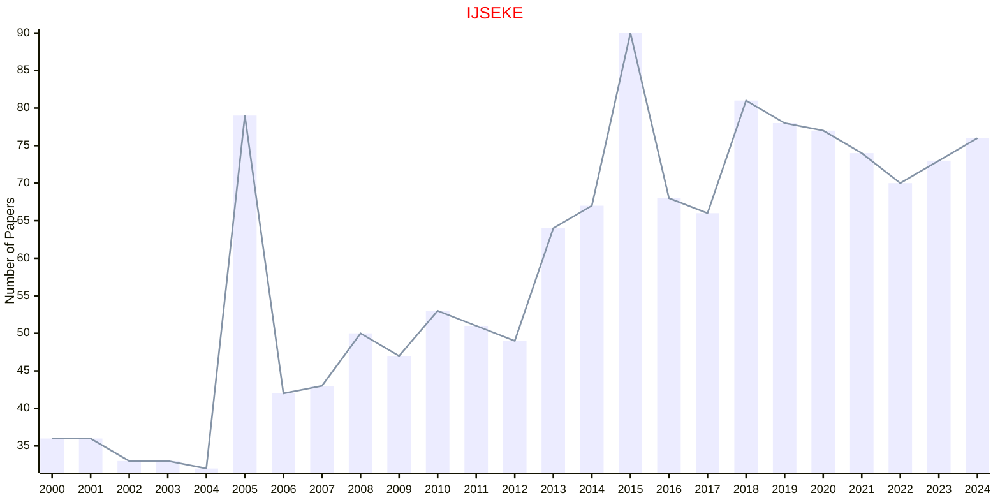

## IJUFKS

|Publishers|Full/Homepage|Abbr/About|Acronym/Issues|Period/DBLP|Top/Early|CCF|CAS|JCR|IF|Keywords/Google|
|-         |-            |-         |-             |-          |-        |-  |-  |-  |- |-              |
|[WS](https://worldscientific.com/)|[International Journal of Uncertainty, Fuzziness and Knowledge-Based Systems](https://worldscientific.com/worldscinet/ijufks)|[Int. J. Uncertain. Fuzziness Knowl.-Based. Syst.](https://worldscientific.com/page/ijufks/aims-scope)|[IJUFKS](https://worldscientific.com/loi/ijufks)|1993 -|False||4|Q4|1.0|[Fuzzy Systems](https://www.google.com/search?q=Fuzzy+Systems); [Knowledge-Based Systems](https://www.google.com/search?q=Knowledge-Based+Systems)|

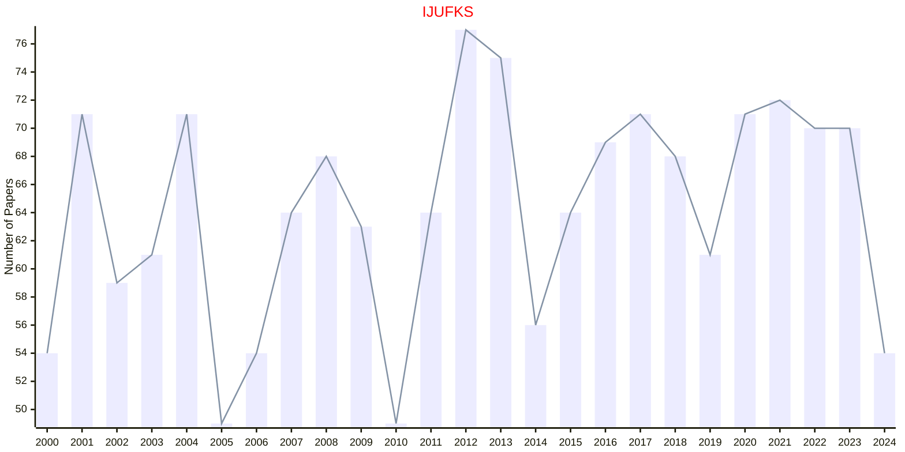

## WSARAI

|Publishers|Full/Homepage|Abbr/About|Acronym/Issues|Period/DBLP|Top/Early|CCF|CAS|JCR|IF|Keywords/Google|
|-         |-            |-         |-             |-          |-        |-  |-  |-  |- |-              |
|[WS](https://worldscientific.com/)|[World Scientific Annual Review of Artificial Intelligence](https://worldscientific.com/worldscinet/wsarai)|[World Sci. Ann. Rev. Artif. Intell.](https://worldscientific.com/page/wsarai/aims-scope)|[WSARAI](https://worldscientific.com/loi/wsarai)|2023 -|False|||||[Artificial Intelligence](https://www.google.com/search?q=Artificial+Intelligence)|

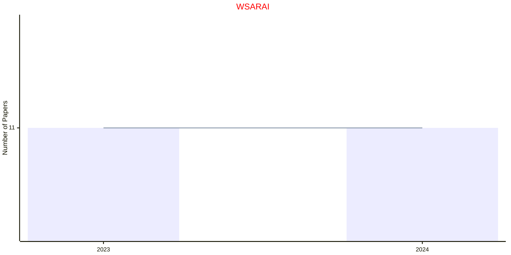

