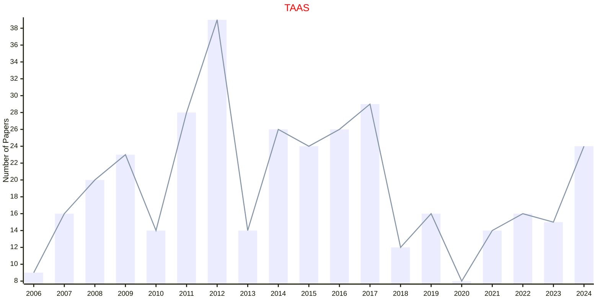

# Adaptive Systems

## TAAS

|Publishers|Full/Homepage|Abbr/About|Acronym/Issues|Period/DBLP|Top/Early|CCF|CAS|JCR|IF|Keywords/Google|
|-         |-            |-         |-             |-          |-        |-  |-  |-  |- |-              |
|[ACM](https://www.acm.org/)|[ACM Transactions on Autonomous and Adaptive Systems](https://dl.acm.org/journal/taas)|[ACM Trans. Auton. Adapt. Syst.](https://dl.acm.org/journal/taas/about)|[TAAS](https://dl.acm.org/loi/taas)|[2006 -](https://dblp.org/db/journals/taas/index.html)|False|B|4|Q2|2.1|[Adaptive Systems](https://www.google.com/search?q=Adaptive+Systems)|

