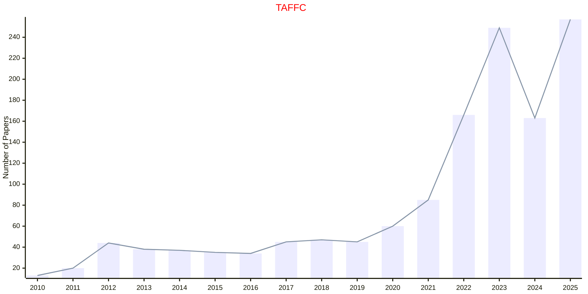

# Affective Computing

## TAFFC

|Publishers|Full/Homepage|Abbr/About|Acronym/Issues|Period/DBLP|Top/Early|CCF|CAS|JCR|IF|Keywords/Google|
|-         |-            |-         |-             |-          |-        |-  |-  |-  |- |-              |
|[IEEE](https://ieeexplore.ieee.org/)|[IEEE Transactions on Affective Computing](https://ieeexplore.ieee.org/xpl/RecentIssue.jsp?punumber=5165369)|[IEEE Trans. Affect. Comput.](https://ieeexplore.ieee.org/xpl/aboutJournal.jsp?punumber=5165369)|[TAFFC](https://xplorestaging.ieee.org/xpl/issues?punumber=5165369&isnumber=10542474)|2010 -|[True](https://xplorestaging.ieee.org/xpl/tocresult.jsp?isnumber=5520654)|B|1|Q1|10.2|[Affective Computing](https://www.google.com/search?q=Affective+Computing)|

