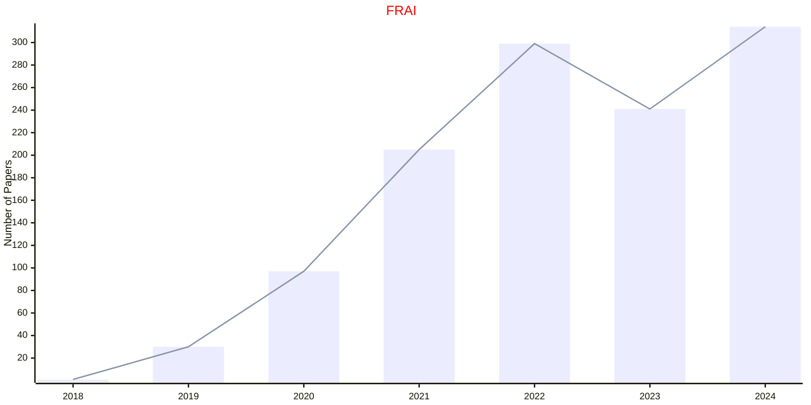
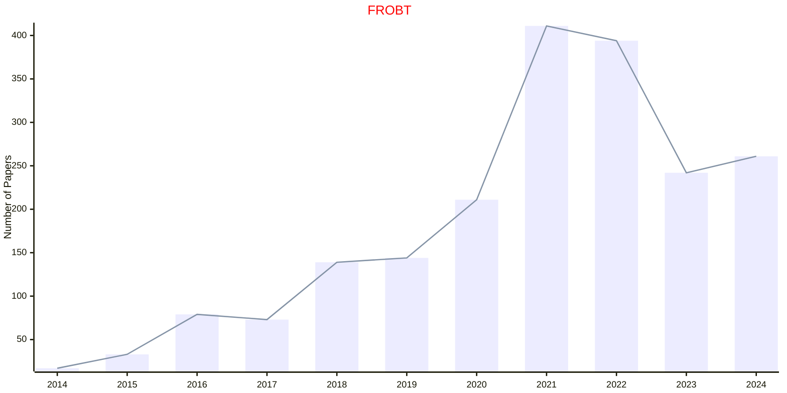
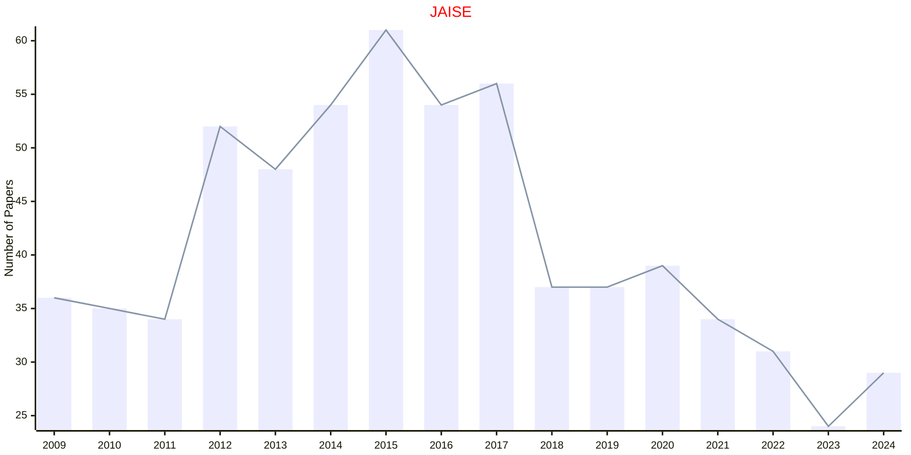
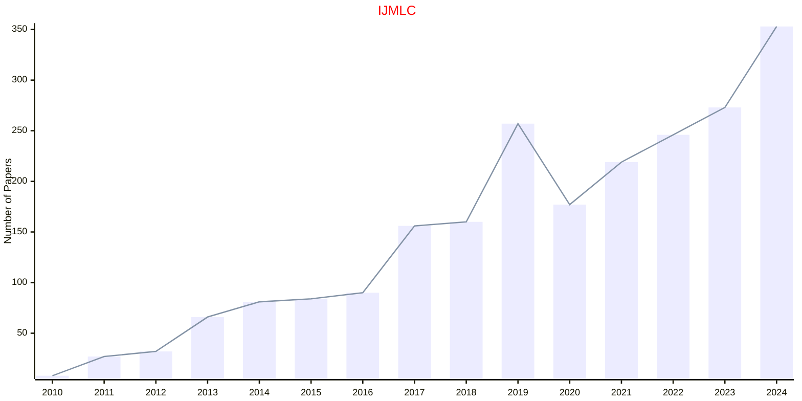

# Ambient Intelligence

## FRAI

|Publishers|Full/Homepage|Abbr/About|Acronym/Issues|Period/DBLP|Top/Early|CCF|CAS|JCR|IF|Keywords/Google|
|-         |-            |-         |-             |-          |-        |-  |-  |-  |- |-              |
|[FRONTIERS](https://www.frontiersin.org/)|[Frontiers in Artificial Intelligence](https://www.frontiersin.org/journals/artificial-intelligence)|[Front. Artif. Intell.](https://www.frontiersin.org/journals/artificial-intelligence/about)|[FRAI](https://www.frontiersin.org/journals/artificial-intelligence/volumes)|2018 -|False||4||5.1|[Ambient Intelligence](https://www.google.com/search?q=Ambient+Intelligence)|

## FROBT

|Publishers|Full/Homepage|Abbr/About|Acronym/Issues|Period/DBLP|Top/Early|CCF|CAS|JCR|IF|Keywords/Google|
|-         |-            |-         |-             |-          |-        |-  |-  |-  |- |-              |
|[FRONTIERS](https://www.frontiersin.org/)|[Frontiers in Robotics and AI](https://www.frontiersin.org/journals/robotics-and-ai)|[Front. Robot. AI](https://www.frontiersin.org/journals/robotics-and-ai/about)|[FROBT](https://www.frontiersin.org/journals/robotics-and-ai/volumes)|2014 -|False||4||4.0|[Ambient Intelligence](https://www.google.com/search?q=Ambient+Intelligence); [Robotics and UAV](https://www.google.com/search?q=Robotics+and+UAV)|

## JAISE

|Publishers|Full/Homepage|Abbr/About|Acronym/Issues|Period/DBLP|Top/Early|CCF|CAS|JCR|IF|Keywords/Google|
|-         |-            |-         |-             |-          |-        |-  |-  |-  |- |-              |
|[SAGE](https://www.sagepub.com/)|[Journal of Ambient Intelligence and Smart Environments](https://journals.sagepub.com/home/ais)|[J. Ambient Intell. Smart Env.](https://journals.sagepub.com/overview-metric/AIS?)|[JAISE](https://journals.sagepub.com/loi/ais)|2009 -|False||4|Q3|1.9|[Ambient Intelligence](https://www.google.com/search?q=Ambient+Intelligence)|

## IJMLC

|Publishers|Full/Homepage|Abbr/About|Acronym/Issues|Period/DBLP|Top/Early|CCF|CAS|JCR|IF|Keywords/Google|
|-         |-            |-         |-             |-          |-        |-  |-  |-  |- |-              |
|[SPRINGER](https://www.springer.com/)|[International Journal of Machine Learning and Cybernetics](https://www.springer.com/journal/13042)|[Int. J. Mach. Learn. Cybern.](https://www.springer.com/journal/13042/aims-and-scope)|[IJMLC](https://link.springer.com/journal/13042/volumes-and-issues)|2010 -|False||4|Q3|3.3|[Ambient Intelligence](https://www.google.com/search?q=Ambient+Intelligence); [Cybernetics](https://www.google.com/search?q=Cybernetics)|

