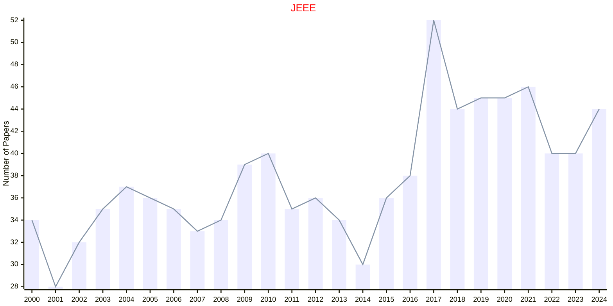

# Animal behaviour

## JEEE

|Publishers|Full/Homepage|Abbr/About|Acronym/Issues|Period/DBLP|Top/Early|CCF|CAS|JCR|IF|Keywords/Google|
|-         |-            |-         |-             |-          |-        |-  |-  |-  |- |-              |
|[TAYLOR](https://www.tandfonline.com/)|[Ethology Ecology And Evolution](https://www.tandfonline.com/journals/teee20)|[Ethol. Ecol. Evol.](https://www.tandfonline.com/journals/teee20/about-this-journal#aims-and-scope)|[JEEE](https://www.tandfonline.com/loi/teee20)|1967 -|False||4|Q3|1.3|[Animal behaviour](https://www.google.com/search?q=Animal+behaviour)|

