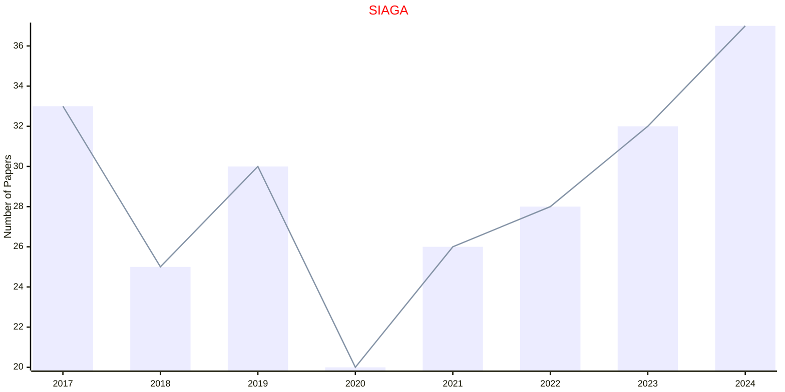

# Applied Geometry

## SIAGA

|Publishers|Full/Homepage|Abbr/About|Acronym/Issues|Period/DBLP|Top/Early|CCF|CAS|JCR|IF|Keywords/Google|
|-         |-            |-         |-             |-          |-        |-  |-  |-  |- |-              |
|[SIAM](https://epubs.siam.org)|[SIAM Journal on Applied Algebra and Geometry](https://epubs.siam.org/journal/siaga)|[SIAM J. Appl. Algebra Geom.](https://epubs.siam.org/journal/siaga/about)|[SIAGA](https://epubs.siam.org/loi/sjaabq)|2017 -|False||2|Q2|1.7|[Applied Algebra](https://www.google.com/search?q=Applied+Algebra); [Applied Geometry](https://www.google.com/search?q=Applied+Geometry)|

