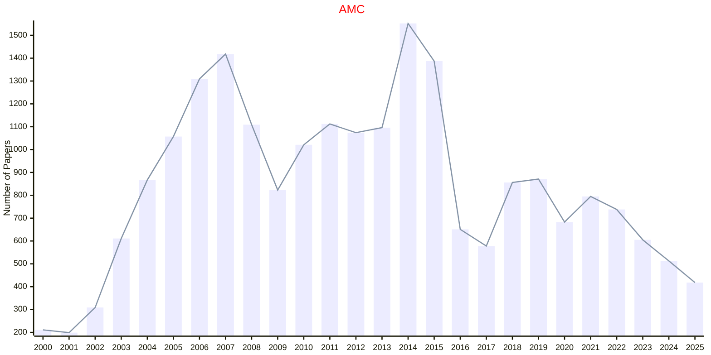
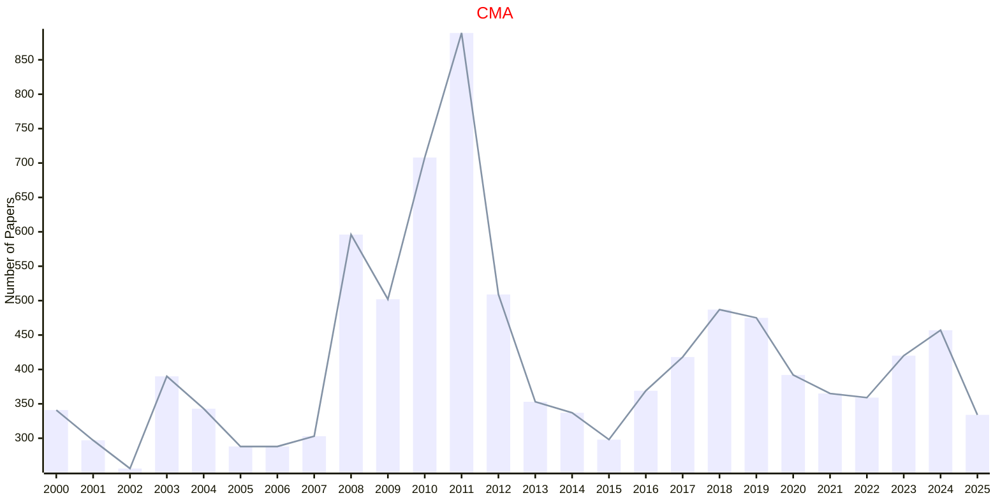
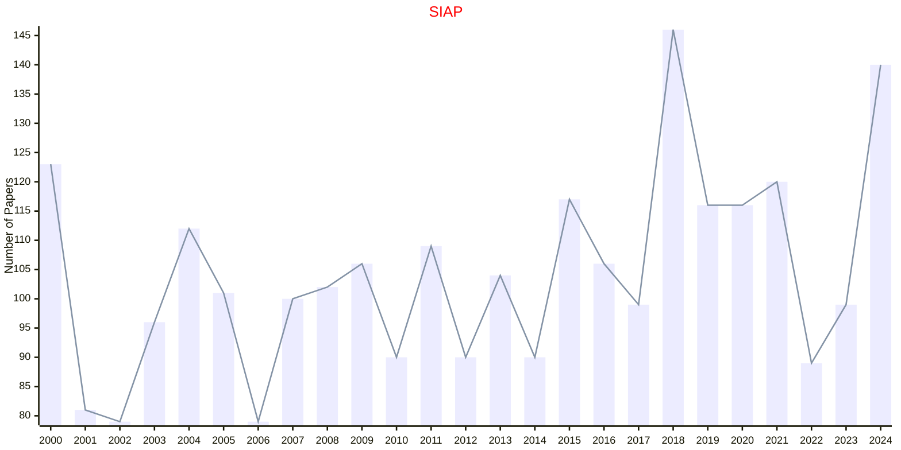
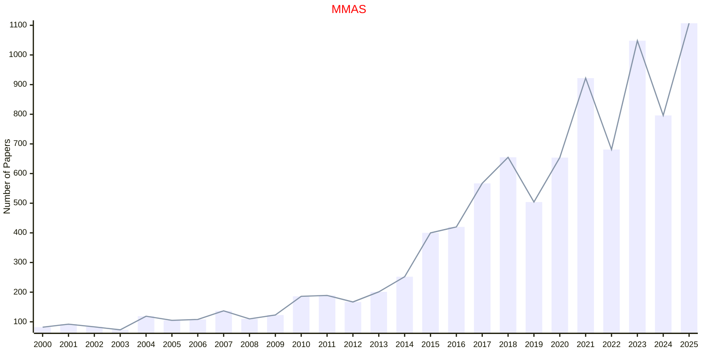

# Applied Mathematics

## AMC

|Publishers|Full/Homepage|Abbr/About|Acronym/Issues|Period/DBLP|Top/Early|CCF|CAS|JCR|IF|Keywords/Google|
|-         |-            |-         |-             |-          |-        |-  |-  |-  |- |-              |
|[ELSEVIER](https://www.sciencedirect.com/)|[Applied Mathematics and Computation](https://www.sciencedirect.com/journal/applied-mathematics-and-computation)|[Appl. Math. Comput.](https://www.sciencedirect.com/journal/applied-mathematics-and-computation/about/aims-and-scope)|[AMC](https://www.sciencedirect.com/journal/applied-mathematics-and-computation/issues)|1975 -|False||2|Q1|3.2|[Applied Mathematics](https://www.google.com/search?q=Applied+Mathematics); [Computational Mathematics](https://www.google.com/search?q=Computational+Mathematics)|

## CMA

|Publishers|Full/Homepage|Abbr/About|Acronym/Issues|Period/DBLP|Top/Early|CCF|CAS|JCR|IF|Keywords/Google|
|-         |-            |-         |-             |-          |-        |-  |-  |-  |- |-              |
|[ELSEVIER](https://www.sciencedirect.com/)|[Computers & Mathematics with Applications](https://www.sciencedirect.com/journal/computers-and-mathematics-with-applications)|[Comput. Meth. Appl.](https://www.sciencedirect.com/journal/computers-and-mathematics-with-applications/about/aims-and-scope)|[CMA](https://www.sciencedirect.com/journal/computers-and-mathematics-with-applications/issues)|1975 -|False||2|Q1|2.5|[Applied Mathematics](https://www.google.com/search?q=Applied+Mathematics)|

## SIAP

|Publishers|Full/Homepage|Abbr/About|Acronym/Issues|Period/DBLP|Top/Early|CCF|CAS|JCR|IF|Keywords/Google|
|-         |-            |-         |-             |-          |-        |-  |-  |-  |- |-              |
|[SIAM](https://epubs.siam.org)|[SIAM Journal on Applied Mathematics](https://epubs.siam.org/journal/smjmap)|[SIAM J. Appl. Math.](https://epubs.siam.org/journal/siap/about)|[SIAP](https://epubs.siam.org/loi/smjmap)|1953 -|False||4|Q1|2.1|[Applied Mathematics](https://www.google.com/search?q=Applied+Mathematics)|

## MMAS

|Publishers|Full/Homepage|Abbr/About|Acronym/Issues|Period/DBLP|Top/Early|CCF|CAS|JCR|IF|Keywords/Google|
|-         |-            |-         |-             |-          |-        |-  |-  |-  |- |-              |
|[WILEY](https://www.wiley.com/)|[Mathematical Methods in the Applied Sciences](https://onlinelibrary.wiley.com/journal/10991476)|[Math. Meth. Appl. Sci.](https://onlinelibrary.wiley.com/page/journal/10991476/homepage/productinformation.html)|[MMAS](https://onlinelibrary.wiley.com/loi/10991476)|1979 -|False||4|Q1|1.9|[Applied Mathematics](https://www.google.com/search?q=Applied+Mathematics)|

