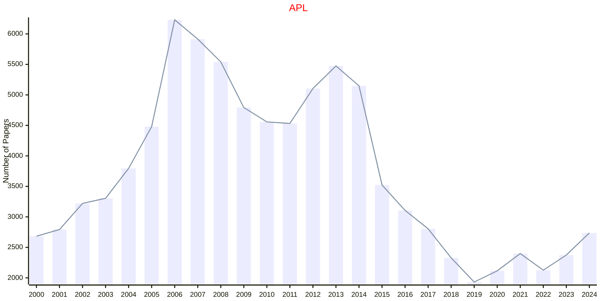
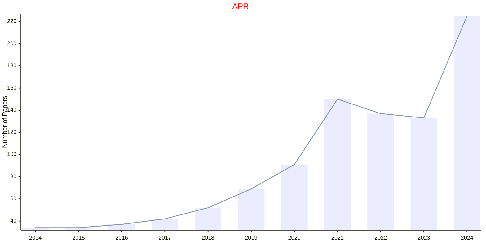

# Applied Physics

## APL

|Publishers|Full/Homepage|Abbr/About|Acronym/Issues|Period/DBLP|Top/Early|CCF|CAS|JCR|IF|Keywords/Google|
|-         |-            |-         |-             |-          |-        |-  |-  |-  |- |-              |
|[AIP](https://pubs.aip.org/)|[Applied Physics Letters](https://pubs.aip.org/aip/apl)|[Appl. Phys. Lett.](https://pubs.aip.org/aip/apl/pages/about)|[APL](https://pubs.aip.org/aip/apl/issue)|1962 -|False||2|Q2|3.6|[Applied Physics](https://www.google.com/search?q=Applied+Physics)|

## APR

|Publishers|Full/Homepage|Abbr/About|Acronym/Issues|Period/DBLP|Top/Early|CCF|CAS|JCR|IF|Keywords/Google|
|-         |-            |-         |-             |-          |-        |-  |-  |-  |- |-              |
|[AIP](https://pubs.aip.org/)|[Applied Physics Reviews](https://pubs.aip.org/aip/apr)|[Appl. Phys. Rev.](https://pubs.aip.org/aip/apr/pages/about)|[APR](https://pubs.aip.org/aip/apr/issue)|2014 -|True||2|Q1|15.2|[Applied Physics](https://www.google.com/search?q=Applied+Physics)|

