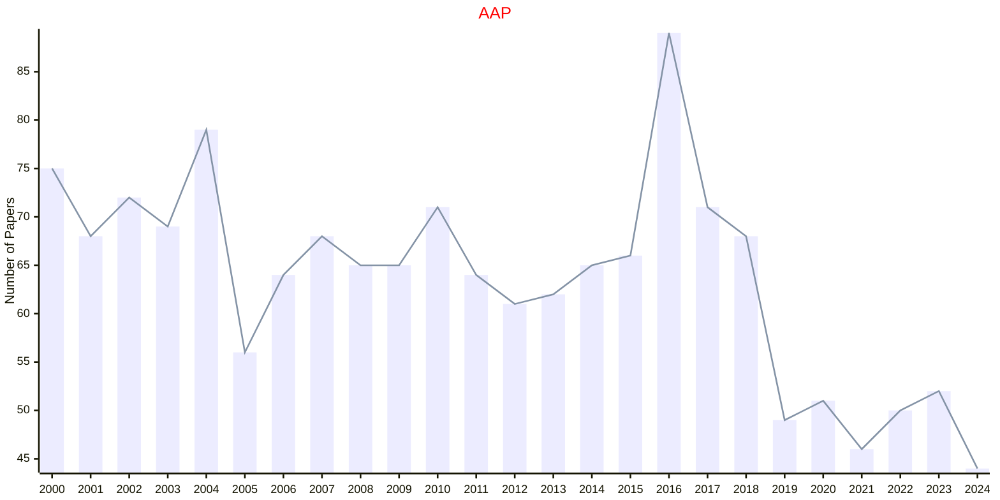
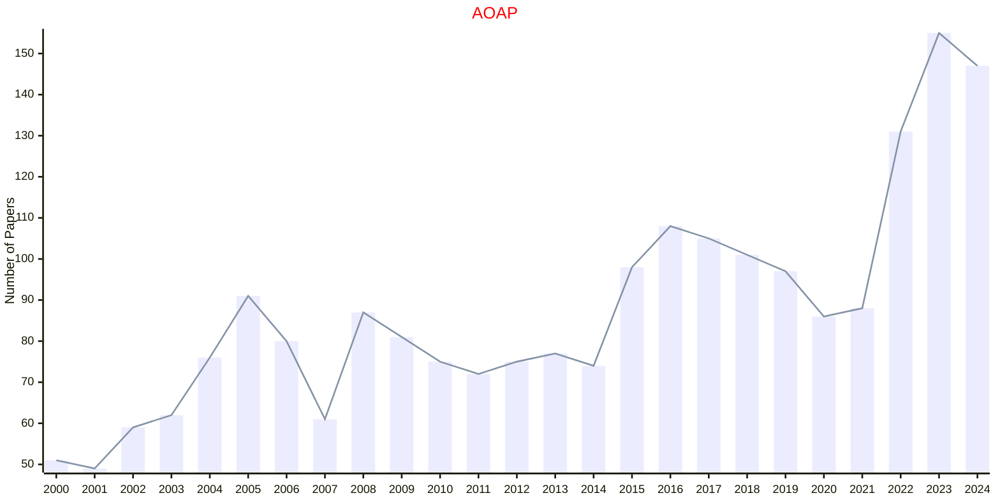
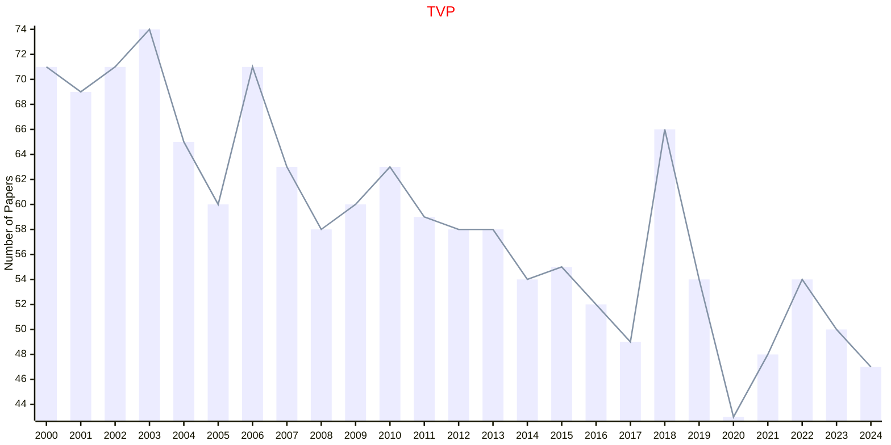
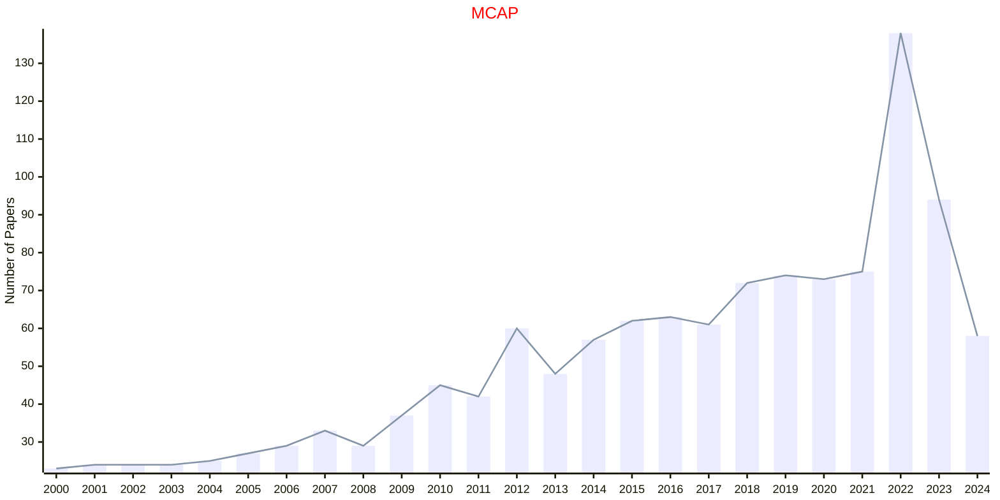

# Applied Probability

## AAP

|Publishers|Full/Homepage|Abbr/About|Acronym/Issues|Period/DBLP|Top/Early|CCF|CAS|JCR|IF|Keywords/Google|
|-         |-            |-         |-             |-          |-        |-  |-  |-  |- |-              |
|[CAMBRIDGE](https://www.cambridge.org/universitypress)|[Advances in Applied Probability](https://www.cambridge.org/core/journals/advances-in-applied-probability)|[Adv. Appl. Probab.](https://www.cambridge.org/core/journals/advances-in-applied-probability/information/about-this-journal)|[AAP](https://www.cambridge.org/core/journals/advances-in-applied-probability/all-issues)|1969 -|False||3|Q2|1.2|[Applied Probability](https://www.google.com/search?q=Applied+Probability)|

## AOAP

|Publishers|Full/Homepage|Abbr/About|Acronym/Issues|Period/DBLP|Top/Early|CCF|CAS|JCR|IF|Keywords/Google|
|-         |-            |-         |-             |-          |-        |-  |-  |-  |- |-              |
|[IMS](https://imstat.org/)|[Annals of Applied Probability](https://imstat.org/journals-and-publications/annals-of-applied-probability)|[Ann. Appl. Probab.](https://imstat.org/journals-and-publications/annals-of-applied-probability)|[AOAP](https://projecteuclid.org/journals/annals-of-applied-probability/issues)|1991 -|False||2|Q1|2.1|[Applied Probability](https://www.google.com/search?q=Applied+Probability); [MCMC](https://www.google.com/search?q=MCMC); [Variational Inference](https://www.google.com/search?q=Variational+Inference)|

## TVP

|Publishers|Full/Homepage|Abbr/About|Acronym/Issues|Period/DBLP|Top/Early|CCF|CAS|JCR|IF|Keywords/Google|
|-         |-            |-         |-             |-          |-        |-  |-  |-  |- |-              |
|[SIAM](https://epubs.siam.org)|[Theory of Probability and Its Applications](https://epubs.siam.org/journal/tprbau)|[Theory Probab. Appl.](https://epubs.siam.org/journal/tvp/about)|[TVP](https://epubs.siam.org/loi/tprbau)|1956 -|False||4|Q4|0.5|[Applied Probability](https://www.google.com/search?q=Applied+Probability)|

## MCAP

|Publishers|Full/Homepage|Abbr/About|Acronym/Issues|Period/DBLP|Top/Early|CCF|CAS|JCR|IF|Keywords/Google|
|-         |-            |-         |-             |-          |-        |-  |-  |-  |- |-              |
|[SPRINGER](https://www.springer.com/)|[Methodology and Computing in Applied Probability](https://link.springer.com/journal/11009)|[Meth. Comput. Appl. Prob.](https://www.springer.com/journal/11009/aims-and-scope)|[MCAP](https://link.springer.com/journal/11009/volumes-and-issues)|1999 -|False|||||[Applied Probability](https://www.google.com/search?q=Applied+Probability)|

