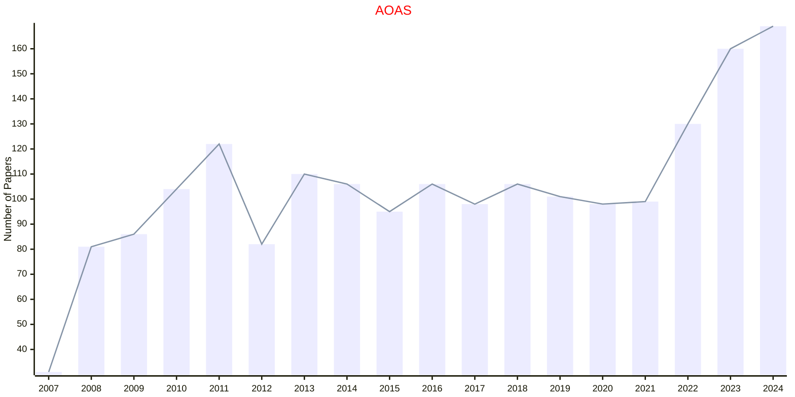
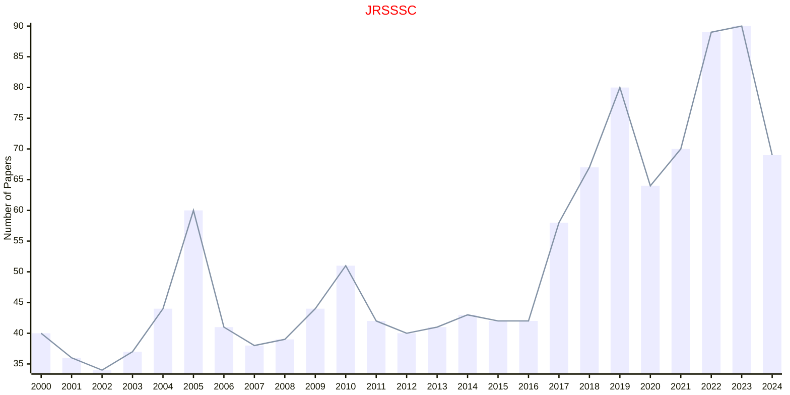
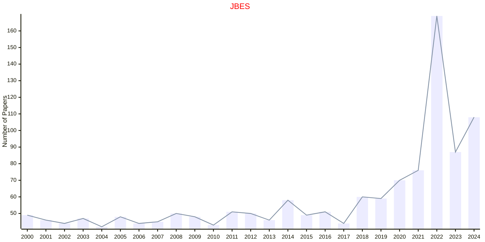
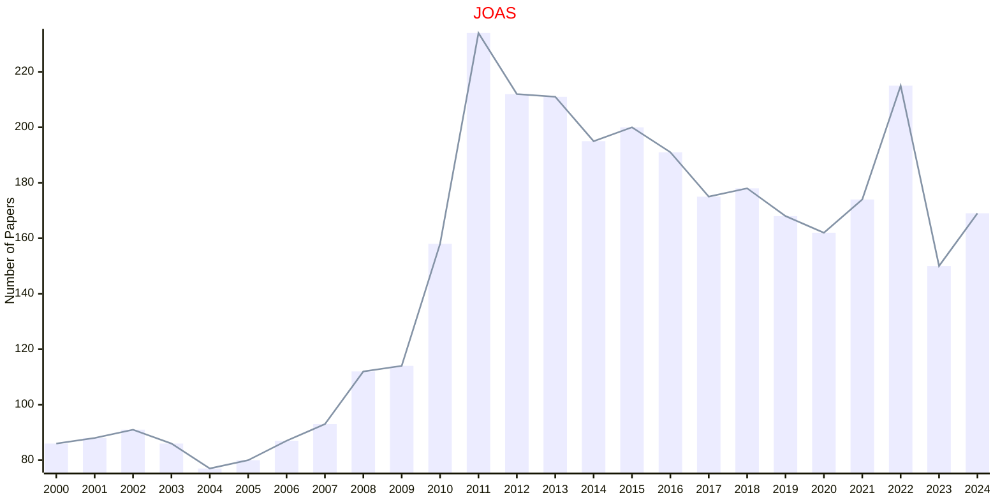

# Applied Statistics

## AOAS

|Publishers|Full/Homepage|Abbr/About|Acronym/Issues|Period/DBLP|Top/Early|CCF|CAS|JCR|IF|Keywords/Google|
|-         |-            |-         |-             |-          |-        |-  |-  |-  |- |-              |
|[IMS](https://imstat.org/)|[Annals of Applied Statistics](https://imstat.org/journals-and-publications/annals-of-applied-statistics)|[Ann. Appl. Stat.](https://imstat.org/journals-and-publications/annals-of-applied-statistics)|[AOAS](https://projecteuclid.org/journals/annals-of-applied-statistics/issues)|2007 -|False||4|Q2|1.8|[Applied Statistics](https://www.google.com/search?q=Applied+Statistics)|

## JRSSSC

|Publishers|Full/Homepage|Abbr/About|Acronym/Issues|Period/DBLP|Top/Early|CCF|CAS|JCR|IF|Keywords/Google|
|-         |-            |-         |-             |-          |-        |-  |-  |-  |- |-              |
|[OXFORD](https://academic.oup.com/)|[Journal of the Royal Statistical Society Series C: Applied Statistics](https://academic.oup.com/jrsssc)|[J. R. Stat. Soc. Ser. C](https://academic.oup.com/jrsssc/pages/about)|[JRSSSC](https://academic.oup.com/jrsssc/issue)|1952 -|False||4|Q2|1.5|[Applied Statistics](https://www.google.com/search?q=Applied+Statistics)|

## JBES

|Publishers|Full/Homepage|Abbr/About|Acronym/Issues|Period/DBLP|Top/Early|CCF|CAS|JCR|IF|Keywords/Google|
|-         |-            |-         |-             |-          |-        |-  |-  |-  |- |-              |
|[TAYLOR](https://www.tandfonline.com/)|[Journal of Business & Economic Statistics](https://www.tandfonline.com/journals/ubes20)|[J. Busin. Econ. Stat.](https://www.tandfonline.com/journals/ubes20/about-this-journal#aims-and-scope)|[JBES](https://www.tandfonline.com/loi/ubes20)|1983 -|False||2|Q1|5.1|[Applied Statistics](https://www.google.com/search?q=Applied+Statistics); [Business and Economic](https://www.google.com/search?q=Business+and+Economic)|

## JCGS

|Publishers|Full/Homepage|Abbr/About|Acronym/Issues|Period/DBLP|Top/Early|CCF|CAS|JCR|IF|Keywords/Google|
|-         |-            |-         |-             |-          |-        |-  |-  |-  |- |-              |
|[TAYLOR](https://www.tandfonline.com/)|[Journal of Computational and Graphical Statistics](https://www.tandfonline.com/journals/ucgs20)|[J. Comput. Graph. Stat.](https://www.tandfonline.com/journals/ucgs20/about-this-journal#aims-and-scope)|[JCGS](https://www.tandfonline.com/loi/ucgs20)|1992 -|False|||||[Applied Statistics](https://www.google.com/search?q=Applied+Statistics); [Computational Statistics](https://www.google.com/search?q=Computational+Statistics); [Graphical Statistics](https://www.google.com/search?q=Graphical+Statistics)|

## JOAS

|Publishers|Full/Homepage|Abbr/About|Acronym/Issues|Period/DBLP|Top/Early|CCF|CAS|JCR|IF|Keywords/Google|
|-         |-            |-         |-             |-          |-        |-  |-  |-  |- |-              |
|[TAYLOR](https://www.tandfonline.com/)|[Journal of Applied Statistics](https://www.tandfonline.com/journals/cjas20)|[J. Appl. Stat.](https://www.tandfonline.com/journals/cjas20/about-this-journal#aims-and-scope)|[JOAS](https://www.tandfonline.com/loi/cjas20)|1974 -|False||4|Q3|1.5|[Applied Statistics](https://www.google.com/search?q=Applied+Statistics)|

## TAS

|Publishers|Full/Homepage|Abbr/About|Acronym/Issues|Period/DBLP|Top/Early|CCF|CAS|JCR|IF|Keywords/Google|
|-         |-            |-         |-             |-          |-        |-  |-  |-  |- |-              |
|[TAYLOR](https://www.tandfonline.com/)|[The American Statistician](https://www.tandfonline.com/journals/utas20)|[Am. Stat.](https://www.tandfonline.com/journals/utas20/about-this-journal#aims-and-scope)|[TAS](https://www.tandfonline.com/loi/utas20)|1974 -|False|||||[Applied Statistics](https://www.google.com/search?q=Applied+Statistics)|

