# Artificial Intelligence

## JAIR

|Publishers|Full/Homepage|Abbr/About|Acronym/Issues|Period/DBLP|Top/Early|CCF|CAS|JCR|IF|Keywords/Google|
|-         |-            |-         |-             |-          |-        |-  |-  |-  |- |-              |
|[AAAI](https://www.aaai.org/)|[Journal of Artificial Intelligence Research](https://www.jair.org/index.php/jair)|[J. Artif. Intell. Res.](https://www.jair.org/index.php/jair/about)|[JAIR](https://www.jair.org/index.php/jair/issue/archive)|[1996 -](https://dblp.org/db/journals/jair/index.html)|False|B|3|Q2|4.6|[Artificial Intelligence](https://www.google.com/search?q=Artificial+Intelligence)|

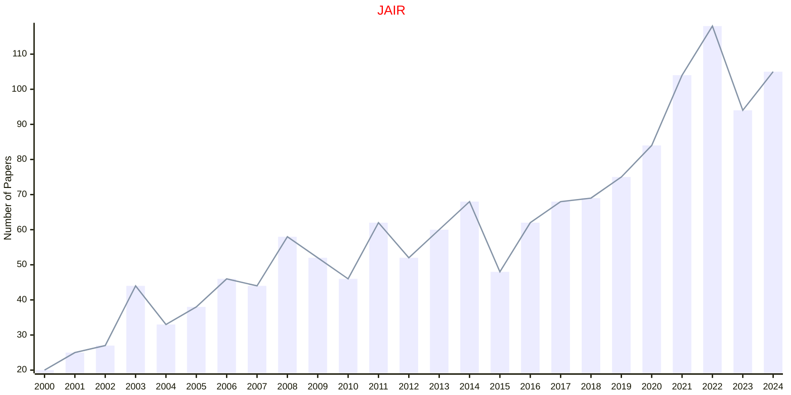

## AIJ

|Publishers|Full/Homepage|Abbr/About|Acronym/Issues|Period/DBLP|Top/Early|CCF|CAS|JCR|IF|Keywords/Google|
|-         |-            |-         |-             |-          |-        |-  |-  |-  |- |-              |
|[ELSEVIER](https://www.sciencedirect.com/)|[Artificial Intelligence](https://www.sciencedirect.com/journal/artificial-intelligence)|[Artif. Intell.](https://www.sciencedirect.com/journal/artificial-intelligence/about/aims-and-scope)|[AIJ](https://www.sciencedirect.com/journal/artificial-intelligence/issues)|1970 -|False|A|2|Q2|6.4|[Artificial Intelligence](https://www.google.com/search?q=Artificial+Intelligence)|

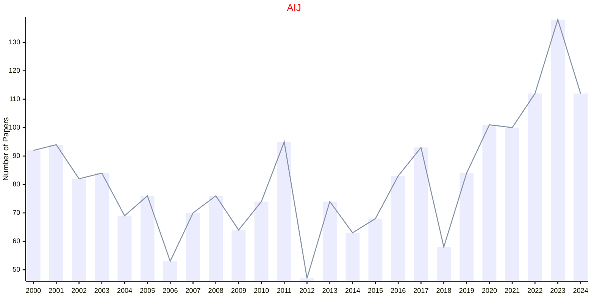

## ARTMED

|Publishers|Full/Homepage|Abbr/About|Acronym/Issues|Period/DBLP|Top/Early|CCF|CAS|JCR|IF|Keywords/Google|
|-         |-            |-         |-             |-          |-        |-  |-  |-  |- |-              |
|[ELSEVIER](https://www.sciencedirect.com/)|[Artificial Intelligence in Medicine](https://www.sciencedirect.com/journal/artificial-intelligence-in-medicine)|[Artif. Intell. Med.](https://www.sciencedirect.com/journal/artificial-intelligence-in-medicine/about/aims-and-scope)|[ARTMED](https://www.sciencedirect.com/journal/artificial-intelligence-in-medicine/issues)|1989 -|True|C|2|Q1|6.9|[Artificial Intelligence](https://www.google.com/search?q=Artificial+Intelligence); [Medicine](https://www.google.com/search?q=Medicine)|

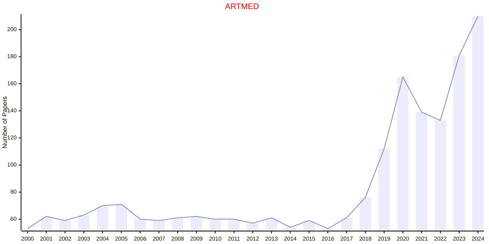

## ASOC

|Publishers|Full/Homepage|Abbr/About|Acronym/Issues|Period/DBLP|Top/Early|CCF|CAS|JCR|IF|Keywords/Google|
|-         |-            |-         |-             |-          |-        |-  |-  |-  |- |-              |
|[ELSEVIER](https://www.sciencedirect.com/)|[Applied Soft Computing](https://www.sciencedirect.com/journal/applied-soft-computing)|[Appl. Soft. Comput.](https://www.sciencedirect.com/journal/applied-soft-computing/about/aims-and-scope)|[ASOC](https://www.sciencedirect.com/journal/applied-soft-computing/issues)|2001 -|True||2|Q1|6.9|[Artificial Intelligence](https://www.google.com/search?q=Artificial+Intelligence); [Evolutionary Computation](https://www.google.com/search?q=Evolutionary+Computation)|

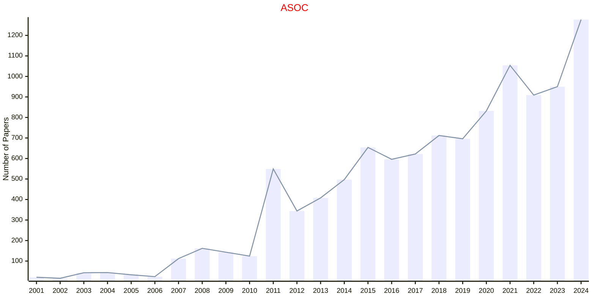

## AUTCON

|Publishers|Full/Homepage|Abbr/About|Acronym/Issues|Period/DBLP|Top/Early|CCF|CAS|JCR|IF|Keywords/Google|
|-         |-            |-         |-             |-          |-        |-  |-  |-  |- |-              |
|[ELSEVIER](https://www.sciencedirect.com/)|[Automation in Construction](https://www.sciencedirect.com/journal/automation-in-construction)|[Autom. Construct.](https://www.sciencedirect.com/journal/automation-in-construction/about/aims-and-scope)|[AUTCON](https://www.sciencedirect.com/journal/automation-in-construction/issues)|1992 -|True||1|Q1|12.7|[Artificial Intelligence](https://www.google.com/search?q=Artificial+Intelligence)|

## EAAI

|Publishers|Full/Homepage|Abbr/About|Acronym/Issues|Period/DBLP|Top/Early|CCF|CAS|JCR|IF|Keywords/Google|
|-         |-            |-         |-             |-          |-        |-  |-  |-  |- |-              |
|[ELSEVIER](https://www.sciencedirect.com/)|[Engineering Applications of Artificial Intelligence](https://www.sciencedirect.com/journal/engineering-applications-of-artificial-intelligence)|[Eng. Appl. Artif. Intell.](https://www.sciencedirect.com/journal/engineering-applications-of-artificial-intelligence/about/aims-and-scope)|[EAAI](https://www.sciencedirect.com/journal/engineering-applications-of-artificial-intelligence/issues)|1988 -|True|C|1|Q1|7.7|[Artificial Intelligence](https://www.google.com/search?q=Artificial+Intelligence)|

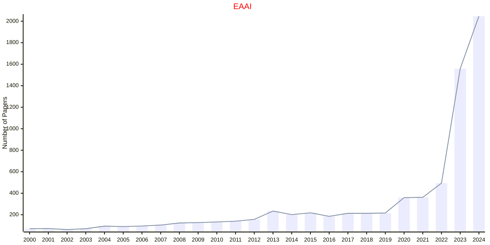

## ESWA

|Publishers|Full/Homepage|Abbr/About|Acronym/Issues|Period/DBLP|Top/Early|CCF|CAS|JCR|IF|Keywords/Google|
|-         |-            |-         |-             |-          |-        |-  |-  |-  |- |-              |
|[ELSEVIER](https://www.sciencedirect.com/)|[Expert Systems with Applications](https://www.sciencedirect.com/journal/expert-systems-with-applications)|[Expert Syst. Appl.](https://www.sciencedirect.com/journal/expert-systems-with-applications/about/aims-and-scope)|[ESWA](https://www.sciencedirect.com/journal/expert-systems-with-applications/issues)|1990 -|True|C|1|Q1|7.8|[Artificial Intelligence](https://www.google.com/search?q=Artificial+Intelligence)|

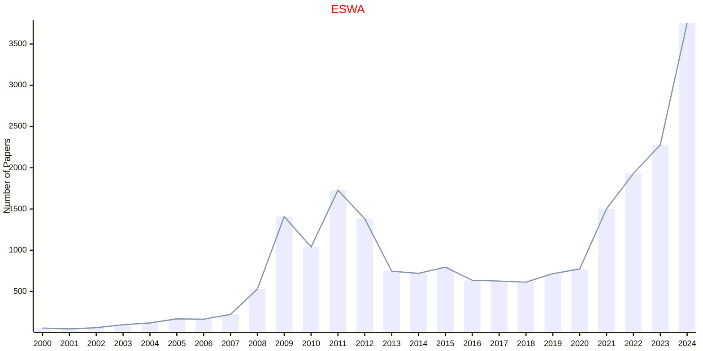

## TAI

|Publishers|Full/Homepage|Abbr/About|Acronym/Issues|Period/DBLP|Top/Early|CCF|CAS|JCR|IF|Keywords/Google|
|-         |-            |-         |-             |-          |-        |-  |-  |-  |- |-              |
|[IEEE](https://ieeexplore.ieee.org/)|[IEEE Transactions on Artificial Intelligence](https://ieeexplore.ieee.org/xpl/RecentIssue.jsp?punumber=9078688)|[IEEE Trans. Artif. Intell.](https://ieeexplore.ieee.org/xpl/aboutJournal.jsp?punumber=9078688)|[TAI](https://ieeexplore.ieee.org/xpl/issues?punumber=9078688&isnumber=10599850)|2020 -|[False](https://ieeexplore.ieee.org/xpl/tocresult.jsp?isnumber=9184921)|||||[Artificial Intelligence](https://www.google.com/search?q=Artificial+Intelligence)|

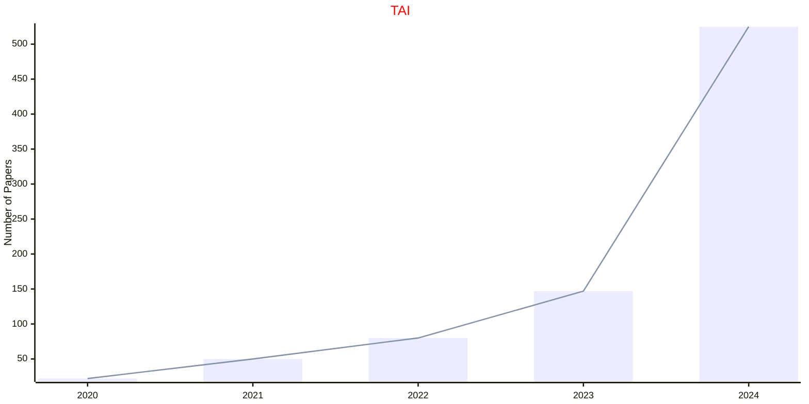

## TCYB

|Publishers|Full/Homepage|Abbr/About|Acronym/Issues|Period/DBLP|Top/Early|CCF|CAS|JCR|IF|Keywords/Google|
|-         |-            |-         |-             |-          |-        |-  |-  |-  |- |-              |
|[IEEE](https://ieeexplore.ieee.org/)|[IEEE Transactions on Cybernetics](https://ieeexplore.ieee.org/xpl/RecentIssue.jsp?punumber=6221036)|[IEEE Trans. Cybern.](https://ieeexplore.ieee.org/xpl/aboutJournal.jsp?punumber=6221036)|[TCYB](https://ieeexplore.ieee.org/xpl/issues?punumber=6221036&isnumber=10223305)|2013 -|[True](https://ieeexplore.ieee.org/xpl/tocresult.jsp?isnumber=6352949)|B|1|Q1|11.6|[Artificial Intelligence](https://www.google.com/search?q=Artificial+Intelligence); [Evolutionary Computation](https://www.google.com/search?q=Evolutionary+Computation)|

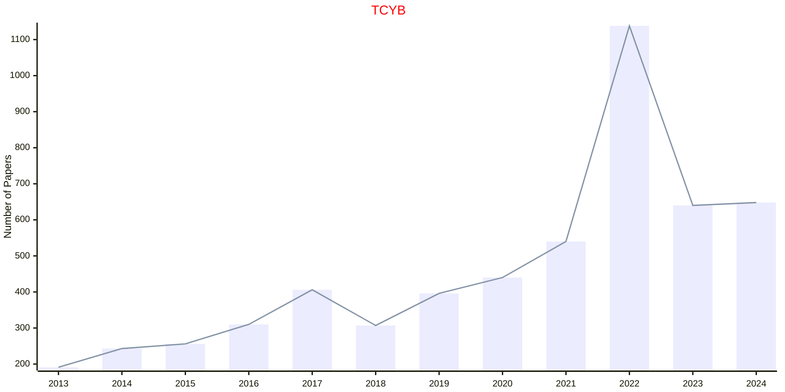

## TPAMI

|Publishers|Full/Homepage|Abbr/About|Acronym/Issues|Period/DBLP|Top/Early|CCF|CAS|JCR|IF|Keywords/Google|
|-         |-            |-         |-             |-          |-        |-  |-  |-  |- |-              |
|[IEEE](https://ieeexplore.ieee.org/)|[IEEE Transactions on Pattern Analysis and Machine Intelligence](https://ieeexplore.ieee.org/xpl/RecentIssue.jsp?punumber=34)|[IEEE Trans. Pattern Anal. Mach. Intell.](https://ieeexplore.ieee.org/xpl/aboutJournal.jsp?punumber=34)|[TPAMI](https://ieeexplore.ieee.org/xpl/issues?punumber=34&isnumber=10241246)|1979 -|[True](https://ieeexplore.ieee.org/xpl/tocresult.jsp?isnumber=4359286)|A|1|Q1|20.4|[Machine Intelligence](https://www.google.com/search?q=Machine+Intelligence); [Pattern Analysis](https://www.google.com/search?q=Pattern+Analysis)|

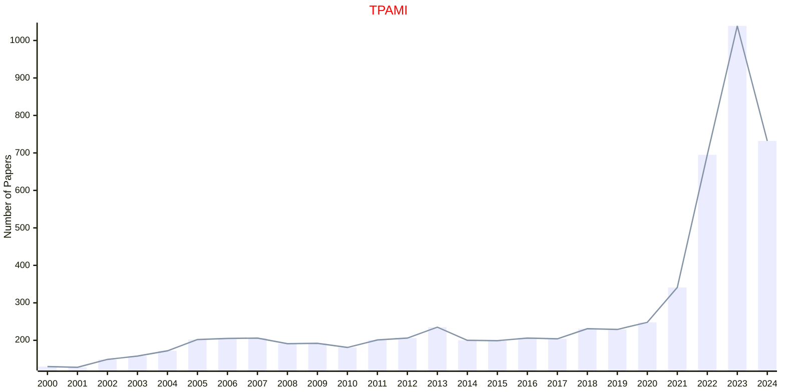

## IJAIML

|Publishers|Full/Homepage|Abbr/About|Acronym/Issues|Period/DBLP|Top/Early|CCF|CAS|JCR|IF|Keywords/Google|
|-         |-            |-         |-             |-          |-        |-  |-  |-  |- |-              |
|[IGI](https://www.igi-global.com/)|[International Journal of Artificial Intelligence and Machine Learning](https://www.igi-global.com/journal/international-journal-artificial-intelligence-machine/225011)|[Int. J. Artif. Intell. Mach. Learn.](https://www.igi-global.com/journal/international-journal-artificial-intelligence-machine/225011#description)|[IJAIML](https://www.igi-global.com/journals/open-access/table-of-contents/international-journal-artificial-intelligence-machine/225011)|2019 -|False|||||[Artificial Intelligence](https://www.google.com/search?q=Artificial+Intelligence); [Machine Learning](https://www.google.com/search?q=Machine+Learning)|

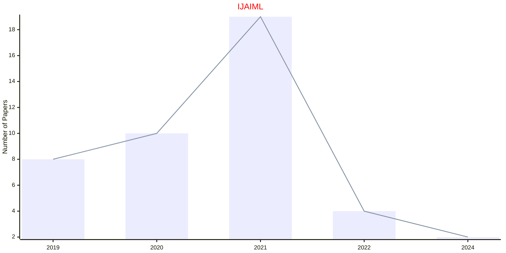

## EAI

|Publishers|Full/Homepage|Abbr/About|Acronym/Issues|Period/DBLP|Top/Early|CCF|CAS|JCR|IF|Keywords/Google|
|-         |-            |-         |-             |-          |-        |-  |-  |-  |- |-              |
|[SAGE](https://www.sagepub.com/)|[European Journal on Artificial Intelligence](https://journals.sagepub.com/home/eai)|[Eur. Artif. Intell.](https://journals.sagepub.com/overview-metric/EAI?)|[EAI](https://journals.sagepub.com/loi/eai)|1987 -|False|||||[Artificial Intelligence](https://www.google.com/search?q=Artificial+Intelligence)|

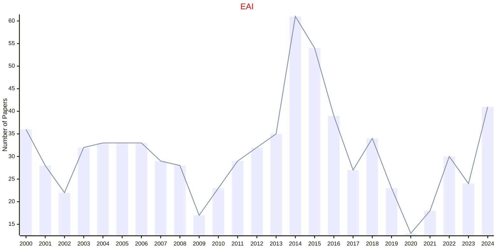

## IDA

|Publishers|Full/Homepage|Abbr/About|Acronym/Issues|Period/DBLP|Top/Early|CCF|CAS|JCR|IF|Keywords/Google|
|-         |-            |-         |-             |-          |-        |-  |-  |-  |- |-              |
|[SAGE](https://www.sagepub.com/)|[Intelligent Data Analysis](https://journals.sagepub.com/home/ida)|[Intell. Data Anal.](https://journals.sagepub.com/overview-metric/IDA?)|[IDA](https://journals.sagepub.com/loi/ida)|1997 -|False|C|4|Q4|0.9|[Artificial Intelligence](https://www.google.com/search?q=Artificial+Intelligence); [Data Mining](https://www.google.com/search?q=Data+Mining); [Evolutionary Computation](https://www.google.com/search?q=Evolutionary+Computation)|

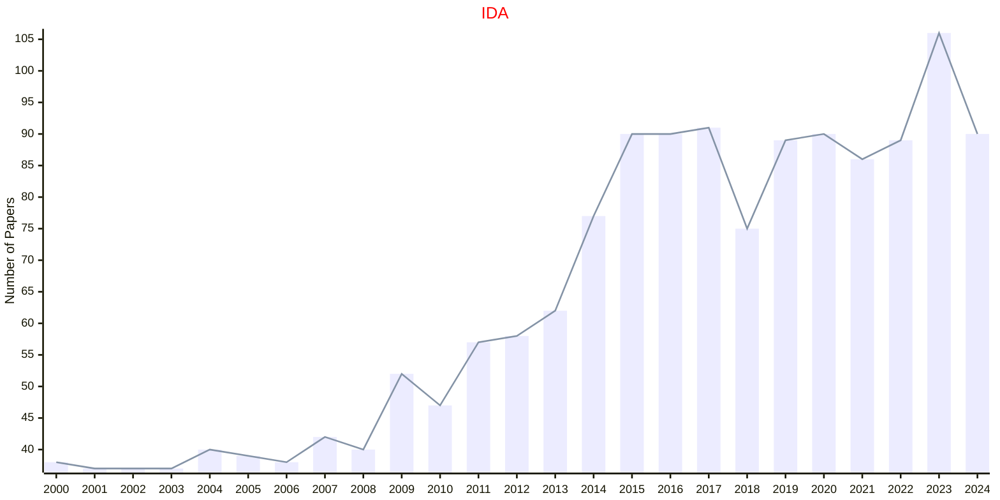

## AIL

|Publishers|Full/Homepage|Abbr/About|Acronym/Issues|Period/DBLP|Top/Early|CCF|CAS|JCR|IF|Keywords/Google|
|-         |-            |-         |-             |-          |-        |-  |-  |-  |- |-              |
|[SPRINGER](https://www.springer.com/)|[Artificial Intelligence and Law](https://www.springer.com/journal/10506)|[Artif. Intell. Law](https://www.springer.com/journal/10506/aims-and-scope)|[AIL](https://link.springer.com/journal/10506/volumes-and-issues)|1992 -|False||2|Q2|3.6|[Law](https://www.google.com/search?q=Law)|

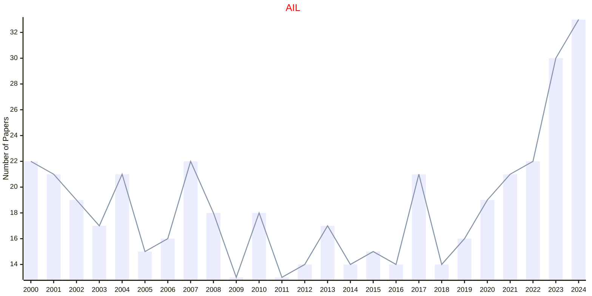

## AIR

|Publishers|Full/Homepage|Abbr/About|Acronym/Issues|Period/DBLP|Top/Early|CCF|CAS|JCR|IF|Keywords/Google|
|-         |-            |-         |-             |-          |-        |-  |-  |-  |- |-              |
|[SPRINGER](https://www.springer.com/)|[Artificial Intelligence Review](https://www.springer.com/journal/10462)|[Artif. Intell. Rev.](https://www.springer.com/journal/10462/aims-and-scope)|[AIR](https://link.springer.com/journal/10462/volumes-and-issues)|1987 -|True||1|Q1|14.9|[Artificial Intelligence](https://www.google.com/search?q=Artificial+Intelligence); [Review](https://www.google.com/search?q=Review)|

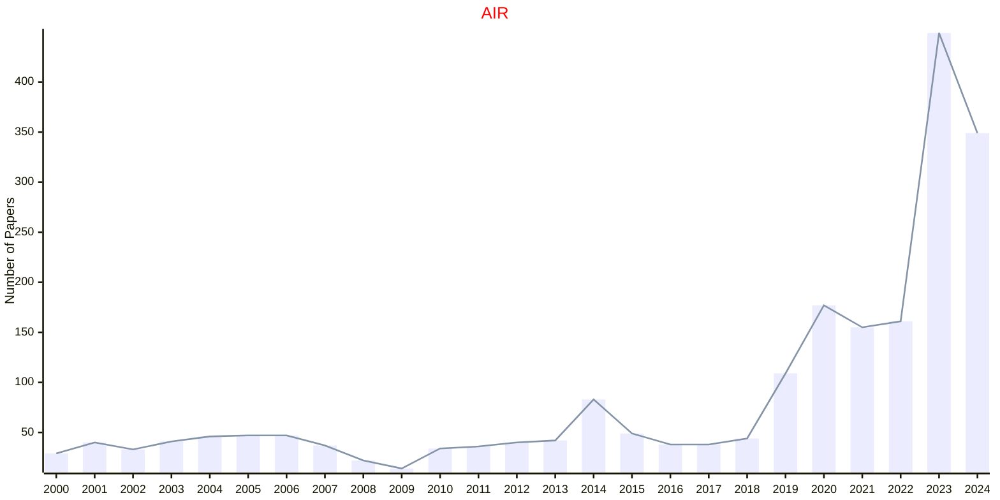

## AMAI

|Publishers|Full/Homepage|Abbr/About|Acronym/Issues|Period/DBLP|Top/Early|CCF|CAS|JCR|IF|Keywords/Google|
|-         |-            |-         |-             |-          |-        |-  |-  |-  |- |-              |
|[SPRINGER](https://www.springer.com/)|[Annals of Mathematics and Artificial Intelligence](https://www.springer.com/journal/10472)|[Ann. Math. Artif. Intell.](https://www.springer.com/journal/10472/aims-and-scope)|[AMAI](https://link.springer.com/journal/10472/volumes-and-issues)|1990 -|False||4|Q3|1.1|[Artificial Intelligence](https://www.google.com/search?q=Artificial+Intelligence)|

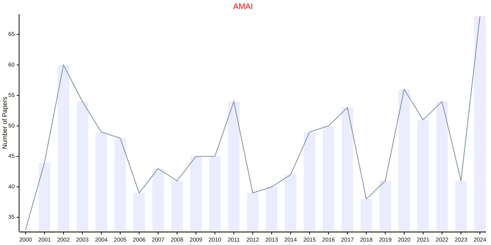

## AAI

|Publishers|Full/Homepage|Abbr/About|Acronym/Issues|Period/DBLP|Top/Early|CCF|CAS|JCR|IF|Keywords/Google|
|-         |-            |-         |-             |-          |-        |-  |-  |-  |- |-              |
|[TAYLOR](https://www.tandfonline.com/)|[Applied Artificial Intelligence](https://www.tandfonline.com/journals/uaai20)|[Appl. Artif. Intell.](https://www.tandfonline.com/journals/uaai20/about-this-journal#aims-and-scope)|[AAI](https://www.tandfonline.com/loi/uaai20)|1987 -|False||4|Q2|3.9|[Artificial Intelligence](https://www.google.com/search?q=Artificial+Intelligence)|

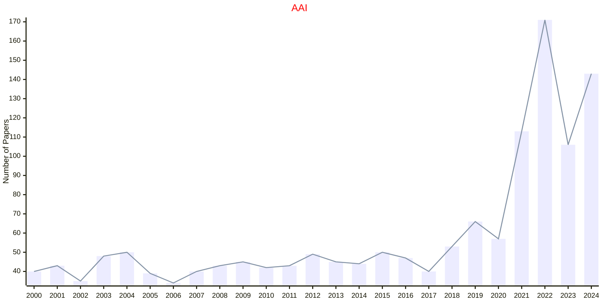

## CSCI

|Publishers|Full/Homepage|Abbr/About|Acronym/Issues|Period/DBLP|Top/Early|CCF|CAS|JCR|IF|Keywords/Google|
|-         |-            |-         |-             |-          |-        |-  |-  |-  |- |-              |
|[TAYLOR](https://www.tandfonline.com/)|[Connection Science](https://www.tandfonline.com/journals/ccos20)|[Connect. Sci.](https://www.tandfonline.com/journals/ccos20/about-this-journal#aims-and-scope)|[CSCI](https://www.tandfonline.com/loi/ccos20)|1989 -|False|C|3|Q2|3.3|[Artificial Intelligence](https://www.google.com/search?q=Artificial+Intelligence); [Evolutionary Computation](https://www.google.com/search?q=Evolutionary+Computation)|

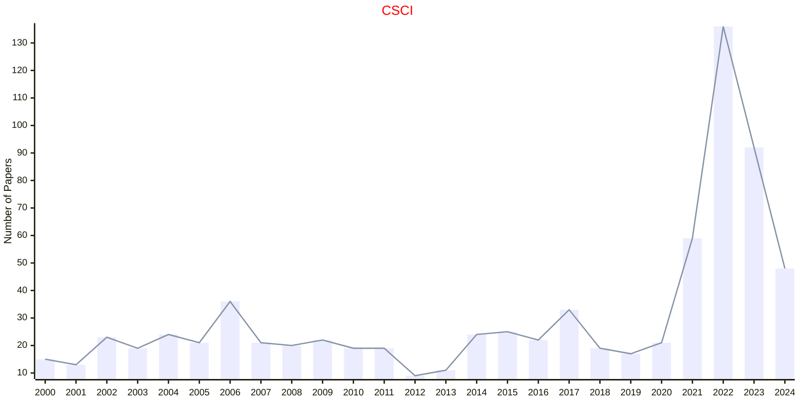

## JETAI

|Publishers|Full/Homepage|Abbr/About|Acronym/Issues|Period/DBLP|Top/Early|CCF|CAS|JCR|IF|Keywords/Google|
|-         |-            |-         |-             |-          |-        |-  |-  |-  |- |-              |
|[TAYLOR](https://www.tandfonline.com/)|[Journal of Experimental and Theoretical Artificial Intelligence](https://www.tandfonline.com/journals/teta20)|[J. Exp. Theor. Artif. Intell.](https://www.tandfonline.com/journals/teta20/about-this-journal#aims-and-scope)|[JETAI](https://www.tandfonline.com/loi/teta20)|1989 -|False|C|4|Q3|1.8|[Artificial Intelligence](https://www.google.com/search?q=Artificial+Intelligence)|

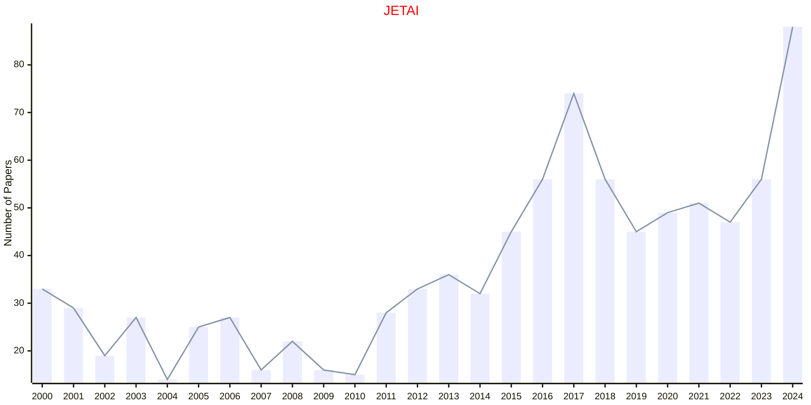

## AAIL

|Publishers|Full/Homepage|Abbr/About|Acronym/Issues|Period/DBLP|Top/Early|CCF|CAS|JCR|IF|Keywords/Google|
|-         |-            |-         |-             |-          |-        |-  |-  |-  |- |-              |
|[WILEY](https://www.wiley.com/)|[Applied AI Letters](https://onlinelibrary.wiley.com/journal/26895595)|[Appl. AI Lett.](https://onlinelibrary.wiley.com/page/journal/26895595/homepage/overview)|[AAIL](https://onlinelibrary.wiley.com/loi/26895595)|2020 -|False|||||[Artificial Intelligence](https://www.google.com/search?q=Artificial+Intelligence)|

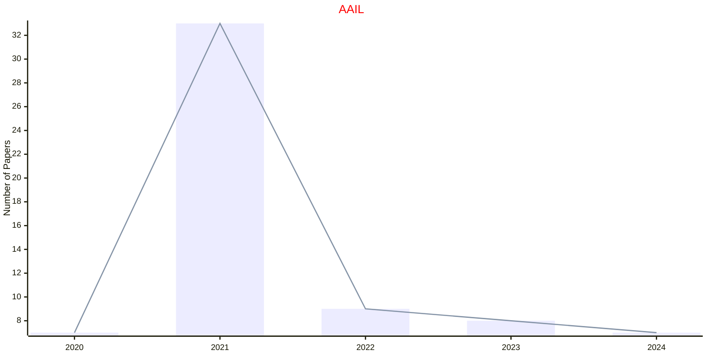

## ACISC

|Publishers|Full/Homepage|Abbr/About|Acronym/Issues|Period/DBLP|Top/Early|CCF|CAS|JCR|IF|Keywords/Google|
|-         |-            |-         |-             |-          |-        |-  |-  |-  |- |-              |
|[WILEY](https://www.wiley.com/)|[Applied Computational Intelligence and Soft Computing](https://onlinelibrary.wiley.com/journal/4795)|[Appl. Comput. Intell. Soft Comput.](https://onlinelibrary.wiley.com/page/journal/4795/homepage/overview)|[ACISC](https://onlinelibrary.wiley.com/loi/4795)|2009 -|False||4||3.0|[Artificial Intelligence](https://www.google.com/search?q=Artificial+Intelligence)|

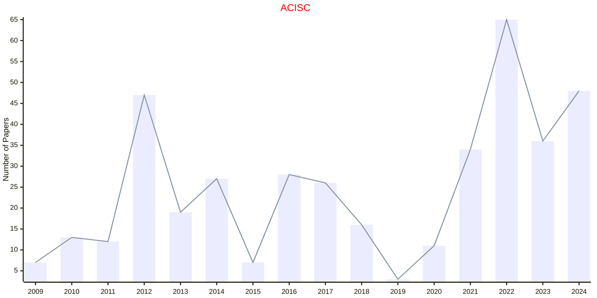

## AIM

|Publishers|Full/Homepage|Abbr/About|Acronym/Issues|Period/DBLP|Top/Early|CCF|CAS|JCR|IF|Keywords/Google|
|-         |-            |-         |-             |-          |-        |-  |-  |-  |- |-              |
|[WILEY](https://www.wiley.com/)|[AI Magazine](https://onlinelibrary.wiley.com/journal/23719621)|[AI Mag.](https://onlinelibrary.wiley.com/page/journal/23719621/homepage/productinformation.html)|[AIM](https://onlinelibrary.wiley.com/loi/23719621)|1980 -|False||4|Q2|3.8|[Artificial Intelligence](https://www.google.com/search?q=Artificial+Intelligence)|

```mermaid
---
config:
    xyChart:
        width: 1200
        height: 600
    themeVariables:
        xyChart:
            titleColor: "#ff0000"
---
xychart-beta
    title "AIM"
    x-axis [2000, 2001, 2002, 2003, 2004, 2005, 2006, 2007, 2008, 2009, 2010, 2011, 2012, 2013, 2014, 2015, 2016, 2017, 2018, 2019, 2020, 2021, 2022, 2023, 2024]
    y-axis "Number of Papers"
    bar [52, 61, 64, 58, 51, 66, 59, 55, 58, 54, 45, 53, 55, 53, 51, 54, 70, 60, 56, 44, 47, 41, 37, 52, 59]
    line [52, 61, 64, 58, 51, 66, 59, 55, 58, 54, 45, 53, 55, 53, 51, 54, 70, 60, 56, 44, 47, 41, 37, 52, 59]
```

## CAAITIT

|Publishers|Full/Homepage|Abbr/About|Acronym/Issues|Period/DBLP|Top/Early|CCF|CAS|JCR|IF|Keywords/Google|
|-         |-            |-         |-             |-          |-        |-  |-  |-  |- |-              |
|[WILEY](https://www.wiley.com/)|[CAAI Transactions on Intelligence Technology](https://onlinelibrary.wiley.com/journal/24682322)|[CAAI Trans. Intell. Technol.](https://ietresearch.onlinelibrary.wiley.com/hub/journal/24682322/homepage/productinformation.html)|[CAAITIT](https://ietresearch.onlinelibrary.wiley.com/loi/24682322)|2017 -|True||1|Q1|6.4|[Artificial Intelligence](https://www.google.com/search?q=Artificial+Intelligence)|

```mermaid
---
config:
    xyChart:
        width: 1200
        height: 600
    themeVariables:
        xyChart:
            titleColor: "#ff0000"
---
xychart-beta
    title "CAAITIT"
    x-axis [2017, 2018, 2019, 2020, 2021, 2022, 2023, 2024]
    y-axis "Number of Papers"
    bar [17, 28, 29, 39, 41, 62, 110, 107]
    line [17, 28, 29, 39, 41, 62, 110, 107]
```

## IJAIRR

|Publishers|Full/Homepage|Abbr/About|Acronym/Issues|Period/DBLP|Top/Early|CCF|CAS|JCR|IF|Keywords/Google|
|-         |-            |-         |-             |-          |-        |-  |-  |-  |- |-              |
|[WS](https://worldscientific.com/)|[International Journal of Artificial Intelligence and Robotics Research](https://worldscientific.com/worldscinet/ijairr)|[Int. J. Artif. Intell. Robot. Res.](https://worldscientific.com/page/ijairr/aims-scope)|[IJAIRR](https://worldscientific.com/loi/ijairr)|2024 -|False|||||[Artificial Intelligence](https://www.google.com/search?q=Artificial+Intelligence); [Robotics and UAV](https://www.google.com/search?q=Robotics+and+UAV)|

```mermaid
---
config:
    xyChart:
        width: 1200
        height: 600
    themeVariables:
        xyChart:
            titleColor: "#ff0000"
---
xychart-beta
    title "IJAIRR"
    x-axis [2024]
    y-axis "Number of Papers"
    bar [10]
    line [10]
```

## IJAIT

|Publishers|Full/Homepage|Abbr/About|Acronym/Issues|Period/DBLP|Top/Early|CCF|CAS|JCR|IF|Keywords/Google|
|-         |-            |-         |-             |-          |-        |-  |-  |-  |- |-              |
|[WS](https://worldscientific.com/)|[International Journal on Artificial Intelligence Tools](https://worldscientific.com/worldscinet/ijait)|[Int. J. Aritf. Intell. Tools](https://worldscientific.com/page/ijait/aims-scope)|[IJAIT](https://worldscientific.com/loi/ijait)|1992 -|False||4|Q4|0.9|[Artificial Intelligence](https://www.google.com/search?q=Artificial+Intelligence)|

```mermaid
---
config:
    xyChart:
        width: 1200
        height: 600
    themeVariables:
        xyChart:
            titleColor: "#ff0000"
---
xychart-beta
    title "IJAIT"
    x-axis [2000, 2001, 2002, 2003, 2004, 2005, 2006, 2007, 2008, 2009, 2010, 2011, 2012, 2013, 2014, 2015, 2016, 2017, 2018, 2019, 2020, 2021, 2022, 2023, 2024]
    y-axis "Number of Papers"
    bar [34, 36, 29, 27, 55, 56, 61, 52, 62, 47, 43, 52, 58, 56, 58, 61, 56, 52, 59, 46, 57, 46, 74, 84, 67]
    line [34, 36, 29, 27, 55, 56, 61, 52, 62, 47, 43, 52, 58, 56, 58, 61, 56, 52, 59, 46, 57, 46, 74, 84, 67]
```

## IJPRAI

|Publishers|Full/Homepage|Abbr/About|Acronym/Issues|Period/DBLP|Top/Early|CCF|CAS|JCR|IF|Keywords/Google|
|-         |-            |-         |-             |-          |-        |-  |-  |-  |- |-              |
|[WS](https://worldscientific.com/)|[International Journal of Pattern Recognition and Artificial Intelligence](https://worldscientific.com/worldscinet/ijprai)|[Int. J. Pattern Recognit. Artif. Intell.](https://worldscientific.com/page/ijprai/aims-scope)|[IJPRAI](https://worldscientific.com/loi/ijprai)|1987 -|False|C|4|Q4|0.9|[Pattern Recognition](https://www.google.com/search?q=Pattern+Recognition)|

```mermaid
---
config:
    xyChart:
        width: 1200
        height: 600
    themeVariables:
        xyChart:
            titleColor: "#ff0000"
---
xychart-beta
    title "IJPRAI"
    x-axis [2000, 2001, 2002, 2003, 2004, 2005, 2006, 2007, 2008, 2009, 2010, 2011, 2012, 2013, 2014, 2015, 2016, 2017, 2018, 2019, 2020, 2021, 2022, 2023, 2024]
    y-axis "Number of Papers"
    bar [68, 71, 62, 75, 79, 55, 70, 72, 87, 77, 63, 67, 83, 81, 84, 97, 112, 144, 168, 189, 209, 235, 219, 198, 187]
    line [68, 71, 62, 75, 79, 55, 70, 72, 87, 77, 63, 67, 83, 81, 84, 97, 112, 144, 168, 189, 209, 235, 219, 198, 187]
```

## WSARAI

|Publishers|Full/Homepage|Abbr/About|Acronym/Issues|Period/DBLP|Top/Early|CCF|CAS|JCR|IF|Keywords/Google|
|-         |-            |-         |-             |-          |-        |-  |-  |-  |- |-              |
|[WS](https://worldscientific.com/)|[World Scientific Annual Review of Artificial Intelligence](https://worldscientific.com/worldscinet/wsarai)|[World Sci. Ann. Rev. Artif. Intell.](https://worldscientific.com/page/wsarai/aims-scope)|[WSARAI](https://worldscientific.com/loi/wsarai)|2023 -|False|||||[Artificial Intelligence](https://www.google.com/search?q=Artificial+Intelligence)|

```mermaid
---
config:
    xyChart:
        width: 1200
        height: 600
    themeVariables:
        xyChart:
            titleColor: "#ff0000"
---
xychart-beta
    title "WSARAI"
    x-axis [2023, 2024]
    y-axis "Number of Papers"
    bar [11, 11]
    line [11, 11]
```

