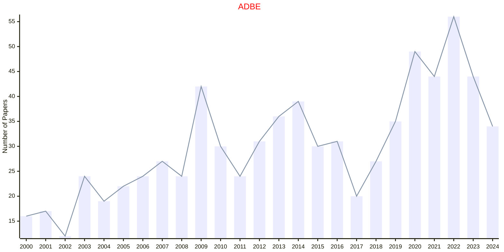

# Artificial Systems

## ADBE

|Publishers|Full/Homepage|Abbr/About|Acronym/Issues|Period/DBLP|Top/Early|CCF|CAS|JCR|IF|Keywords/Google|
|-         |-            |-         |-             |-          |-        |-  |-  |-  |- |-              |
|[SAGE](https://www.sagepub.com/)|[Adaptive Behavior](https://journals.sagepub.com/home/adba)|[Adaptive Behavior](https://journals.sagepub.com/overview-metric/ADB?)|[ADBE](https://journals.sagepub.com/loi/adba)|1992 -|False||4|Q4|1.5|[Artificial Systems](https://www.google.com/search?q=Artificial+Systems)|

