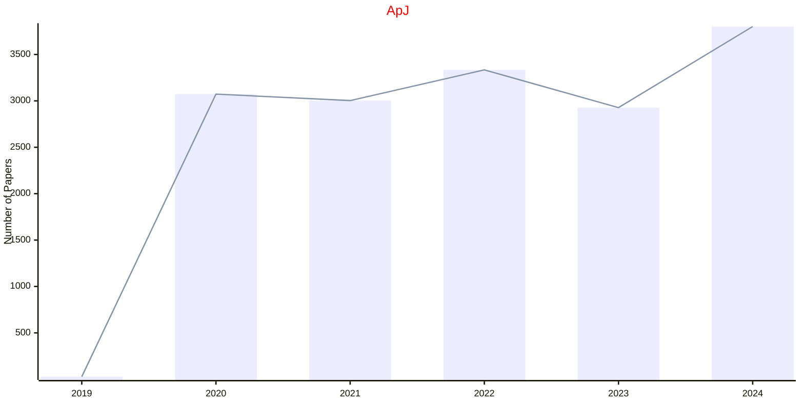

# Astrophysics

## AANDA

|Publishers|Full/Homepage|Abbr/About|Acronym/Issues|Period/DBLP|Top/Early|CCF|CAS|JCR|IF|Keywords/Google|
|-         |-            |-         |-             |-          |-        |-  |-  |-  |- |-              |
|[EDP](https://www.edpsciences.org/)|[Astronomy & Astrophysics](https://www.aanda.org/)|[Astron. Astrophys.](https://www.aanda.org/about-aa/aims-and-scope)|[AANDA](https://www.aanda.org/component/issues)|1980 -|False||2|Q1|6.1|[Astrophysics](https://www.google.com/search?q=Astrophysics)|

## ApJ

|Publishers|Full/Homepage|Abbr/About|Acronym/Issues|Period/DBLP|Top/Early|CCF|CAS|JCR|IF|Keywords/Google|
|-         |-            |-         |-             |-          |-        |-  |-  |-  |- |-              |
|[IOP](https://ioppublishing.org/)|[The Astrophysical Journal](https://iopscience.iop.org/journal/0004-637X)|[The Astrophys. J.](https://iopscience.iop.org/journal/0004-637X/page/about-the-journal)|[ApJ](https://iopscience.iop.org/journal/0004-637X)|1995 -|False||2|Q1|5.2|[Astrophysics](https://www.google.com/search?q=Astrophysics)|

