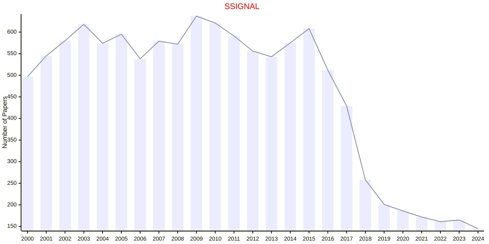
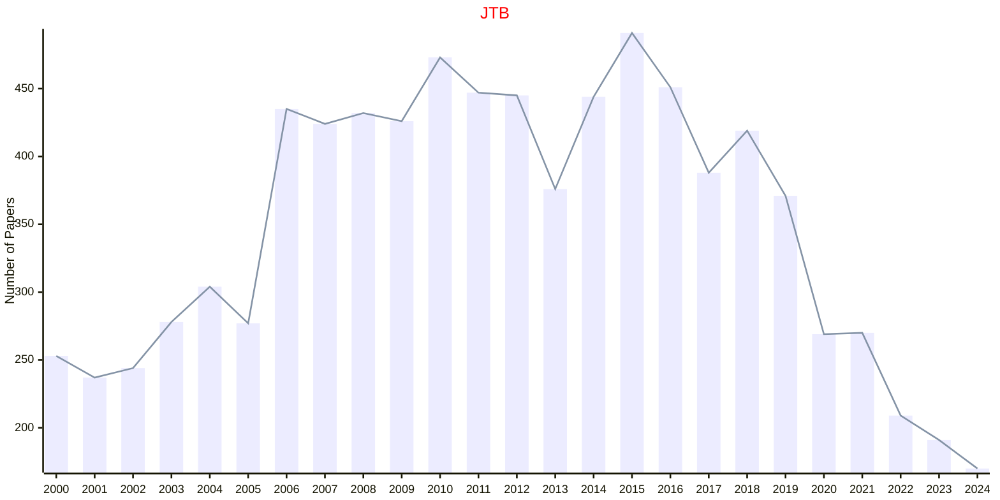
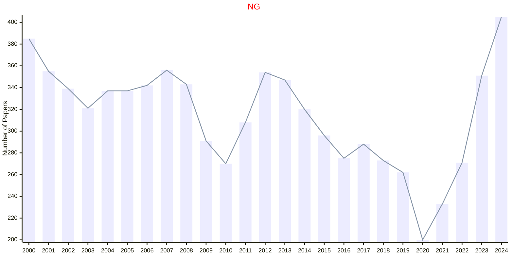
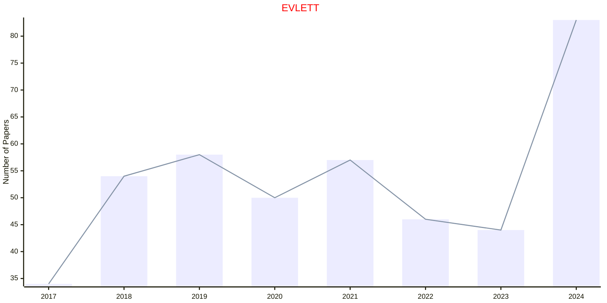
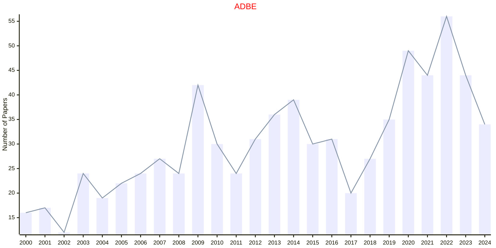
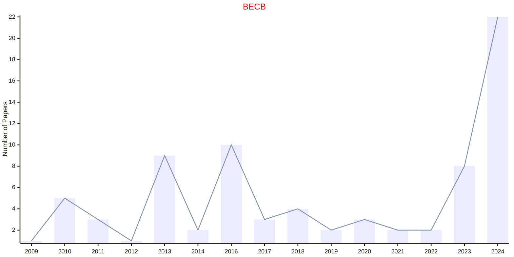
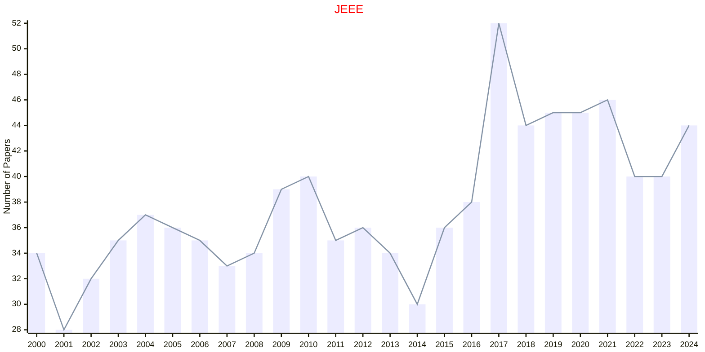

# Biology

## SSIGNAL

|Publishers|Full/Homepage|Abbr/About|Acronym/Issues|Period/DBLP|Top/Early|CCF|CAS|JCR|IF|Keywords/Google|
|-         |-            |-         |-             |-          |-        |-  |-  |-  |- |-              |
|[AAAS](https://www.science.org/)|[Science Signaling](https://www.science.org/journal/signaling)|[Sci. Signal.](https://www.science.org/content/page/science-signaling-information)|[SSIGNAL](https://www.science.org/loi/signaling)|1999 -|True||1|Q1|7.3|[Cellular Signaling](https://www.google.com/search?q=Cellular+Signaling)|

## JTB

|Publishers|Full/Homepage|Abbr/About|Acronym/Issues|Period/DBLP|Top/Early|CCF|CAS|JCR|IF|Keywords/Google|
|-         |-            |-         |-             |-          |-        |-  |-  |-  |- |-              |
|[ELSEVIER](https://www.sciencedirect.com/)|[Journal of Theoretical Biology](https://www.sciencedirect.com/journal/journal-of-theoretical-biology)|[J. Theor. Biol](https://www.sciencedirect.com/journal/journal-of-theoretical-biology/about/aims-and-scope)|[JTB](https://www.sciencedirect.com/journal/journal-of-theoretical-biology/issues)|1961 -|False||4|Q2|1.9|[Theoretical Biology](https://www.google.com/search?q=Theoretical+Biology)|

## NG

|Publishers|Full/Homepage|Abbr/About|Acronym/Issues|Period/DBLP|Top/Early|CCF|CAS|JCR|IF|Keywords/Google|
|-         |-            |-         |-             |-          |-        |-  |-  |-  |- |-              |
|[NATURE](https://www.nature.com/)|[Nature Genetics](https://www.nature.com/ng)|[Nat. Genet.](https://www.nature.com/ng/aims)|[NG](https://www.nature.com/ng/volumes)|1992 -|True||1|Q1|37.4|[Biology](https://www.google.com/search?q=Biology)|

## EVLETT

|Publishers|Full/Homepage|Abbr/About|Acronym/Issues|Period/DBLP|Top/Early|CCF|CAS|JCR|IF|Keywords/Google|
|-         |-            |-         |-             |-          |-        |-  |-  |-  |- |-              |
|[OXFORD](https://academic.oup.com/)|[Evolution Letters](https://academic.oup.com/evlett)|[Evol. Lett.](https://academic.oup.com/evlett/pages/about)|[EVLETT](https://academic.oup.com/evlett/issue)|2017 -|True||1|Q1|4.5|[Evolutionary Biology](https://www.google.com/search?q=Evolutionary+Biology)|

## ADBE

|Publishers|Full/Homepage|Abbr/About|Acronym/Issues|Period/DBLP|Top/Early|CCF|CAS|JCR|IF|Keywords/Google|
|-         |-            |-         |-             |-          |-        |-  |-  |-  |- |-              |
|[SAGE](https://www.sagepub.com/)|[Adaptive Behavior](https://journals.sagepub.com/home/adba)|[Adaptive Behavior](https://journals.sagepub.com/overview-metric/ADB?)|[ADBE](https://journals.sagepub.com/loi/adba)|1992 -|False||4|Q4|1.5|[Artificial Systems](https://www.google.com/search?q=Artificial+Systems)|

## BECB

|Publishers|Full/Homepage|Abbr/About|Acronym/Issues|Period/DBLP|Top/Early|CCF|CAS|JCR|IF|Keywords/Google|
|-         |-            |-         |-             |-          |-        |-  |-  |-  |- |-              |
|[SAGE](https://www.sagepub.com/)|[Biomedical Engineering and Computational Biology](https://journals.sagepub.com/home/beca)|[Biomed. Eng. Comput. Biol.](https://journals.sagepub.com/overview-metric/BEC?)|[BECB](https://journals.sagepub.com/loi/beca)|2009 -|False||||3.8|[Biomedical Engineering](https://www.google.com/search?q=Biomedical+Engineering); [Computational Biology](https://www.google.com/search?q=Computational+Biology)|

## JEEE

|Publishers|Full/Homepage|Abbr/About|Acronym/Issues|Period/DBLP|Top/Early|CCF|CAS|JCR|IF|Keywords/Google|
|-         |-            |-         |-             |-          |-        |-  |-  |-  |- |-              |
|[TAYLOR](https://www.tandfonline.com/)|[Ethology Ecology And Evolution](https://www.tandfonline.com/journals/teee20)|[Ethol. Ecol. Evol.](https://www.tandfonline.com/journals/teee20/about-this-journal#aims-and-scope)|[JEEE](https://www.tandfonline.com/loi/teee20)|1967 -|False||4|Q3|1.3|[Animal behaviour](https://www.google.com/search?q=Animal+behaviour)|

