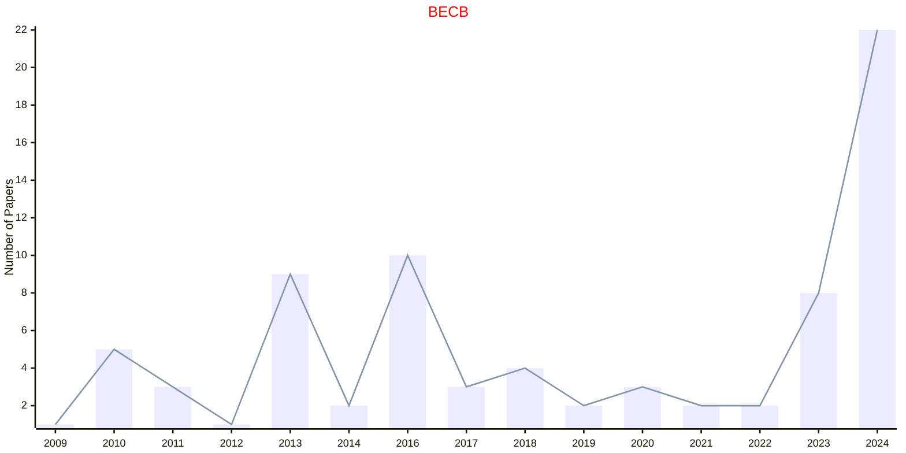

# Biomedical Engineering

## BECB

|Publishers|Full/Homepage|Abbr/About|Acronym/Issues|Period/DBLP|Top/Early|CCF|CAS|JCR|IF|Keywords/Google|
|-         |-            |-         |-             |-          |-        |-  |-  |-  |- |-              |
|[SAGE](https://www.sagepub.com/)|[Biomedical Engineering and Computational Biology](https://journals.sagepub.com/home/beca)|[Biomed. Eng. Comput. Biol.](https://journals.sagepub.com/overview-metric/BEC?)|[BECB](https://journals.sagepub.com/loi/beca)|2009 -|False||||3.8|[Biomedical Engineering](https://www.google.com/search?q=Biomedical+Engineering); [Computational Biology](https://www.google.com/search?q=Computational+Biology)|

