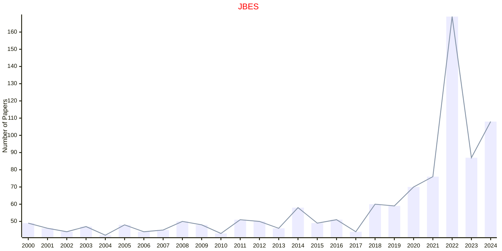

# Business and Economic

## JBES

|Publishers|Full/Homepage|Abbr/About|Acronym/Issues|Period/DBLP|Top/Early|CCF|CAS|JCR|IF|Keywords/Google|
|-         |-            |-         |-             |-          |-        |-  |-  |-  |- |-              |
|[TAYLOR](https://www.tandfonline.com/)|[Journal of Business & Economic Statistics](https://www.tandfonline.com/journals/ubes20)|[J. Busin. Econ. Stat.](https://www.tandfonline.com/journals/ubes20/about-this-journal#aims-and-scope)|[JBES](https://www.tandfonline.com/loi/ubes20)|1983 -|False||2|Q1|5.1|[Applied Statistics](https://www.google.com/search?q=Applied+Statistics); [Business and Economic](https://www.google.com/search?q=Business+and+Economic)|

