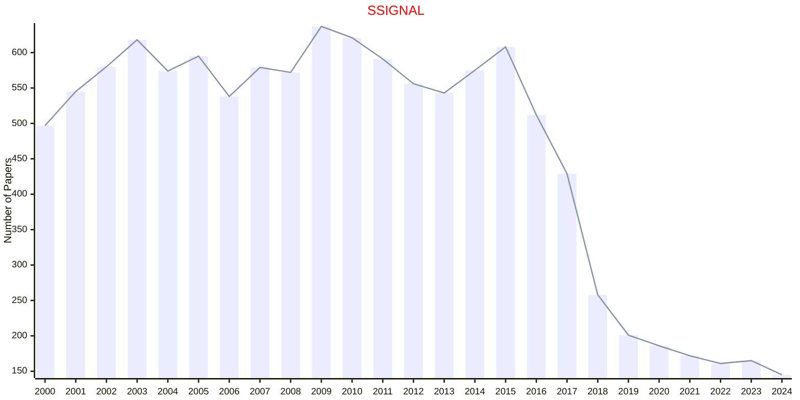

# Cellular Signaling

## SSIGNAL

|Publishers|Full/Homepage|Abbr/About|Acronym/Issues|Period/DBLP|Top/Early|CCF|CAS|JCR|IF|Keywords/Google|
|-         |-            |-         |-             |-          |-        |-  |-  |-  |- |-              |
|[AAAS](https://www.science.org/)|[Science Signaling](https://www.science.org/journal/signaling)|[Sci. Signal.](https://www.science.org/content/page/science-signaling-information)|[SSIGNAL](https://www.science.org/loi/signaling)|1999 -|True||1|Q1|7.3|[Cellular Signaling](https://www.google.com/search?q=Cellular+Signaling)|

