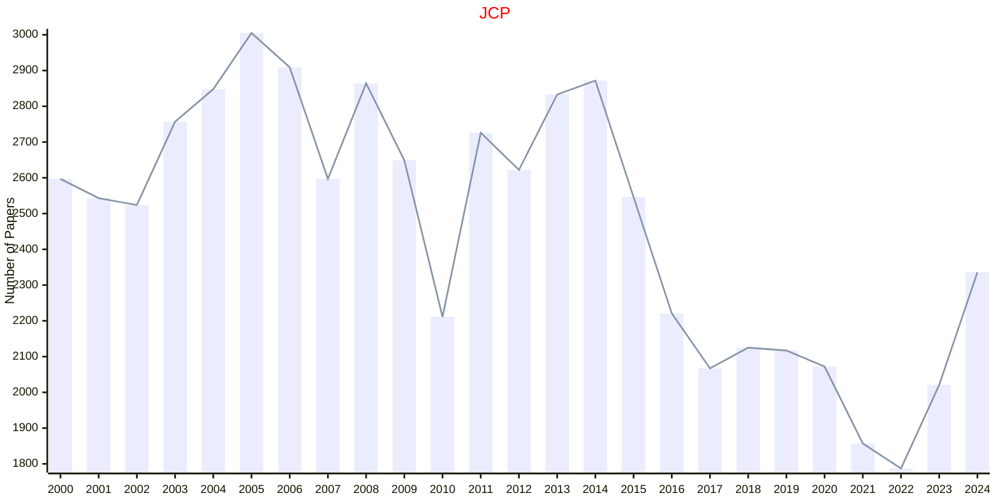

# Chemical Physics

## JCP

|Publishers|Full/Homepage|Abbr/About|Acronym/Issues|Period/DBLP|Top/Early|CCF|CAS|JCR|IF|Keywords/Google|
|-         |-            |-         |-             |-          |-        |-  |-  |-  |- |-              |
|[AIP](https://pubs.aip.org/)|[Journal of Chemical Physics](https://aip.scitation.org/journal/jcp)|[J. Chem. Phys.](https://pubs.aip.org/aip/jcp/pages/about)|[JCP](https://pubs.aip.org/aip/jcp/issue)|1933 -|False||2|Q2|3.8|[Chemical Physics](https://www.google.com/search?q=Chemical+Physics)|

