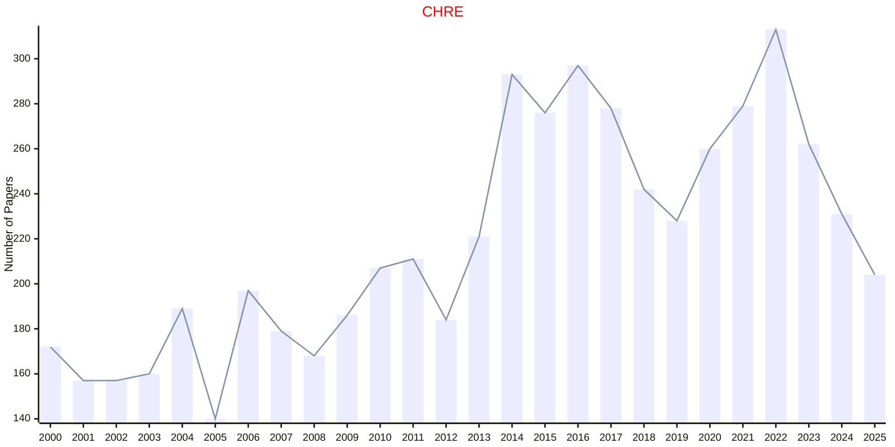
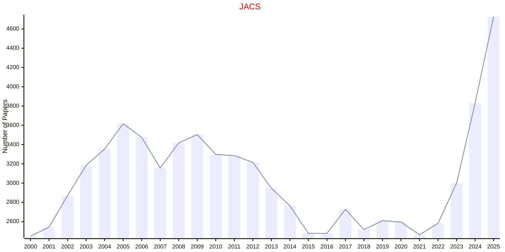
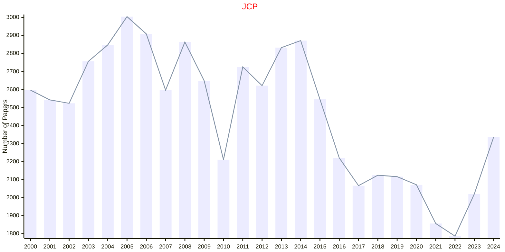
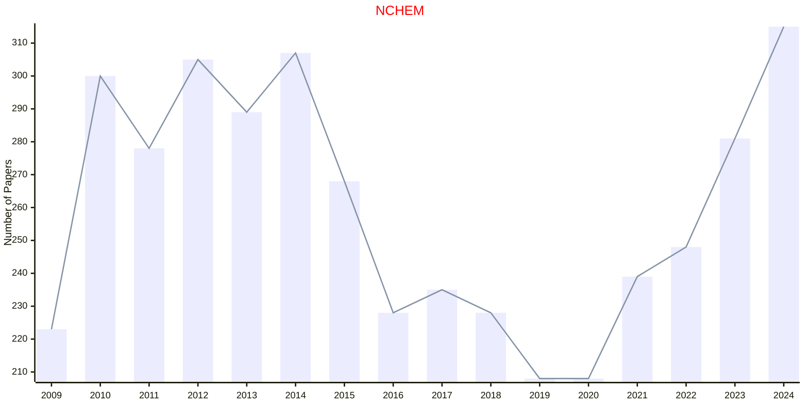
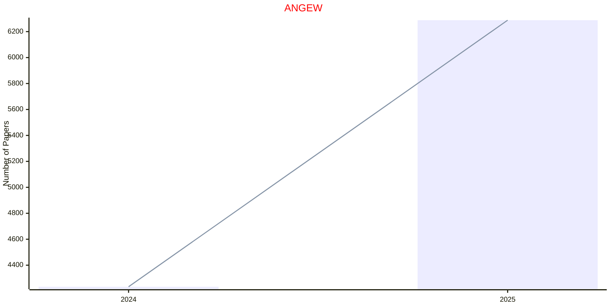
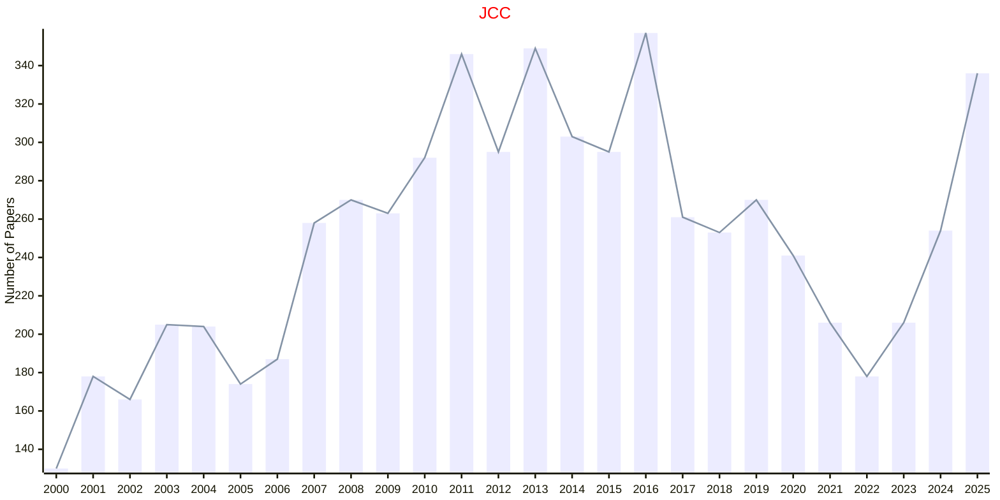

# Chemistry

## CHRE

|Publishers|Full/Homepage|Abbr/About|Acronym/Issues|Period/DBLP|Top/Early|CCF|CAS|JCR|IF|Keywords/Google|
|-         |-            |-         |-             |-          |-        |-  |-  |-  |- |-              |
|[ACS](https://www.acs.org/)|[Chemical Reviews](https://pubs.acs.org/journal/chreay)|[Chem. Rev.](https://pubs.acs.org/page/chreay/about.html)|[CHRE](https://pubs.acs.org/loi/chreay)|1924 -|True||1|Q1|67.5|[Chemical Reviews](https://www.google.com/search?q=Chemical+Reviews); [Chemistry](https://www.google.com/search?q=Chemistry)|

## JACS

|Publishers|Full/Homepage|Abbr/About|Acronym/Issues|Period/DBLP|Top/Early|CCF|CAS|JCR|IF|Keywords/Google|
|-         |-            |-         |-             |-          |-        |-  |-  |-  |- |-              |
|[ACS](https://www.acs.org/)|[Journal of the American Chemical Society](https://pubs.acs.org/journal/jacsat)|[J. Am. Chem. Soc.](https://pubs.acs.org/page/jacsat/about.html)|[JACS](https://pubs.acs.org/loi/jacsat)|1879 -|True||1|Q1|15.6|[Chemistry](https://www.google.com/search?q=Chemistry)|

## JCP

|Publishers|Full/Homepage|Abbr/About|Acronym/Issues|Period/DBLP|Top/Early|CCF|CAS|JCR|IF|Keywords/Google|
|-         |-            |-         |-             |-          |-        |-  |-  |-  |- |-              |
|[AIP](https://pubs.aip.org/)|[Journal of Chemical Physics](https://aip.scitation.org/journal/jcp)|[J. Chem. Phys.](https://pubs.aip.org/aip/jcp/pages/about)|[JCP](https://pubs.aip.org/aip/jcp/issue)|1933 -|False||2|Q2|3.8|[Chemical Physics](https://www.google.com/search?q=Chemical+Physics)|

## NCHEM

|Publishers|Full/Homepage|Abbr/About|Acronym/Issues|Period/DBLP|Top/Early|CCF|CAS|JCR|IF|Keywords/Google|
|-         |-            |-         |-             |-          |-        |-  |-  |-  |- |-              |
|[NATURE](https://www.nature.com/)|[Nature Chemistry](https://www.nature.com/nchem)|[Nat. Chem.](https://www.nature.com/nchem/aims)|[NCHEM](https://www.nature.com/nchem/volumes)|2009 -|True||1|Q1|22.8|[Chemistry](https://www.google.com/search?q=Chemistry)|

## ANGEW

|Publishers|Full/Homepage|Abbr/About|Acronym/Issues|Period/DBLP|Top/Early|CCF|CAS|JCR|IF|Keywords/Google|
|-         |-            |-         |-             |-          |-        |-  |-  |-  |- |-              |
|[WILEY](https://www.wiley.com/)|[Angewandte Chemie International Edition](https://onlinelibrary.wiley.com/journal/15213773)|[Angew. Chem. Int. Edit.](https://onlinelibrary.wiley.com/page/journal/15213773/homepage/productinformation.html)|[ANGEW](https://onlinelibrary.wiley.com/loi/15213773)|1962 -|True||1|Q1|16.4|[Chemistry](https://www.google.com/search?q=Chemistry)|

## JCC

|Publishers|Full/Homepage|Abbr/About|Acronym/Issues|Period/DBLP|Top/Early|CCF|CAS|JCR|IF|Keywords/Google|
|-         |-            |-         |-             |-          |-        |-  |-  |-  |- |-              |
|[WILEY](https://www.wiley.com/)|[Journal of Computational Chemistry](https://onlinelibrary.wiley.com/journal/1096987x)|[J. Comput. Chem.](https://onlinelibrary.wiley.com/page/journal/1096987x/homepage/productinformation.html)|[JCC](https://onlinelibrary.wiley.com/loi/1096987x)|1980 -|False||3|Q2|4.2|[Computational Chemistry](https://www.google.com/search?q=Computational+Chemistry)|

