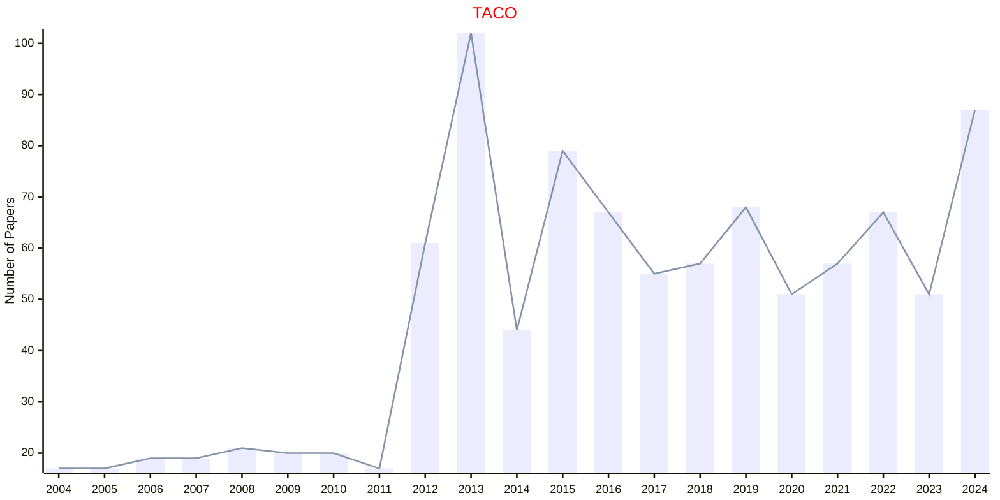

# Code Optimization

## TACO

|Publishers|Full/Homepage|Abbr/About|Acronym/Issues|Period/DBLP|Top/Early|CCF|CAS|JCR|IF|Keywords/Google|
|-         |-            |-         |-             |-          |-        |-  |-  |-  |- |-              |
|[ACM](https://www.acm.org/)|[ACM Transactions on Architecture and Code Optimization](https://dl.acm.org/journal/taco)|[ACM Trans. Archit. Code Optim.](https://dl.acm.org/journal/taco/about)|[TACO](https://dl.acm.org/loi/taco)|[2004 -](https://dblp.org/db/journals/taco/index.html)|False|A|3|Q2|1.9|[Code Optimization](https://www.google.com/search?q=Code+Optimization); [Computer Architecture](https://www.google.com/search?q=Computer+Architecture)|

