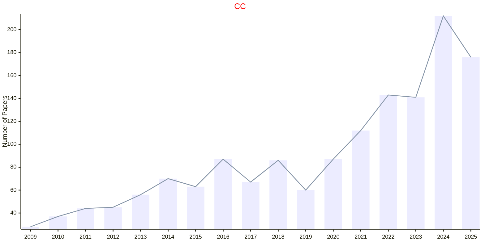

# Cognitive Computation

## CC

|Publishers|Full/Homepage|Abbr/About|Acronym/Issues|Period/DBLP|Top/Early|CCF|CAS|JCR|IF|Keywords/Google|
|-         |-            |-         |-             |-          |-        |-  |-  |-  |- |-              |
|[SPRINGER](https://www.springer.com/)|[Cognitive Computation](https://www.springer.com/journal/12559)|[Cogn. Comput.](https://www.springer.com/journal/12559/aims-and-scope)|[CC](https://link.springer.com/journal/12559/volumes-and-issues)|2009 -|False||3|Q1|4.1|[Cognitive Computation](https://www.google.com/search?q=Cognitive+Computation)|

