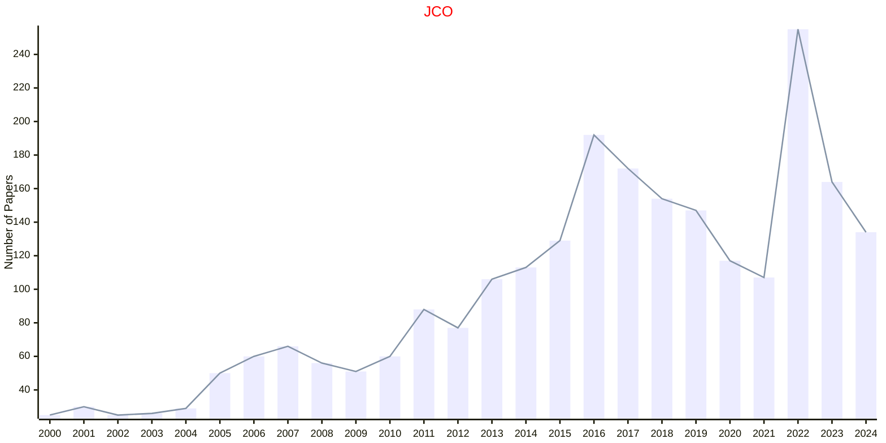

# Combinatorial Optimization

## JCO

|Publishers|Full/Homepage|Abbr/About|Acronym/Issues|Period/DBLP|Top/Early|CCF|CAS|JCR|IF|Keywords/Google|
|-         |-            |-         |-             |-          |-        |-  |-  |-  |- |-              |
|[SPRINGER](https://www.springer.com/)|[Journal of Combinatorial Optimization](https://link.springer.com/journal/10878)|[J. Comb. Optim.](https://link.springer.com/journal/10878/aims-and-scope)|[JCO](https://link.springer.com/journal/10878/volumes-and-issues)|1997 -|False||4|Q2|1.1|[Combinatorial Optimization](https://www.google.com/search?q=Combinatorial+Optimization)|

