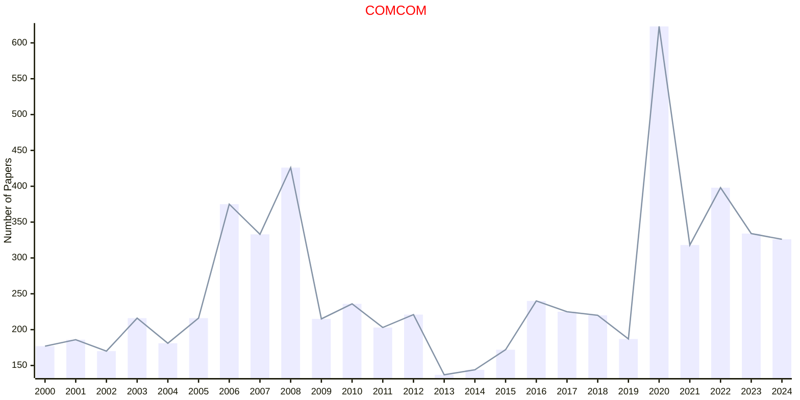

# Communication Networks

## COMCOM

|Publishers|Full/Homepage|Abbr/About|Acronym/Issues|Period/DBLP|Top/Early|CCF|CAS|JCR|IF|Keywords/Google|
|-         |-            |-         |-             |-          |-        |-  |-  |-  |- |-              |
|[ELSEVIER](https://www.sciencedirect.com/)|[Computer Communications](https://www.sciencedirect.com/journal/computer-communications)|[Comput. Commun.](https://www.sciencedirect.com/journal/computer-communications/about/aims-and-scope)|[COMCOM](https://www.sciencedirect.com/journal/computer-communications/issues)|1978 -|False|C|3|Q2|4.6|[Communication Networks](https://www.google.com/search?q=Communication+Networks); [Computational Science](https://www.google.com/search?q=Computational+Science)|

