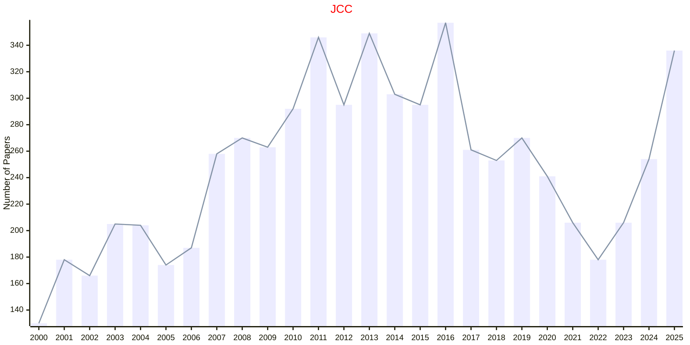

# Computational Chemistry

## JCC

|Publishers|Full/Homepage|Abbr/About|Acronym/Issues|Period/DBLP|Top/Early|CCF|CAS|JCR|IF|Keywords/Google|
|-         |-            |-         |-             |-          |-        |-  |-  |-  |- |-              |
|[WILEY](https://www.wiley.com/)|[Journal of Computational Chemistry](https://onlinelibrary.wiley.com/journal/1096987x)|[J. Comput. Chem.](https://onlinelibrary.wiley.com/page/journal/1096987x/homepage/productinformation.html)|[JCC](https://onlinelibrary.wiley.com/loi/1096987x)|1980 -|False||3|Q2|4.2|[Computational Chemistry](https://www.google.com/search?q=Computational+Chemistry)|

