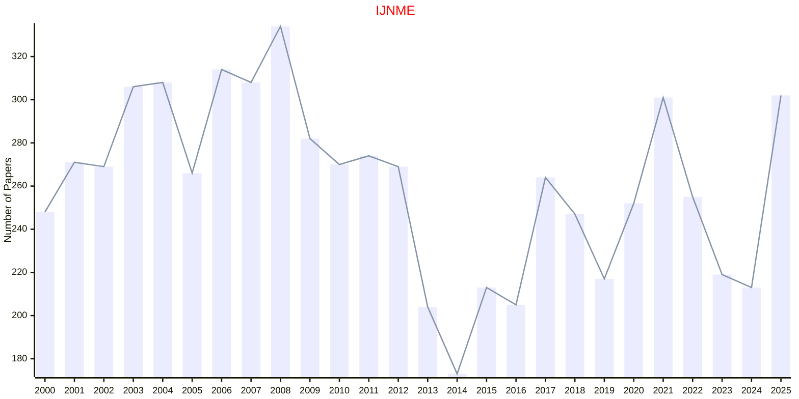

# Computational Engineering

## IJNME

|Publishers|Full/Homepage|Abbr/About|Acronym/Issues|Period/DBLP|Top/Early|CCF|CAS|JCR|IF|Keywords/Google|
|-         |-            |-         |-             |-          |-        |-  |-  |-  |- |-              |
|[WILEY](https://www.wiley.com/)|[International Journal for Numerical Methods in Engineering](https://onlinelibrary.wiley.com/journal/10970207)|[Int. J. Numer. Meth. Eng.](https://onlinelibrary.wiley.com/page/journal/10970207/homepage/productinformation.html)|[IJNME](https://onlinelibrary.wiley.com/loi/10970207)|1969 -|False||3|Q1|2.9|[Computational Engineering](https://www.google.com/search?q=Computational+Engineering)|

