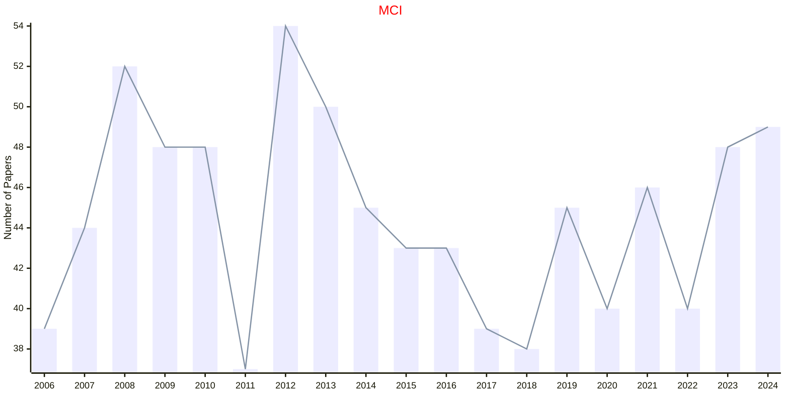
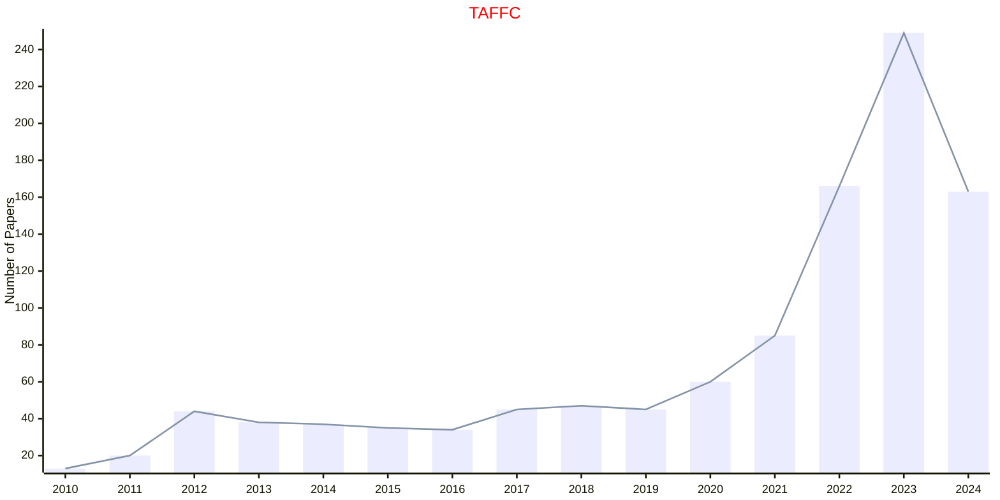
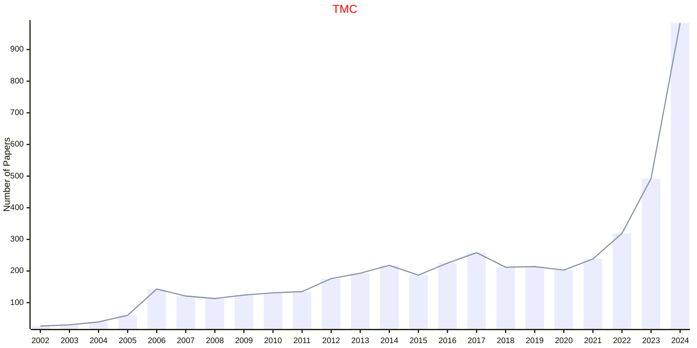
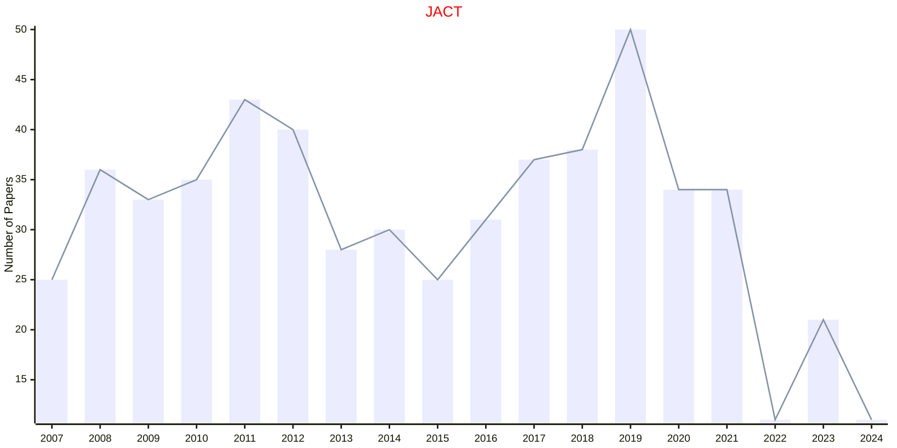
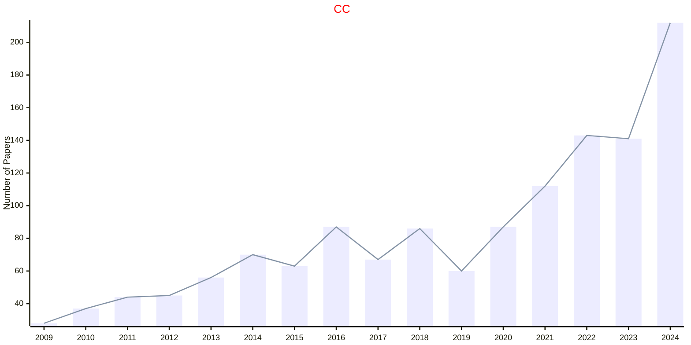
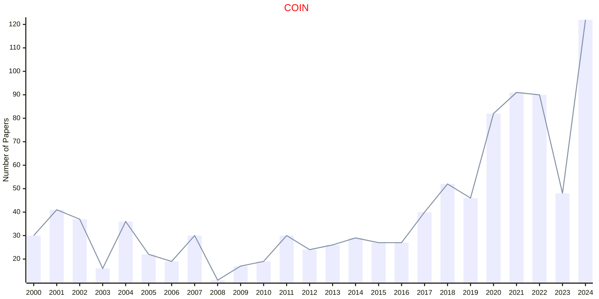
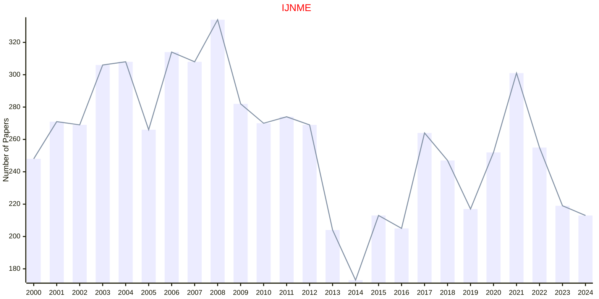
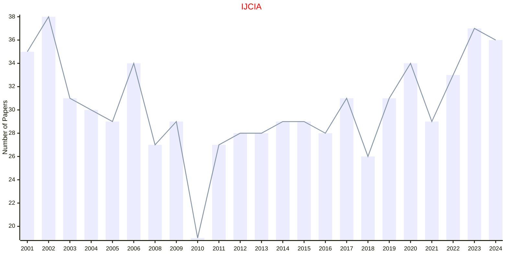

# Computational Intelligence

## MCI

|Publishers|Full/Homepage|Abbr/About|Acronym/Issues|Period/DBLP|Top/Early|CCF|CAS|JCR|IF|Keywords/Google|
|-         |-            |-         |-             |-          |-        |-  |-  |-  |- |-              |
|[IEEE](https://ieeexplore.ieee.org/)|[IEEE Computational Intelligence Magazine](https://ieeexplore.ieee.org/xpl/RecentIssue.jsp?punumber=10207)|[IEEE Comput. Intell. Mag.](https://ieeexplore.ieee.org/xpl/aboutJournal.jsp?punumber=10207)|[MCI](https://ieeexplore.ieee.org/xpl/issues?punumber=10207&isnumber=10844565)|2006 -|False||2|Q1|9.3|[Computational Intelligence](https://www.google.com/search?q=Computational+Intelligence)|

## TAFFC

|Publishers|Full/Homepage|Abbr/About|Acronym/Issues|Period/DBLP|Top/Early|CCF|CAS|JCR|IF|Keywords/Google|
|-         |-            |-         |-             |-          |-        |-  |-  |-  |- |-              |
|[IEEE](https://ieeexplore.ieee.org/)|[IEEE Transactions on Affective Computing](https://ieeexplore.ieee.org/xpl/RecentIssue.jsp?punumber=5165369)|[IEEE Trans. Affect. Comput.](https://ieeexplore.ieee.org/xpl/aboutJournal.jsp?punumber=5165369)|[TAFFC](https://xplorestaging.ieee.org/xpl/issues?punumber=5165369&isnumber=10542474)|2010 -|[True](https://xplorestaging.ieee.org/xpl/tocresult.jsp?isnumber=5520654)|B|1|Q1|10.2|[Affective Computing](https://www.google.com/search?q=Affective+Computing)|

## TMC

|Publishers|Full/Homepage|Abbr/About|Acronym/Issues|Period/DBLP|Top/Early|CCF|CAS|JCR|IF|Keywords/Google|
|-         |-            |-         |-             |-          |-        |-  |-  |-  |- |-              |
|[IEEE](https://ieeexplore.ieee.org/)|[IEEE Transactions on Mobile Computing](https://ieeexplore.ieee.org/xpl/RecentIssue.jsp?punumber=7755)|[IEEE Trans. Mobile Comput.](https://ieeexplore.ieee.org/xpl/aboutJournal.jsp?punumber=7755)|[TMC](https://ieeexplore.ieee.org/xpl/issues?punumber=7755&isnumber=10627925)|2002 -|[True](https://ieeexplore.ieee.org/xpl/tocresult.jsp?isnumber=4358975)|A|1|Q1|8.1|[Mobile Computing](https://www.google.com/search?q=Mobile+Computing)|

## JACT

|Publishers|Full/Homepage|Abbr/About|Acronym/Issues|Period/DBLP|Top/Early|CCF|CAS|JCR|IF|Keywords/Google|
|-         |-            |-         |-             |-          |-        |-  |-  |-  |- |-              |
|[SAGE](https://www.sagepub.com/)|[Journal of Algorithms & Computational Technology](https://journals.sagepub.com/home/acta)|[J. Algo. Comput. Technol.](https://journals.sagepub.com/overview-metric/ACT?)|[JACT](https://journals.sagepub.com/loi/acta)|2007 -|False||4||1.2|[Computational Technology](https://www.google.com/search?q=Computational+Technology)|

## CC

|Publishers|Full/Homepage|Abbr/About|Acronym/Issues|Period/DBLP|Top/Early|CCF|CAS|JCR|IF|Keywords/Google|
|-         |-            |-         |-             |-          |-        |-  |-  |-  |- |-              |
|[SPRINGER](https://www.springer.com/)|[Cognitive Computation](https://www.springer.com/journal/12559)|[Cogn. Comput.](https://www.springer.com/journal/12559/aims-and-scope)|[CC](https://link.springer.com/journal/12559/volumes-and-issues)|2009 -|False||3|Q1|4.1|[Cognitive Computation](https://www.google.com/search?q=Cognitive+Computation)|

## COIN

|Publishers|Full/Homepage|Abbr/About|Acronym/Issues|Period/DBLP|Top/Early|CCF|CAS|JCR|IF|Keywords/Google|
|-         |-            |-         |-             |-          |-        |-  |-  |-  |- |-              |
|[WILEY](https://www.wiley.com/)|[Computational Intelligence](https://onlinelibrary.wiley.com/journal/14678640)|[Comput. Intell.](https://onlinelibrary.wiley.com/page/journal/14678640/homepage/productinformation.html)|[COIN](https://onlinelibrary.wiley.com/loi/14678640)|1985 -|False|C|4|Q3|2.1|[Computational Intelligence](https://www.google.com/search?q=Computational+Intelligence)|

## IJNME

|Publishers|Full/Homepage|Abbr/About|Acronym/Issues|Period/DBLP|Top/Early|CCF|CAS|JCR|IF|Keywords/Google|
|-         |-            |-         |-             |-          |-        |-  |-  |-  |- |-              |
|[WILEY](https://www.wiley.com/)|[International Journal for Numerical Methods in Engineering](https://onlinelibrary.wiley.com/journal/10970207)|[Int. J. Numer. Meth. Eng.](https://onlinelibrary.wiley.com/page/journal/10970207/homepage/productinformation.html)|[IJNME](https://onlinelibrary.wiley.com/loi/10970207)|1969 -|False||3|Q1|2.9|[Computational Engineering](https://www.google.com/search?q=Computational+Engineering)|

## IJCIA

|Publishers|Full/Homepage|Abbr/About|Acronym/Issues|Period/DBLP|Top/Early|CCF|CAS|JCR|IF|Keywords/Google|
|-         |-            |-         |-             |-          |-        |-  |-  |-  |- |-              |
|[WS](https://worldscientific.com/)|[International Journal of Computational Intelligence and Applications](https://worldscientific.com/worldscinet/ijcia)|[Int. J. Comput. Intell. Appl.](https://worldscientific.com/page/ijcia/aims-scope)|[IJCIA](https://worldscientific.com/loi/ijcia)|2001 -|False|C|4||1.5|[Computational Intelligence](https://www.google.com/search?q=Computational+Intelligence); [Evolutionary Computation](https://www.google.com/search?q=Evolutionary+Computation)|

