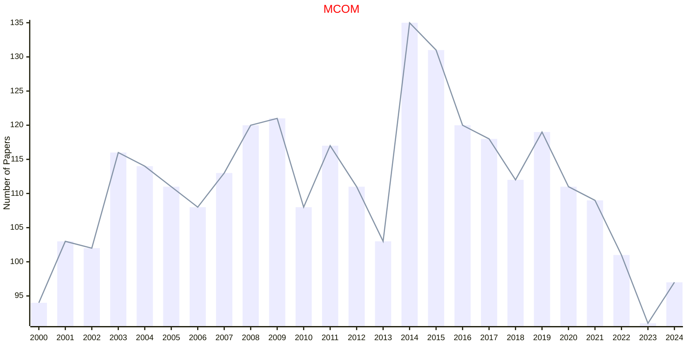
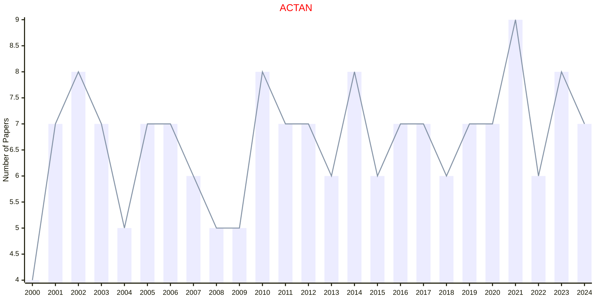
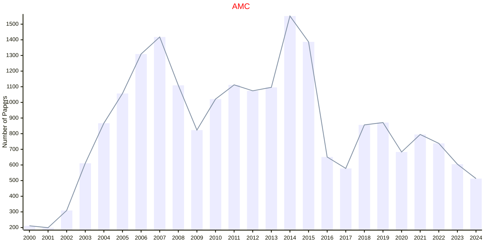
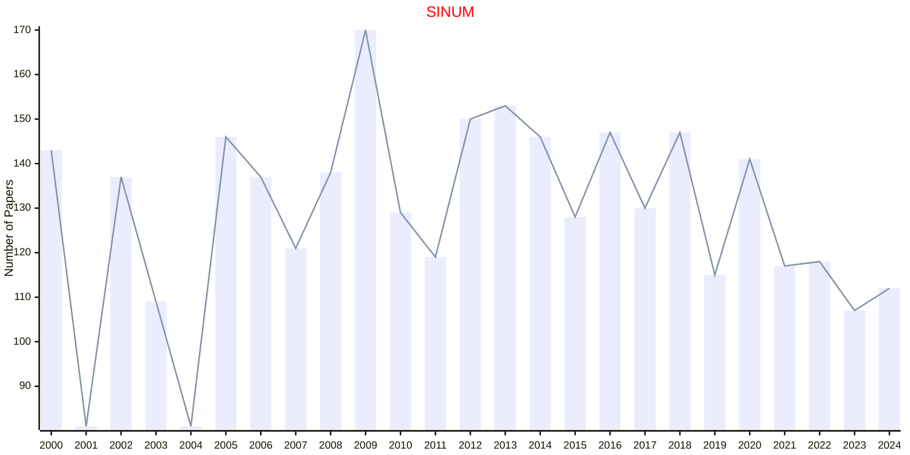
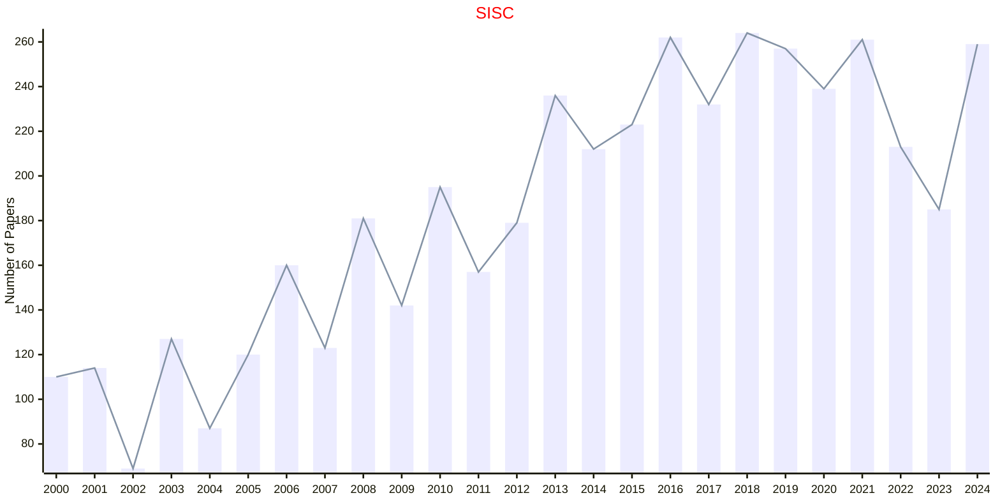
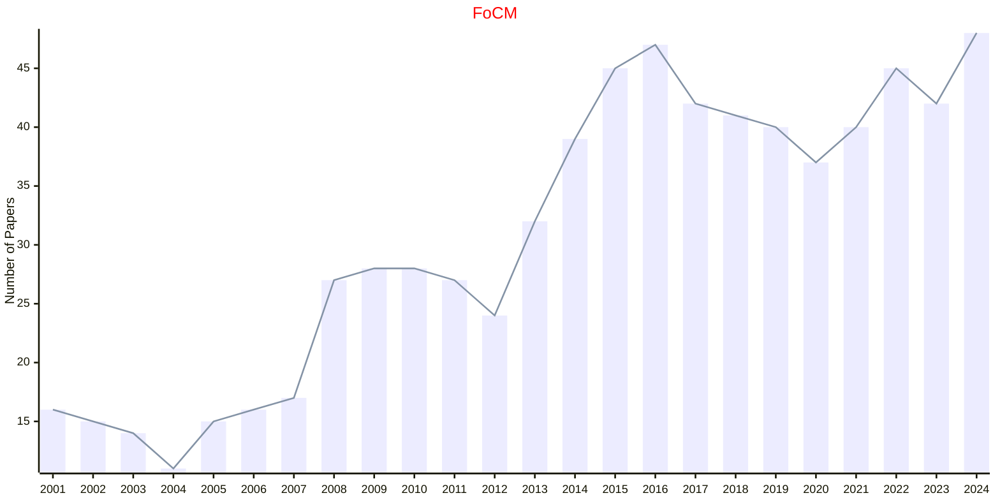

# Computational Mathematics

## MCOM

|Publishers|Full/Homepage|Abbr/About|Acronym/Issues|Period/DBLP|Top/Early|CCF|CAS|JCR|IF|Keywords/Google|
|-         |-            |-         |-             |-          |-        |-  |-  |-  |- |-              |
|[AMS](https://www.ams.org/)|[Mathematics of Computation](https://www.ams.org/journals/mcom)|[Math. Comput.](https://www.ams.org/publications/journals/journalsframework/aboutmcom)|[MCOM](https://www.ams.org/journals/mcom/all_issues.html?active=allissues)|1943 -|True||1|Q1|2.2|[Computational Mathematics](https://www.google.com/search?q=Computational+Mathematics)|

## ACTAN

|Publishers|Full/Homepage|Abbr/About|Acronym/Issues|Period/DBLP|Top/Early|CCF|CAS|JCR|IF|Keywords/Google|
|-         |-            |-         |-             |-          |-        |-  |-  |-  |- |-              |
|[CAMBRIDGE](https://www.cambridge.org/universitypress)|[Acta Numerica](https://www.cambridge.org/core/journals/acta-numerica)|[Acta Numer.](https://www.cambridge.org/core/journals/acta-numerica/information/about-this-journal)|[ACTAN](https://www.cambridge.org/core/journals/acta-numerica/all-issues)|1992 -|True||1|Q1|22.3|[Computational Mathematics](https://www.google.com/search?q=Computational+Mathematics)|

## AMC

|Publishers|Full/Homepage|Abbr/About|Acronym/Issues|Period/DBLP|Top/Early|CCF|CAS|JCR|IF|Keywords/Google|
|-         |-            |-         |-             |-          |-        |-  |-  |-  |- |-              |
|[ELSEVIER](https://www.sciencedirect.com/)|[Applied Mathematics and Computation](https://www.sciencedirect.com/journal/applied-mathematics-and-computation)|[Appl. Math. Comput.](https://www.sciencedirect.com/journal/applied-mathematics-and-computation/about/aims-and-scope)|[AMC](https://www.sciencedirect.com/journal/applied-mathematics-and-computation/issues)|1975 -|False||2|Q1|3.2|[Applied Mathematics](https://www.google.com/search?q=Applied+Mathematics); [Computational Mathematics](https://www.google.com/search?q=Computational+Mathematics)|

## SINUM

|Publishers|Full/Homepage|Abbr/About|Acronym/Issues|Period/DBLP|Top/Early|CCF|CAS|JCR|IF|Keywords/Google|
|-         |-            |-         |-             |-          |-        |-  |-  |-  |- |-              |
|[SIAM](https://epubs.siam.org)|[SIAM Journal on Numerical Analysis](https://epubs.siam.org/journal/sjnaam)|[SIAM J. Numer. Anal.](https://epubs.siam.org/journal/sinum/about)|[SINUM](https://epubs.siam.org/loi/sjnaam)|1964 -|True||1|Q1|3.4|[Computational Mathematics](https://www.google.com/search?q=Computational+Mathematics)|

## SISC

|Publishers|Full/Homepage|Abbr/About|Acronym/Issues|Period/DBLP|Top/Early|CCF|CAS|JCR|IF|Keywords/Google|
|-         |-            |-         |-             |-          |-        |-  |-  |-  |- |-              |
|[SIAM](https://epubs.siam.org)|[SIAM Journal on Scientific Computing](https://epubs.siam.org/journal/sjoce3)|[SIAM J. Sci. Comput.](https://epubs.siam.org/journal/sisc/about)|[SISC](https://epubs.siam.org/loi/sjoce3)|1980 -|True||2|Q1|3.7|[Computational Mathematics](https://www.google.com/search?q=Computational+Mathematics)|

## FoCM

|Publishers|Full/Homepage|Abbr/About|Acronym/Issues|Period/DBLP|Top/Early|CCF|CAS|JCR|IF|Keywords/Google|
|-         |-            |-         |-             |-          |-        |-  |-  |-  |- |-              |
|[SPRINGER](https://www.springer.com/)|[Foundations of Computational Mathematics](https://www.springer.com/journal/10208)|[Found. Comput. Math.](https://www.springer.com/journal/10208/aims-and-scope)|[FoCM](https://link.springer.com/journal/10208/volumes-and-issues)|2001 -|True||1|Q1|3.3|[Computational Mathematics](https://www.google.com/search?q=Computational+Mathematics)|

