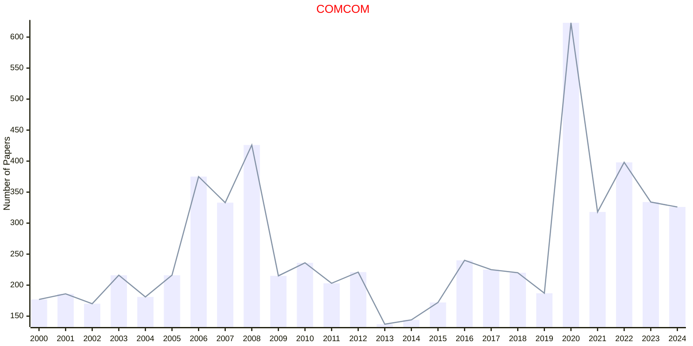
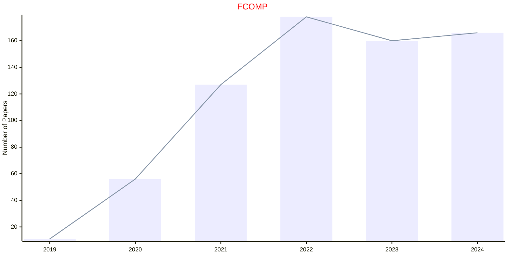
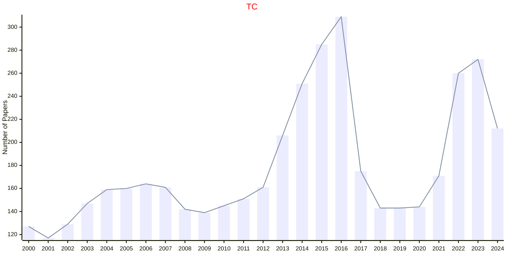
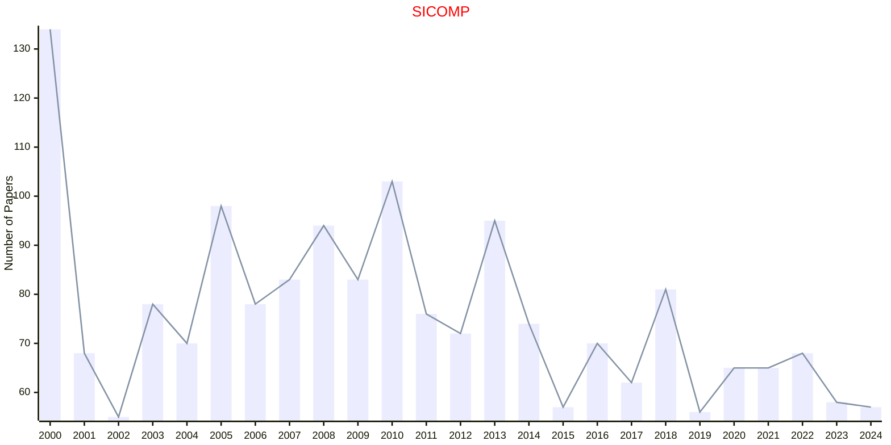

# Computational Science

## COMCOM

|Publishers|Full/Homepage|Abbr/About|Acronym/Issues|Period/DBLP|Top/Early|CCF|CAS|JCR|IF|Keywords/Google|
|-         |-            |-         |-             |-          |-        |-  |-  |-  |- |-              |
|[ELSEVIER](https://www.sciencedirect.com/)|[Computer Communications](https://www.sciencedirect.com/journal/computer-communications)|[Comput. Commun.](https://www.sciencedirect.com/journal/computer-communications/about/aims-and-scope)|[COMCOM](https://www.sciencedirect.com/journal/computer-communications/issues)|1978 -|False|C|3|Q2|4.6|[Communication Networks](https://www.google.com/search?q=Communication+Networks); [Computational Science](https://www.google.com/search?q=Computational+Science)|

## FCOMP

|Publishers|Full/Homepage|Abbr/About|Acronym/Issues|Period/DBLP|Top/Early|CCF|CAS|JCR|IF|Keywords/Google|
|-         |-            |-         |-             |-          |-        |-  |-  |-  |- |-              |
|[FRONTIERS](https://www.frontiersin.org/)|[Frontiers in Computer Science](https://www.frontiersin.org/journals/computer-science)|[Front. Comput. Sci.](https://www.frontiersin.org/journals/computer-science/about)|[FCOMP](https://www.frontiersin.org/journals/computer-science/volumes)|2019 -|False||4||3.2|[Computational Science](https://www.google.com/search?q=Computational+Science)|

## TC

|Publishers|Full/Homepage|Abbr/About|Acronym/Issues|Period/DBLP|Top/Early|CCF|CAS|JCR|IF|Keywords/Google|
|-         |-            |-         |-             |-          |-        |-  |-  |-  |- |-              |
|[IEEE](https://ieeexplore.ieee.org/)|[IEEE Transactions on Computers](https://ieeexplore.ieee.org/xpl/RecentIssue.jsp?punumber=12)|[IEEE Trans. Comput.](https://ieeexplore.ieee.org/xpl/aboutJournal.jsp?punumber=12)|[TC](https://ieeexplore.ieee.org/xpl/issues?punumber=12&isnumber=10243393)|1968 -|[False](https://ieeexplore.ieee.org/xpl/tocresult.jsp?isnumber=4358213)|A|2|Q2|3.7|[Computational Science](https://www.google.com/search?q=Computational+Science)|

## SICOMP

|Publishers|Full/Homepage|Abbr/About|Acronym/Issues|Period/DBLP|Top/Early|CCF|CAS|JCR|IF|Keywords/Google|
|-         |-            |-         |-             |-          |-        |-  |-  |-  |- |-              |
|[SIAM](https://epubs.siam.org)|[SIAM Journal on Computing](https://epubs.siam.org/journal/smjcat)|[SIAM J. Comput.](https://epubs.siam.org/journal/sicomp/about)|[SICOMP](https://epubs.siam.org/loi/smjcat)|1972 -|False|A|3|Q2|2.1|[Computational Science](https://www.google.com/search?q=Computational+Science); [Mathematics](https://www.google.com/search?q=Mathematics)|

