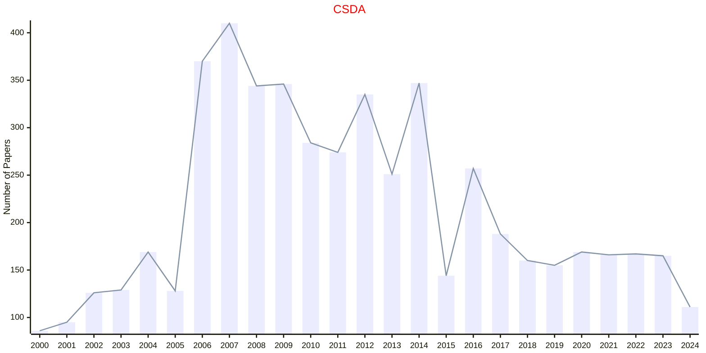
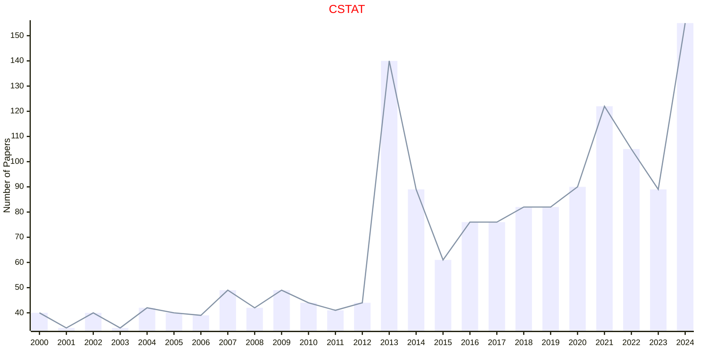

# Computational Statistics

## CSDA

|Publishers|Full/Homepage|Abbr/About|Acronym/Issues|Period/DBLP|Top/Early|CCF|CAS|JCR|IF|Keywords/Google|
|-         |-            |-         |-             |-          |-        |-  |-  |-  |- |-              |
|[ELSEVIER](https://www.sciencedirect.com/)|[Computational Statistics & Data Analysis](https://www.sciencedirect.com/journal/computational-statistics-and-data-analysis)|[Comput. Stat. Data Anal.](https://www.sciencedirect.com/journal/computational-statistics-and-data-analysis/about/aims-and-scope)|[CSDA](https://www.sciencedirect.com/journal/computational-statistics-and-data-analysis/issues)|1983 -|False||3|Q2|1.9|[Computational Statistics](https://www.google.com/search?q=Computational+Statistics); [Data Analysis](https://www.google.com/search?q=Data+Analysis)|

## CSTAT

|Publishers|Full/Homepage|Abbr/About|Acronym/Issues|Period/DBLP|Top/Early|CCF|CAS|JCR|IF|Keywords/Google|
|-         |-            |-         |-             |-          |-        |-  |-  |-  |- |-              |
|[SPRINGER](https://www.springer.com/)|[Computational Statistics](https://link.springer.com/journal/180)|[Comput. Stat.](https://www.springer.com/journal/180/aims-and-scope)|[CSTAT](https://link.springer.com/journal/180/volumes-and-issues)|1999 -|False|||||[Computational Statistics](https://www.google.com/search?q=Computational+Statistics)|

## JCGS

|Publishers|Full/Homepage|Abbr/About|Acronym/Issues|Period/DBLP|Top/Early|CCF|CAS|JCR|IF|Keywords/Google|
|-         |-            |-         |-             |-          |-        |-  |-  |-  |- |-              |
|[TAYLOR](https://www.tandfonline.com/)|[Journal of Computational and Graphical Statistics](https://www.tandfonline.com/journals/ucgs20)|[J. Comput. Graph. Stat.](https://www.tandfonline.com/journals/ucgs20/about-this-journal#aims-and-scope)|[JCGS](https://www.tandfonline.com/loi/ucgs20)|1992 -|False|||||[Applied Statistics](https://www.google.com/search?q=Applied+Statistics); [Computational Statistics](https://www.google.com/search?q=Computational+Statistics); [Graphical Statistics](https://www.google.com/search?q=Graphical+Statistics)|

