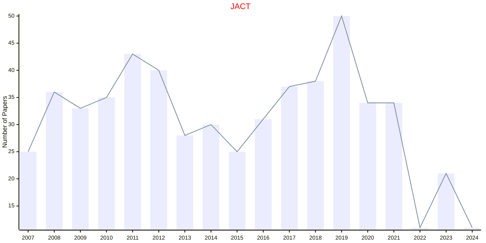

# Computational Technology

## JACT

|Publishers|Full/Homepage|Abbr/About|Acronym/Issues|Period/DBLP|Top/Early|CCF|CAS|JCR|IF|Keywords/Google|
|-         |-            |-         |-             |-          |-        |-  |-  |-  |- |-              |
|[SAGE](https://www.sagepub.com/)|[Journal of Algorithms & Computational Technology](https://journals.sagepub.com/home/acta)|[J. Algo. Comput. Technol.](https://journals.sagepub.com/overview-metric/ACT?)|[JACT](https://journals.sagepub.com/loi/acta)|2007 -|False||4||1.2|[Computational Technology](https://www.google.com/search?q=Computational+Technology)|

