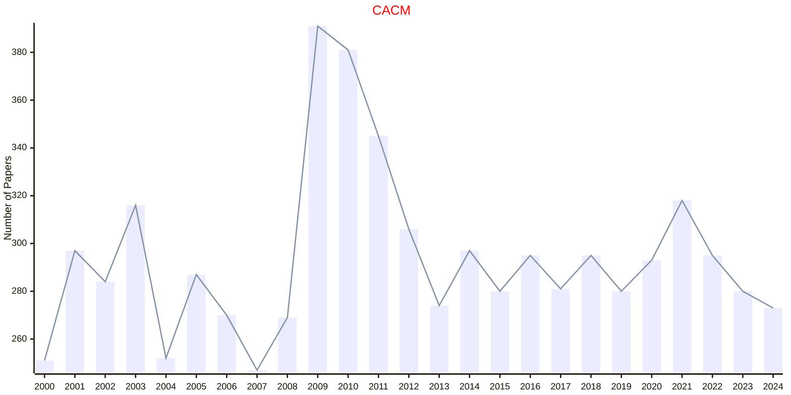
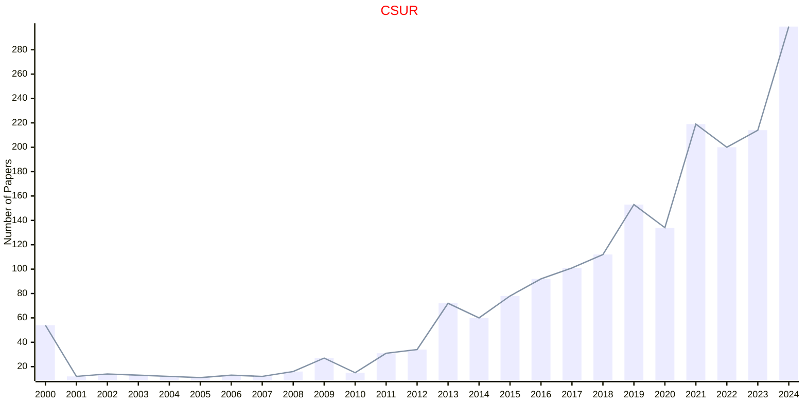
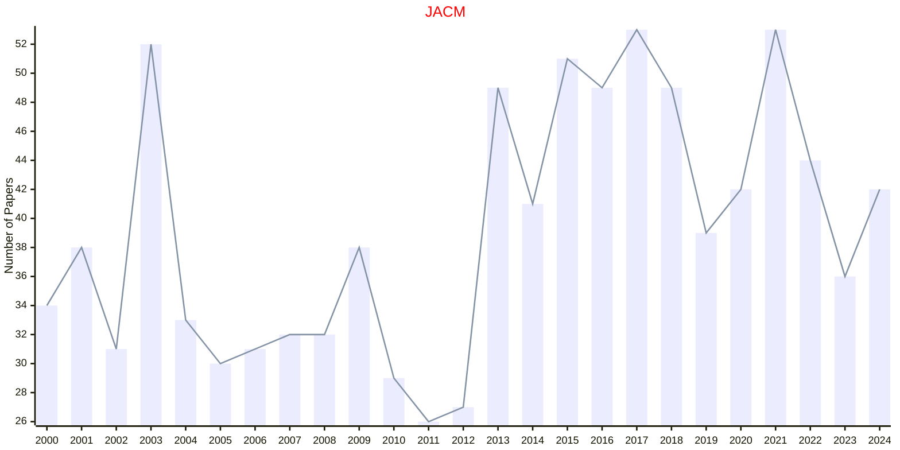
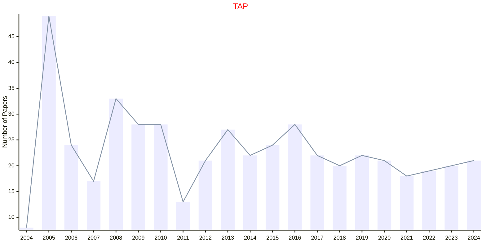
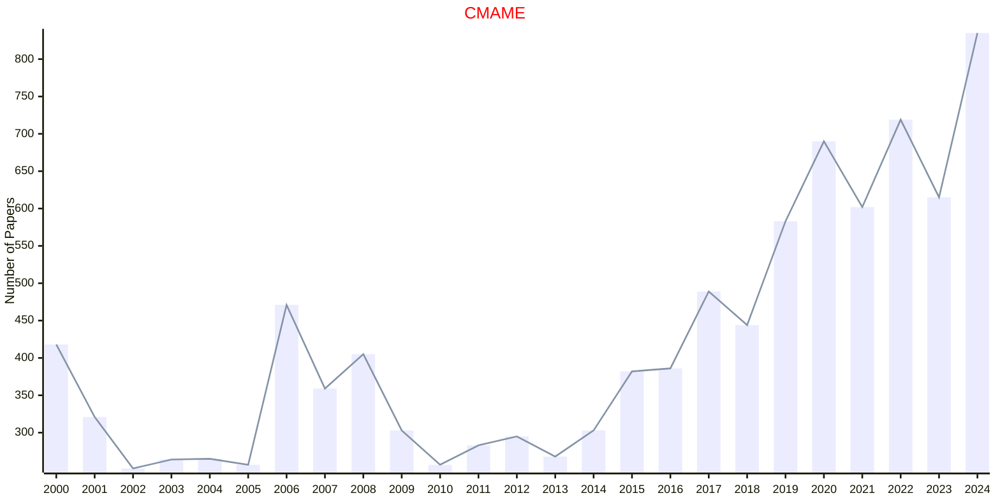
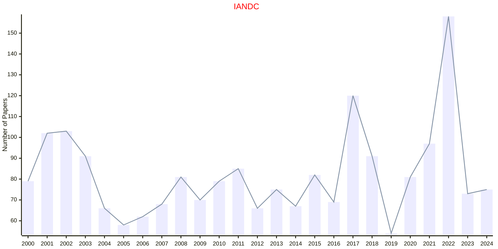
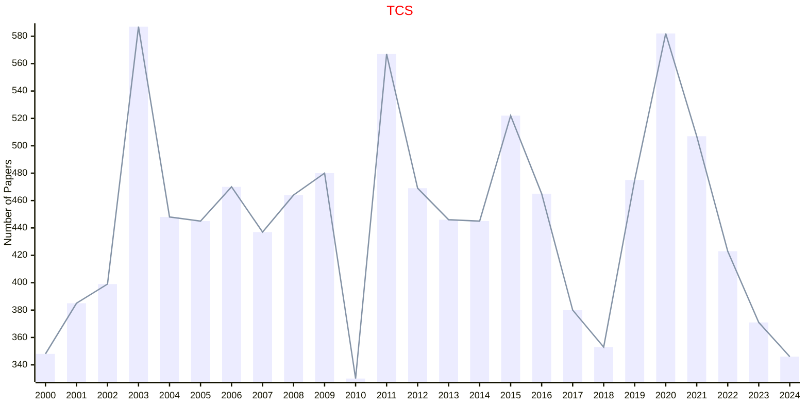
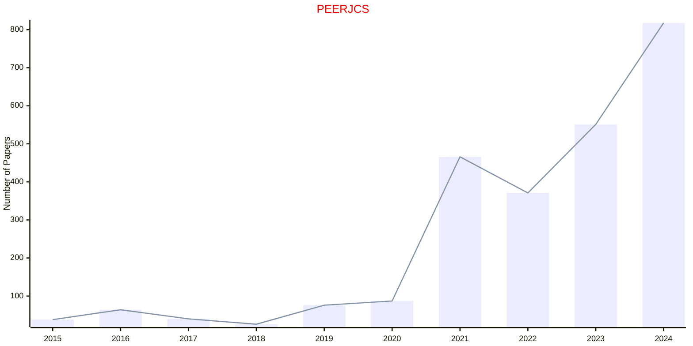
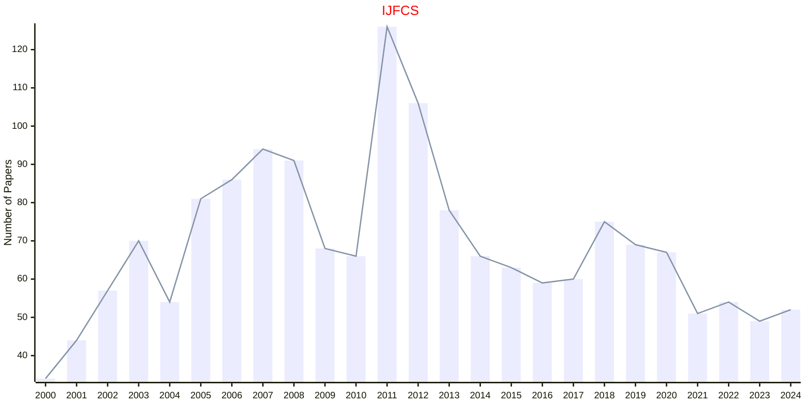

# Computer Science

## CACM

|Publishers|Full/Homepage|Abbr/About|Acronym/Issues|Period/DBLP|Top/Early|CCF|CAS|JCR|IF|Keywords/Google|
|-         |-            |-         |-             |-          |-        |-  |-  |-  |- |-              |
|[ACM](https://www.acm.org/)|[Communications of the ACM](https://dl.acm.org/magazine/cacm)|[Commun. ACM](https://dl.acm.org/magazine/cacm)|[CACM](https://dl.acm.org/loi/cacm)|[1958 -](https://dblp.org/db/journals/cacm/index.html)|False||3|Q1|20.3|[Computer Science](https://www.google.com/search?q=Computer+Science)|

## CSUR

|Publishers|Full/Homepage|Abbr/About|Acronym/Issues|Period/DBLP|Top/Early|CCF|CAS|JCR|IF|Keywords/Google|
|-         |-            |-         |-             |-          |-        |-  |-  |-  |- |-              |
|[ACM](https://www.acm.org/)|[ACM Computing Surveys](https://dl.acm.org/journal/csur)|[ACM Comput. Surv.](https://dl.acm.org/journal/csur)|[CSUR](https://dl.acm.org/loi/csur)|[1969 -](https://dblp.org/db/journals/csur/index.html)|True||1|Q1|26.3|[Computer Science](https://www.google.com/search?q=Computer+Science)|

## JACM

|Publishers|Full/Homepage|Abbr/About|Acronym/Issues|Period/DBLP|Top/Early|CCF|CAS|JCR|IF|Keywords/Google|
|-         |-            |-         |-             |-          |-        |-  |-  |-  |- |-              |
|[ACM](https://www.acm.org/)|[Journal of the ACM](https://dl.acm.org/journal/jacm)|[J. ACM](https://dl.acm.org/journal/jacm/about)|[JACM](https://dl.acm.org/loi/jacm)|[1954 -](https://dblp.org/db/journals/jacm/index.html)|False|A|2|Q2|3.3|[Computer Science](https://www.google.com/search?q=Computer+Science)|

## TAP

|Publishers|Full/Homepage|Abbr/About|Acronym/Issues|Period/DBLP|Top/Early|CCF|CAS|JCR|IF|Keywords/Google|
|-         |-            |-         |-             |-          |-        |-  |-  |-  |- |-              |
|[ACM](https://www.acm.org/)|[ACM Transactions on Applied Perception](https://dl.acm.org/journal/tap)|[ACM Trans. Appl. Perc.](https://dl.acm.org/journal/tap/about)|[TAP](https://dl.acm.org/loi/tap)|[2004 -](https://dblp.org/db/journals/tap/index.html)|False|B|3|Q3|2.5|[Computer Science](https://www.google.com/search?q=Computer+Science); [Psychology](https://www.google.com/search?q=Psychology)|

## CMAME

|Publishers|Full/Homepage|Abbr/About|Acronym/Issues|Period/DBLP|Top/Early|CCF|CAS|JCR|IF|Keywords/Google|
|-         |-            |-         |-             |-          |-        |-  |-  |-  |- |-              |
|[ELSEVIER](https://www.sciencedirect.com/)|[Computer Methods in Applied Mechanics and Engineering](https://www.sciencedirect.com/journal/computer-methods-in-applied-mechanics-and-engineering)|[Comput. Meth. Appl. Mech. Eng.](https://www.sciencedirect.com/journal/computer-methods-in-applied-mechanics-and-engineering/about/aims-and-scope)|[CMAME](https://www.sciencedirect.com/journal/computer-methods-in-applied-mechanics-and-engineering/issues)|1972 -|True||1|Q1|7.5|[Computer Science](https://www.google.com/search?q=Computer+Science)|

## IANDC

|Publishers|Full/Homepage|Abbr/About|Acronym/Issues|Period/DBLP|Top/Early|CCF|CAS|JCR|IF|Keywords/Google|
|-         |-            |-         |-             |-          |-        |-  |-  |-  |- |-              |
|[ELSEVIER](https://www.sciencedirect.com/)|[Information and Computation](https://www.sciencedirect.com/journal/information-and-computation)|[Inf. Comput.](https://www.sciencedirect.com/journal/information-and-computation/about/aims-and-scope)|[IANDC](https://www.sciencedirect.com/journal/information-and-computation/issues)|1987 -|False|A|4|Q3|1.1|[Information Theory](https://www.google.com/search?q=Information+Theory); [Theoretical Computer Science](https://www.google.com/search?q=Theoretical+Computer+Science)|

## TCS

|Publishers|Full/Homepage|Abbr/About|Acronym/Issues|Period/DBLP|Top/Early|CCF|CAS|JCR|IF|Keywords/Google|
|-         |-            |-         |-             |-          |-        |-  |-  |-  |- |-              |
|[ELSEVIER](https://www.sciencedirect.com/)|[Theoretical Computer Science](https://www.sciencedirect.com/journal/theoretical-computer-science)|[Theor. Comput. Sci.](https://www.sciencedirect.com/journal/theoretical-computer-science/about/aims-and-scope)|[TCS](https://www.sciencedirect.com/journal/theoretical-computer-science/issues)|1975 -|False|B|4|Q3|1.0|[Theoretical Computer Science](https://www.google.com/search?q=Theoretical+Computer+Science)|

## PEERJCS

|Publishers|Full/Homepage|Abbr/About|Acronym/Issues|Period/DBLP|Top/Early|CCF|CAS|JCR|IF|Keywords/Google|
|-         |-            |-         |-             |-          |-        |-  |-  |-  |- |-              |
|[PEERJ](https://peerj.com/)|[PeerJ Computer Science](https://peerj.com/computer-science/)|[PeerJ Comput. Sci.](https://d2pdyyx74uypu5.cloudfront.net/docs/peerj-cs-journal-factsheet.pdf)|[PEERJCS](https://peerj.com/computer-science/)|[2015 -](https://dblp.org/db/journals/peerj-cs/index.html)|False||4|Q2|3.3|[Computer Science](https://www.google.com/search?q=Computer+Science)|

## IJFCS

|Publishers|Full/Homepage|Abbr/About|Acronym/Issues|Period/DBLP|Top/Early|CCF|CAS|JCR|IF|Keywords/Google|
|-         |-            |-         |-             |-          |-        |-  |-  |-  |- |-              |
|[WS](https://worldscientific.com/)|[International Journal of Foundations of Computer Science](https://worldscientific.com/worldscinet/ijfcs)|[Int. J. Found. Comput. Sci](https://worldscientific.com/page/ijfcs/aims-scope)|[IJFCS](https://worldscientific.com/loi/ijfcs)|1990 -|False||4|Q4|0.6|[Computer Science](https://www.google.com/search?q=Computer+Science)|

