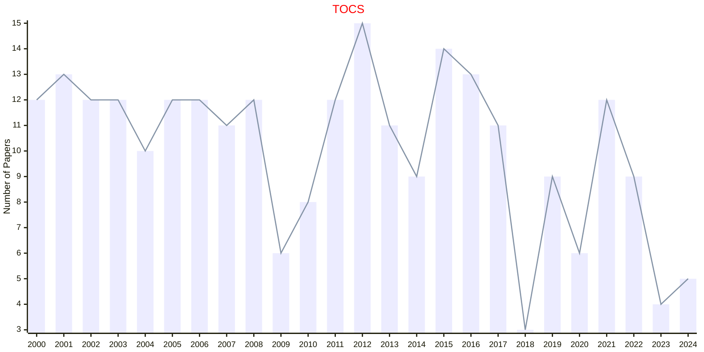

# Computer Systems

## TOCS

|Publishers|Full/Homepage|Abbr/About|Acronym/Issues|Period/DBLP|Top/Early|CCF|CAS|JCR|IF|Keywords/Google|
|-         |-            |-         |-             |-          |-        |-  |-  |-  |- |-              |
|[ACM](https://www.acm.org/)|[ACM Transactions on Computer Systems](https://dl.acm.org/journal/tocs)|[ACM Trans. Comput. Syst.](https://dl.acm.org/journal/tocs/about)|[TOCS](https://dl.acm.org/loi/tocs)|[1994 -](https://dblp.org/db/journals/tocs/index.html)|False|A|4|Q2|2.4|[Computer Systems](https://www.google.com/search?q=Computer+Systems)|

