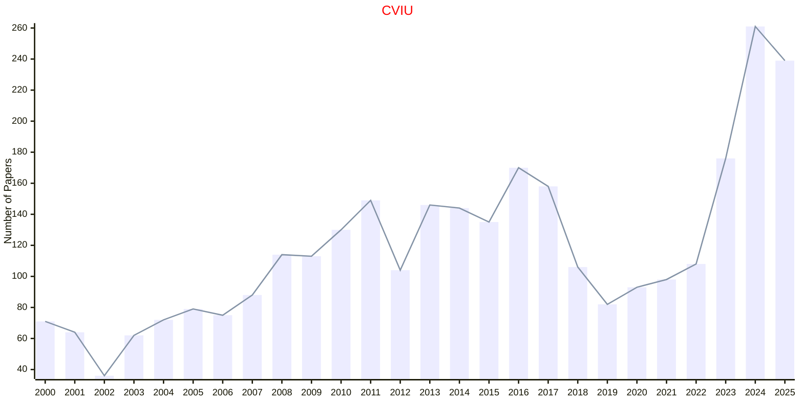
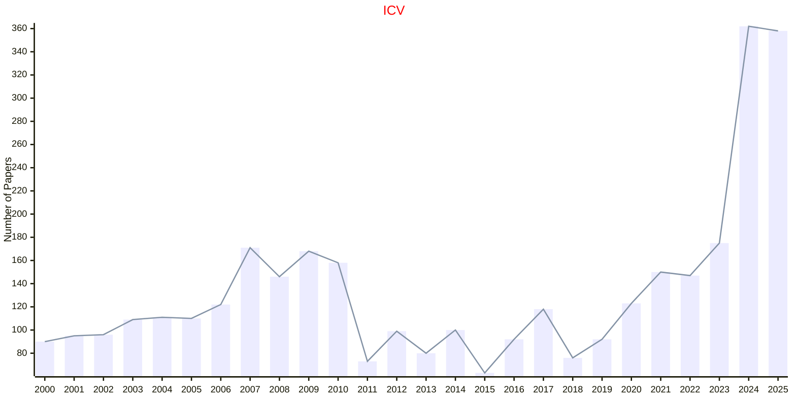
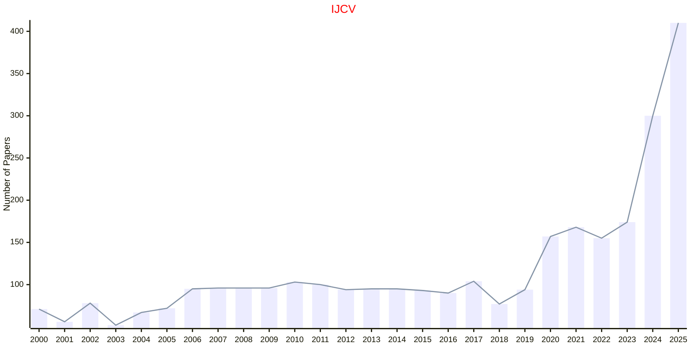
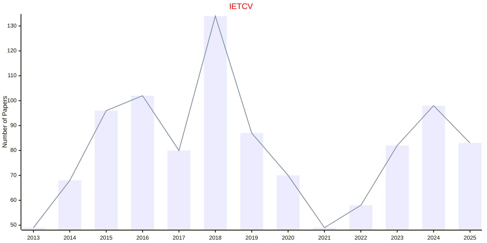

# Computer Vision

## CVIU

|Publishers|Full/Homepage|Abbr/About|Acronym/Issues|Period/DBLP|Top/Early|CCF|CAS|JCR|IF|Keywords/Google|
|-         |-            |-         |-             |-          |-        |-  |-  |-  |- |-              |
|[ELSEVIER](https://www.sciencedirect.com/)|[Computer Vision and Image Understanding](https://www.sciencedirect.com/journal/computer-vision-and-image-understanding)|[Comput. Vis. Image Understanding](https://www.sciencedirect.com/journal/computer-vision-and-image-understanding/about/aims-and-scope)|[CVIU](https://www.sciencedirect.com/journal/computer-vision-and-image-understanding/issues)|1995 -|False|B|3|Q2|4.8|[Computer Vision](https://www.google.com/search?q=Computer+Vision)|

## ICV

|Publishers|Full/Homepage|Abbr/About|Acronym/Issues|Period/DBLP|Top/Early|CCF|CAS|JCR|IF|Keywords/Google|
|-         |-            |-         |-             |-          |-        |-  |-  |-  |- |-              |
|[ELSEVIER](https://www.sciencedirect.com/)|[Image and Vision Computing](https://www.sciencedirect.com/journal/image-and-vision-computing)|[Image Vis. Comput.](https://www.sciencedirect.com/journal/image-and-vision-computing/about/aims-and-scope)|[ICV](https://www.sciencedirect.com/journal/image-and-vision-computing/issues)|1983 -|False|C|3|Q1|4.1|[Computer Vision](https://www.google.com/search?q=Computer+Vision); [Image Processing](https://www.google.com/search?q=Image+Processing)|

## IJCV

|Publishers|Full/Homepage|Abbr/About|Acronym/Issues|Period/DBLP|Top/Early|CCF|CAS|JCR|IF|Keywords/Google|
|-         |-            |-         |-             |-          |-        |-  |-  |-  |- |-              |
|[SPRINGER](https://www.springer.com/)|[International Journal of Computer Vision](https://www.springer.com/journal/11263)|[Int. J. Comput. Vis.](https://www.springer.com/journal/11263/aims-and-scope)|[IJCV](https://link.springer.com/journal/11263/volumes-and-issues)|1988 -|False|A|2|Q1|15.5|[Computer Vision](https://www.google.com/search?q=Computer+Vision)|

## IETCV

|Publishers|Full/Homepage|Abbr/About|Acronym/Issues|Period/DBLP|Top/Early|CCF|CAS|JCR|IF|Keywords/Google|
|-         |-            |-         |-             |-          |-        |-  |-  |-  |- |-              |
|[WILEY](https://www.wiley.com/)|[IET Computer Vision](https://ietresearch.onlinelibrary.wiley.com/journal/17519640)|[IET Comput. Vis.](https://ietresearch.onlinelibrary.wiley.com/hub/journal/17519640/homepage/productinformation.html)|[IETCV](https://ietresearch.onlinelibrary.wiley.com/loi/17519640)|2013 -|False|C|4|Q4|1.4|[Computer Vision](https://www.google.com/search?q=Computer+Vision)|

