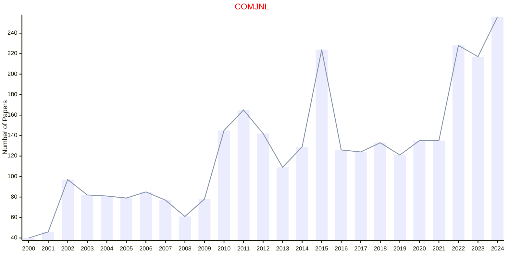

# Computing Science

## COMJNL

|Publishers|Full/Homepage|Abbr/About|Acronym/Issues|Period/DBLP|Top/Early|CCF|CAS|JCR|IF|Keywords/Google|
|-         |-            |-         |-             |-          |-        |-  |-  |-  |- |-              |
|[OXFORD](https://academic.oup.com/)|[The Computer Journal](https://academic.oup.com/comjnl)|[Comput. J.](https://academic.oup.com/comjnl/pages/about)|[COMJNL](https://academic.oup.com/comjnl/issue)|1958 -|False|B|4|Q3|1.5|[Computing Science](https://www.google.com/search?q=Computing+Science)|

