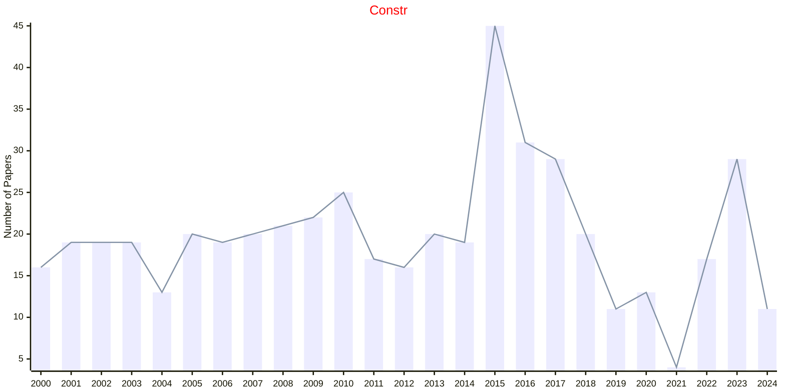

# Constraint Optimization

## Constr

|Publishers|Full/Homepage|Abbr/About|Acronym/Issues|Period/DBLP|Top/Early|CCF|CAS|JCR|IF|Keywords/Google|
|-         |-            |-         |-             |-          |-        |-  |-  |-  |- |-              |
|[SPRINGER](https://www.springer.com/)|[Constraints](https://www.springer.com/journal/10601)|[Constraints](https://www.springer.com/journal/10601/aims-and-scope)|[Constr](https://link.springer.com/journal/10601/volumes-and-issues)|1996 -|False||4|Q3|1.3|[Constraint Optimization](https://www.google.com/search?q=Constraint+Optimization); [Constraint Programming](https://www.google.com/search?q=Constraint+Programming)|

