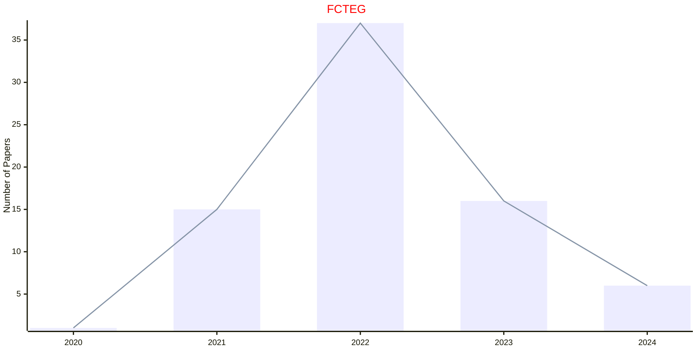

# Control Systems

## FCTEG

|Publishers|Full/Homepage|Abbr/About|Acronym/Issues|Period/DBLP|Top/Early|CCF|CAS|JCR|IF|Keywords/Google|
|-         |-            |-         |-             |-          |-        |-  |-  |-  |- |-              |
|[FRONTIERS](https://www.frontiersin.org/)|[Frontiers in Control Engineering](https://www.frontiersin.org/journals/control-engineering)|[Front. Control Eng.](https://www.frontiersin.org/journals/control-engineering/about)|[FCTEG](https://www.frontiersin.org/journals/control-engineering/volumes)|2020 -|False|||||[Control Systems](https://www.google.com/search?q=Control+Systems)|

