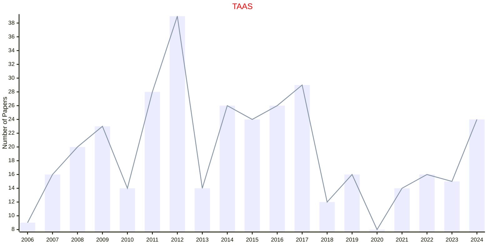
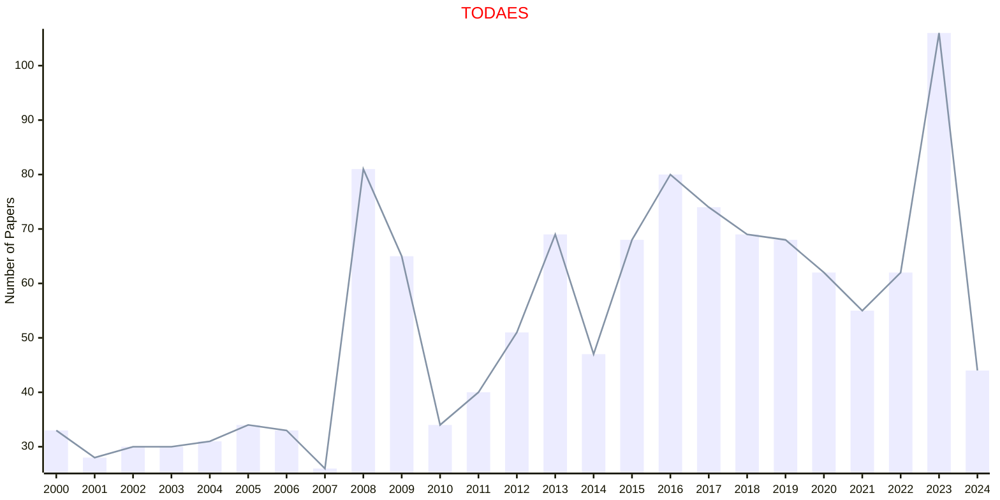
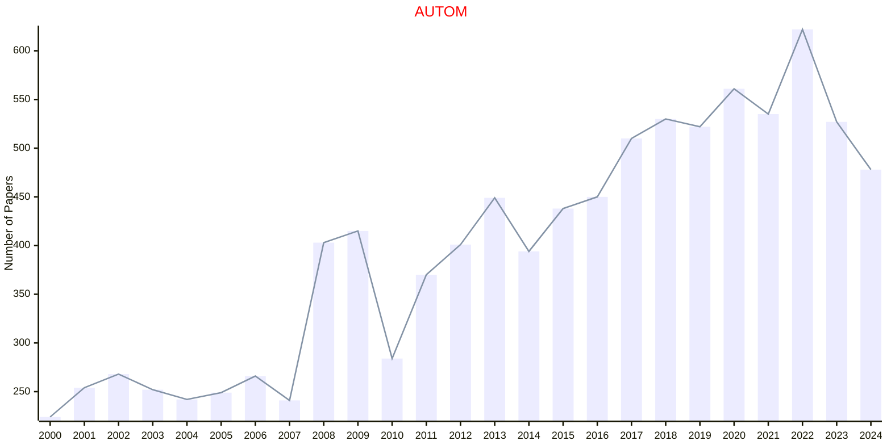
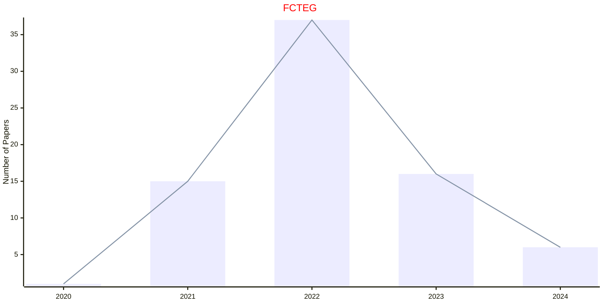
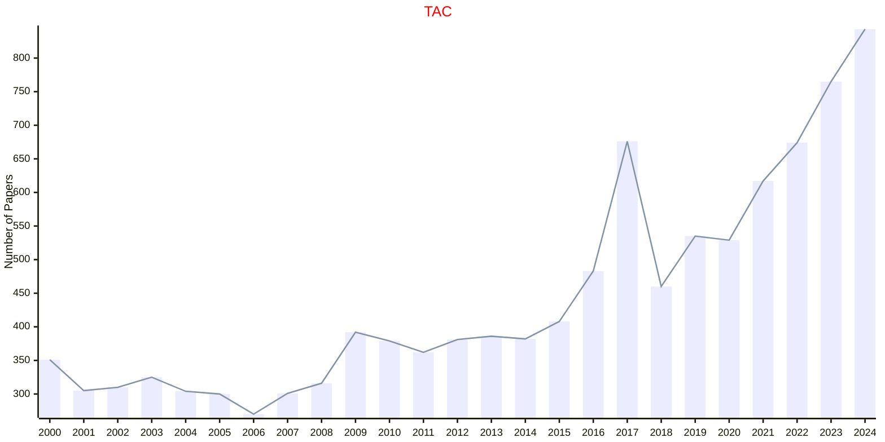
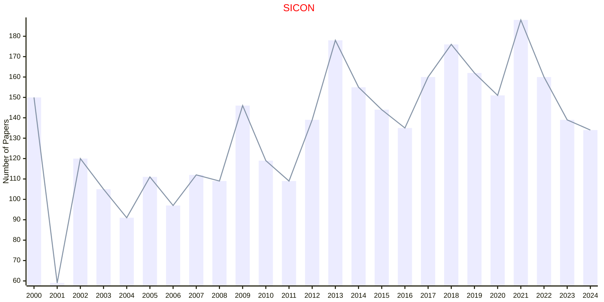
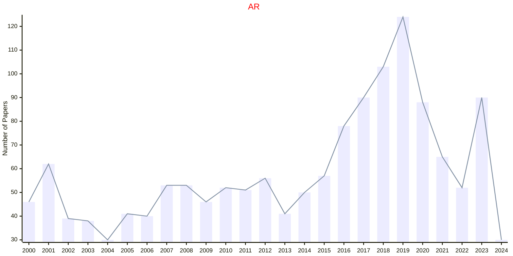
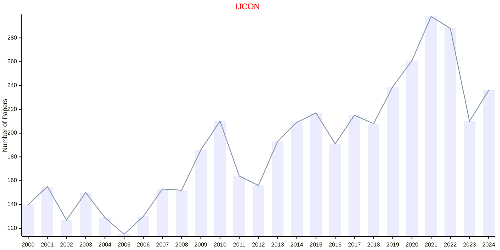

# Control and Automation

## TAAS

|Publishers|Full/Homepage|Abbr/About|Acronym/Issues|Period/DBLP|Top/Early|CCF|CAS|JCR|IF|Keywords/Google|
|-         |-            |-         |-             |-          |-        |-  |-  |-  |- |-              |
|[ACM](https://www.acm.org/)|[ACM Transactions on Autonomous and Adaptive Systems](https://dl.acm.org/journal/taas)|[ACM Trans. Auton. Adapt. Syst.](https://dl.acm.org/journal/taas/about)|[TAAS](https://dl.acm.org/loi/taas)|[2006 -](https://dblp.org/db/journals/taas/index.html)|False|B|4|Q2|2.1|[Adaptive Systems](https://www.google.com/search?q=Adaptive+Systems)|

## TODAES

|Publishers|Full/Homepage|Abbr/About|Acronym/Issues|Period/DBLP|Top/Early|CCF|CAS|JCR|IF|Keywords/Google|
|-         |-            |-         |-             |-          |-        |-  |-  |-  |- |-              |
|[ACM](https://www.acm.org/)|[ACM Transactions on Design Automation of Electronic Systems](https://dl.acm.org/journal/todaes)|[ACM Trans. Des. Autom. Electron. Syst.](https://dl.acm.org/journal/todaes/about)|[TODAES](https://dl.acm.org/loi/todaes)|[1996 -](https://dblp.org/db/journals/todaes/index.html)|False|B|4|Q3|1.9|[Electronic Systems](https://www.google.com/search?q=Electronic+Systems)|

## AUTOM

|Publishers|Full/Homepage|Abbr/About|Acronym/Issues|Period/DBLP|Top/Early|CCF|CAS|JCR|IF|Keywords/Google|
|-         |-            |-         |-             |-          |-        |-  |-  |-  |- |-              |
|[ELSEVIER](https://www.sciencedirect.com/)|[Automatica](https://www.sciencedirect.com/journal/automatica)|[Automatica](https://www.sciencedirect.com/journal/automatica/about/aims-and-scope)|[AUTOM](https://www.sciencedirect.com/journal/automatica/issues)|1963 -|False||2|Q1|6.3|[Control and Automation](https://www.google.com/search?q=Control+and+Automation)|

## ISAT

|Publishers|Full/Homepage|Abbr/About|Acronym/Issues|Period/DBLP|Top/Early|CCF|CAS|JCR|IF|Keywords/Google|
|-         |-            |-         |-             |-          |-        |-  |-  |-  |- |-              |
|[ELSEVIER](https://www.sciencedirect.com/)|[ISA Transactions](https://www.sciencedirect.com/journal/isa-transactions)|[ISA Trans.](https://www.sciencedirect.com/journal/isa-transactions/about/aims-and-scope)|[ISAT](https://www.sciencedirect.com/journal/isa-transactions/issues)|1989 -|True||2|Q1|6.3|[Control and Automation](https://www.google.com/search?q=Control+and+Automation)|

## FCTEG

|Publishers|Full/Homepage|Abbr/About|Acronym/Issues|Period/DBLP|Top/Early|CCF|CAS|JCR|IF|Keywords/Google|
|-         |-            |-         |-             |-          |-        |-  |-  |-  |- |-              |
|[FRONTIERS](https://www.frontiersin.org/)|[Frontiers in Control Engineering](https://www.frontiersin.org/journals/control-engineering)|[Front. Control Eng.](https://www.frontiersin.org/journals/control-engineering/about)|[FCTEG](https://www.frontiersin.org/journals/control-engineering/volumes)|2020 -|False|||||[Control Systems](https://www.google.com/search?q=Control+Systems)|

## TAC

|Publishers|Full/Homepage|Abbr/About|Acronym/Issues|Period/DBLP|Top/Early|CCF|CAS|JCR|IF|Keywords/Google|
|-         |-            |-         |-             |-          |-        |-  |-  |-  |- |-              |
|[IEEE](https://ieeexplore.ieee.org/)|[IEEE Transactions on Automatic Control](https://ieeexplore.ieee.org/xpl/RecentIssue.jsp?punumber=9)|[IEEE Trans. Autom. Control](https://ieeexplore.ieee.org/xpl/aboutJournal.jsp?punumber=9)|[TAC](https://ieeexplore.ieee.org/xpl/issues?punumber=9&isnumber=10233941)|1963 -|[True](https://ieeexplore.ieee.org/xpl/tocresult.jsp?isnumber=4601496)||2|Q1|7.2|[Control and Automation](https://www.google.com/search?q=Control+and+Automation)|

## SICON

|Publishers|Full/Homepage|Abbr/About|Acronym/Issues|Period/DBLP|Top/Early|CCF|CAS|JCR|IF|Keywords/Google|
|-         |-            |-         |-             |-          |-        |-  |-  |-  |- |-              |
|[SIAM](https://epubs.siam.org)|[SIAM Journal on Control and Optimization](https://epubs.siam.org/journal/sjcodc)|[SIAM J. Control Optim.](https://epubs.siam.org/journal/sicon/about)|[SICON](https://epubs.siam.org/loi/sjcodc)|1962 -|False||2|Q1|2.5|[Control and Automation](https://www.google.com/search?q=Control+and+Automation)|

## AR

|Publishers|Full/Homepage|Abbr/About|Acronym/Issues|Period/DBLP|Top/Early|CCF|CAS|JCR|IF|Keywords/Google|
|-         |-            |-         |-             |-          |-        |-  |-  |-  |- |-              |
|[SPRINGER](https://www.springer.com/)|[Autonomous Robots](https://www.springer.com/journal/10514)|[Auton. Robot.](https://www.springer.com/journal/10514/aims-and-scope)|[AR](https://link.springer.com/journal/10514/volumes-and-issues)|1994 -|False||3|Q2|3.9|[Control and Automation](https://www.google.com/search?q=Control+and+Automation); [Robotics and UAV](https://www.google.com/search?q=Robotics+and+UAV)|

## IJCON

|Publishers|Full/Homepage|Abbr/About|Acronym/Issues|Period/DBLP|Top/Early|CCF|CAS|JCR|IF|Keywords/Google|
|-         |-            |-         |-             |-          |-        |-  |-  |-  |- |-              |
|[TAYLOR](https://www.tandfonline.com/)|[International Journal of Control](https://www.tandfonline.com/journals/tcon20)|[Int. J. Control](https://www.tandfonline.com/journals/tcon20/about-this-journal#aims-and-scope)|[IJCON](https://www.tandfonline.com/loi/tcon20)|1965 -|False||4|Q3|1.9|[Control and Automation](https://www.google.com/search?q=Control+and+Automation)|

