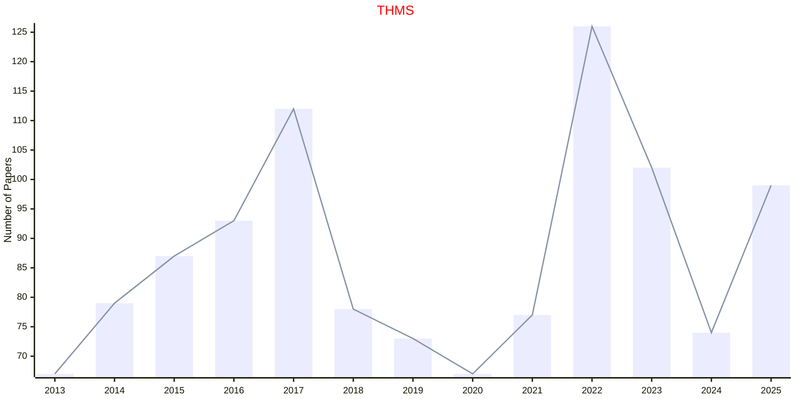
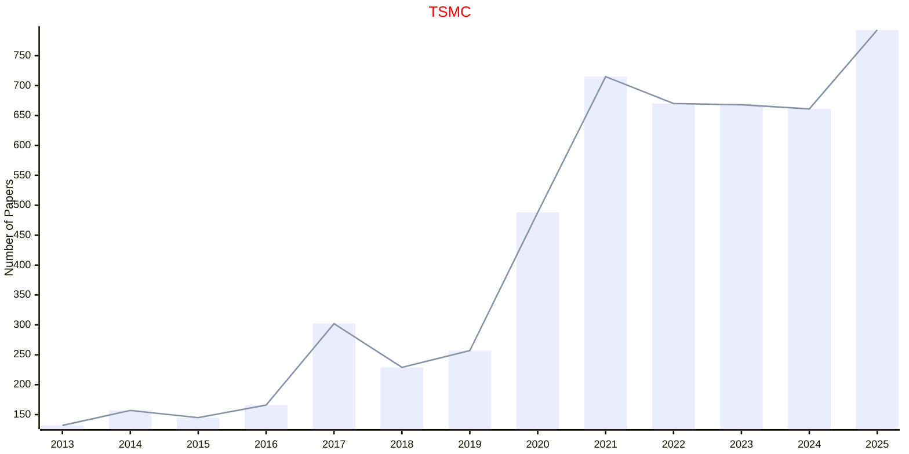
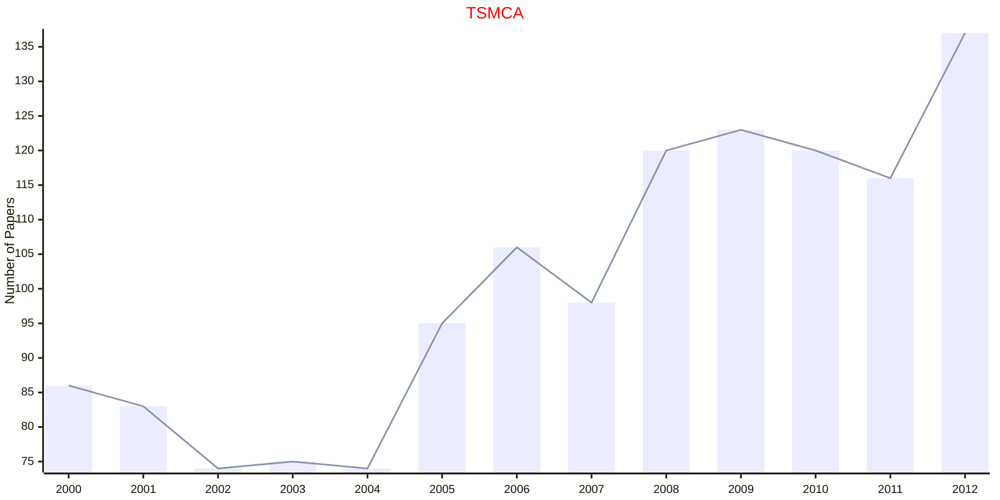
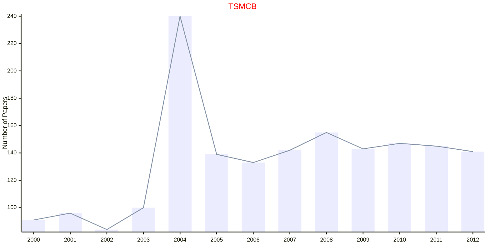
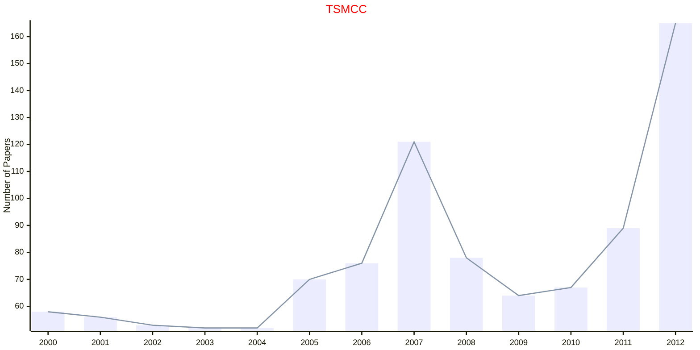
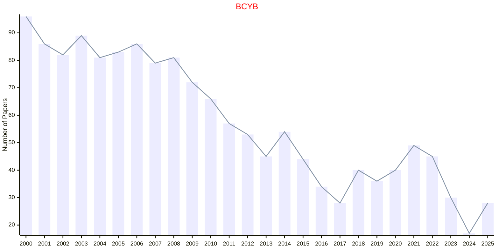
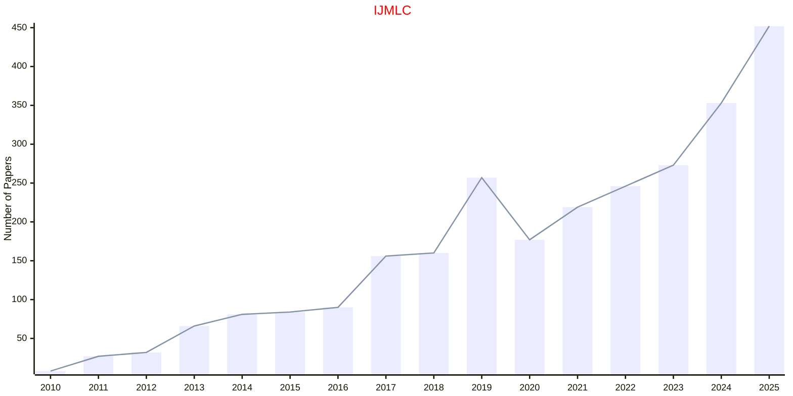
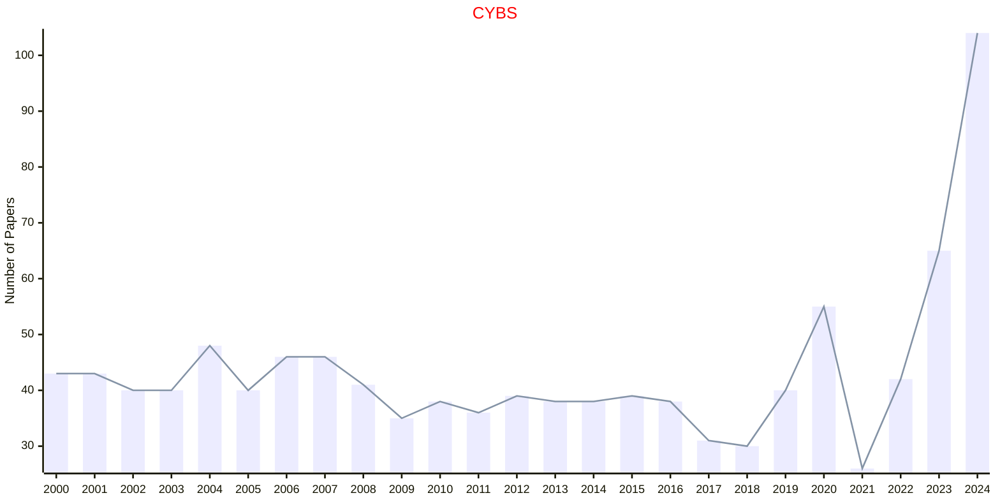

# Cybernetics

## THMS

|Publishers|Full/Homepage|Abbr/About|Acronym/Issues|Period/DBLP|Top/Early|CCF|CAS|JCR|IF|Keywords/Google|
|-         |-            |-         |-             |-          |-        |-  |-  |-  |- |-              |
|[IEEE](https://ieeexplore.ieee.org/)|[IEEE Transactions on Human-Machine Systems](https://ieeexplore.ieee.org/xpl/RecentIssue.jsp?punumber=6221037)|[IEEE Trans. Human-Mach. Syst.](https://ieeexplore.ieee.org/xpl/aboutJournal.jsp?punumber=6221037)|[THMS](https://ieeexplore.ieee.org/xpl/issues?punumber=6221037&isnumber=10684406)|2013 -|[False](https://ieeexplore.ieee.org/xpl/tocresult.jsp?isnumber=6340045)|B|2|Q2|4.9|[Cybernetics](https://www.google.com/search?q=Cybernetics)|

## TSMC

|Publishers|Full/Homepage|Abbr/About|Acronym/Issues|Period/DBLP|Top/Early|CCF|CAS|JCR|IF|Keywords/Google|
|-         |-            |-         |-             |-          |-        |-  |-  |-  |- |-              |
|[IEEE](https://ieeexplore.ieee.org/)|[IEEE Transactions on Systems, Man, and Cybernetics: Systems](https://ieeexplore.ieee.org/xpl/RecentIssue.jsp?punumber=6221021)|[IEEE Trans. Syst., Man, Cybern., Syst.](https://ieeexplore.ieee.org/xpl/aboutJournal.jsp?punumber=6221021)|[TSMC](https://ieeexplore.ieee.org/xpl/issues?punumber=6221021&isnumber=10223304)|2013 -|[True](https://ieeexplore.ieee.org/xpl/tocresult.jsp?isnumber=6376248)|B|1|||[Cybernetics](https://www.google.com/search?q=Cybernetics)|

## TSMCA

|Publishers|Full/Homepage|Abbr/About|Acronym/Issues|Period/DBLP|Top/Early|CCF|CAS|JCR|IF|Keywords/Google|
|-         |-            |-         |-             |-          |-        |-  |-  |-  |- |-              |
|[IEEE](https://ieeexplore.ieee.org/)|[IEEE Transactions on Systems, Man, and Cybernetics, Part A: Systems and Humans](https://ieeexplore.ieee.org/xpl/RecentIssue.jsp?punumber=3468)|[IEEE Trans. Syst., Man, Cybern. A](https://ieeexplore.ieee.org/xpl/aboutJournal.jsp?punumber=3468)|TSMCA|1996 - 2012|False|||||[Cybernetics](https://www.google.com/search?q=Cybernetics)|

## TSMCB

|Publishers|Full/Homepage|Abbr/About|Acronym/Issues|Period/DBLP|Top/Early|CCF|CAS|JCR|IF|Keywords/Google|
|-         |-            |-         |-             |-          |-        |-  |-  |-  |- |-              |
|[IEEE](https://ieeexplore.ieee.org/)|[IEEE Transactions on Systems, Man, and Cybernetics, Part B (Cybernetics)](https://ieeexplore.ieee.org/xpl/RecentIssue.jsp?punumber=3477)|[IEEE Trans. Syst., Man, Cybern. B](https://ieeexplore.ieee.org/xpl/aboutJournal.jsp?punumber=3477)|TSMCB|1996 - 2012|False|||||[Cybernetics](https://www.google.com/search?q=Cybernetics)|

## TSMCC

|Publishers|Full/Homepage|Abbr/About|Acronym/Issues|Period/DBLP|Top/Early|CCF|CAS|JCR|IF|Keywords/Google|
|-         |-            |-         |-             |-          |-        |-  |-  |-  |- |-              |
|[IEEE](https://ieeexplore.ieee.org/)|[IEEE Transactions on Systems, Man, and Cybernetics, Part C (Applications and Reviews)](https://ieeexplore.ieee.org/xpl/RecentIssue.jsp?punumber=5326)|[IEEE Trans. Syst., Man, Cybern. C](https://ieeexplore.ieee.org/xpl/aboutJournal.jsp?punumber=5326)|TSMCC|1998 - 2012|False|||||[Cybernetics](https://www.google.com/search?q=Cybernetics)|

## BCYB

|Publishers|Full/Homepage|Abbr/About|Acronym/Issues|Period/DBLP|Top/Early|CCF|CAS|JCR|IF|Keywords/Google|
|-         |-            |-         |-             |-          |-        |-  |-  |-  |- |-              |
|[SPRINGER](https://www.springer.com/)|[Biological Cybernetics](https://www.springer.com/journal/422)|[Biol. Cybern.](https://www.springer.com/journal/422/aims-and-scope)|[BCYB](https://link.springer.com/journal/422/volumes-and-issues)|1961 -|False||4|Q3|2.1|[Cybernetics](https://www.google.com/search?q=Cybernetics)|

## IJMLC

|Publishers|Full/Homepage|Abbr/About|Acronym/Issues|Period/DBLP|Top/Early|CCF|CAS|JCR|IF|Keywords/Google|
|-         |-            |-         |-             |-          |-        |-  |-  |-  |- |-              |
|[SPRINGER](https://www.springer.com/)|[International Journal of Machine Learning and Cybernetics](https://www.springer.com/journal/13042)|[Int. J. Mach. Learn. Cybern.](https://www.springer.com/journal/13042/aims-and-scope)|[IJMLC](https://link.springer.com/journal/13042/volumes-and-issues)|2010 -|False||4|Q3|3.3|[Ambient Intelligence](https://www.google.com/search?q=Ambient+Intelligence); [Cybernetics](https://www.google.com/search?q=Cybernetics)|

## CYBS

|Publishers|Full/Homepage|Abbr/About|Acronym/Issues|Period/DBLP|Top/Early|CCF|CAS|JCR|IF|Keywords/Google|
|-         |-            |-         |-             |-          |-        |-  |-  |-  |- |-              |
|[TAYLOR](https://www.tandfonline.com/)|[Cybernetics and Systems](https://www.tandfonline.com/journals/ucbs20)|[Cybern. Sci.](https://www.tandfonline.com/journals/ucbs20/about-this-journal#aims-and-scope)|[CYBS](https://www.tandfonline.com/loi/ucbs20)|1971 -|False|C|4|Q3|1.8|[Cybernetics](https://www.google.com/search?q=Cybernetics)|

