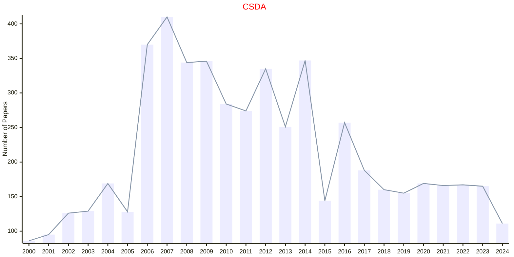
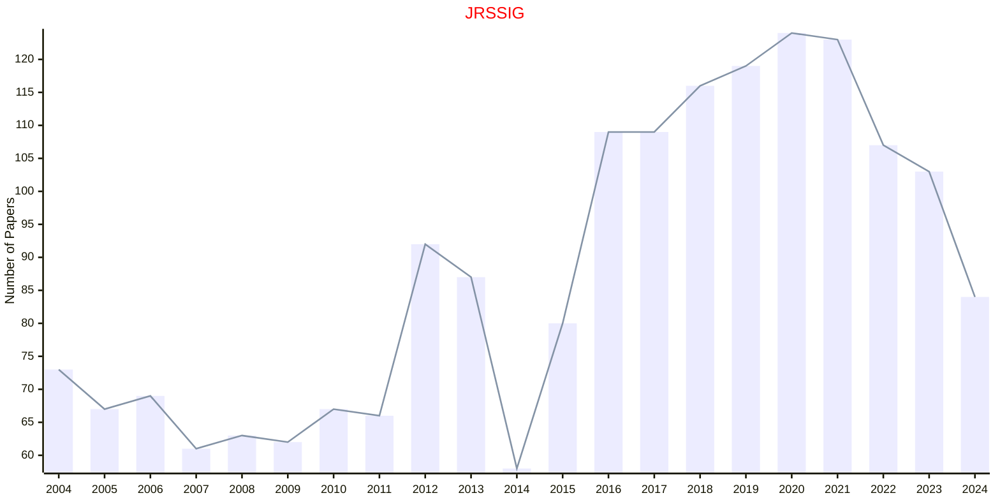

# Data Analysis

## CSDA

|Publishers|Full/Homepage|Abbr/About|Acronym/Issues|Period/DBLP|Top/Early|CCF|CAS|JCR|IF|Keywords/Google|
|-         |-            |-         |-             |-          |-        |-  |-  |-  |- |-              |
|[ELSEVIER](https://www.sciencedirect.com/)|[Computational Statistics & Data Analysis](https://www.sciencedirect.com/journal/computational-statistics-and-data-analysis)|[Comput. Stat. Data Anal.](https://www.sciencedirect.com/journal/computational-statistics-and-data-analysis/about/aims-and-scope)|[CSDA](https://www.sciencedirect.com/journal/computational-statistics-and-data-analysis/issues)|1983 -|False||3|Q2|1.9|[Computational Statistics](https://www.google.com/search?q=Computational+Statistics); [Data Analysis](https://www.google.com/search?q=Data+Analysis)|

## JRSSIG

|Publishers|Full/Homepage|Abbr/About|Acronym/Issues|Period/DBLP|Top/Early|CCF|CAS|JCR|IF|Keywords/Google|
|-         |-            |-         |-             |-          |-        |-  |-  |-  |- |-              |
|[OXFORD](https://academic.oup.com/)|[Significance](https://academic.oup.com/jrssig)|[Significance](https://academic.oup.com/jrssig/pages/about)|[JRSSIG](https://academic.oup.com/jrssig/issue)|2004 -|False|||||[Data Analysis](https://www.google.com/search?q=Data+Analysis)|

