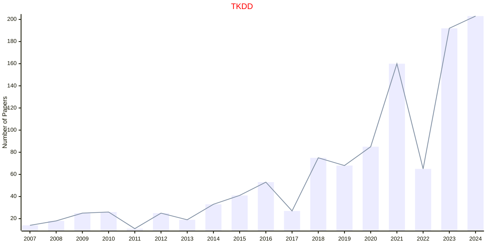
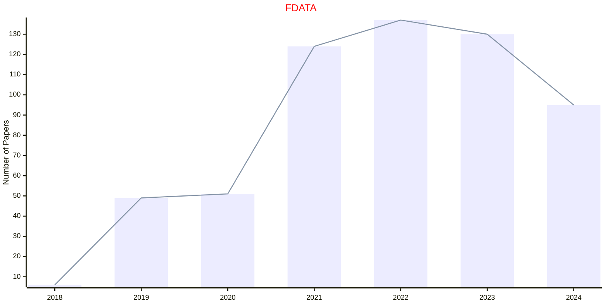
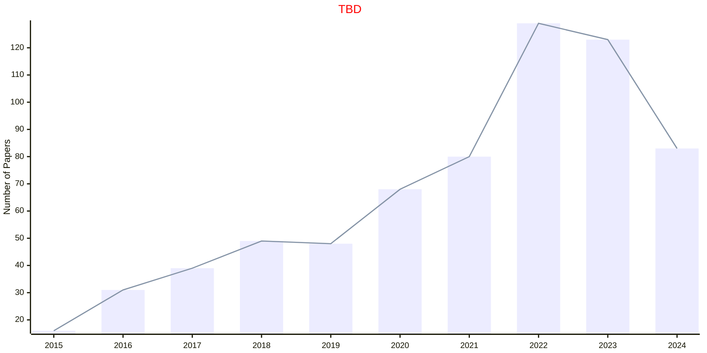
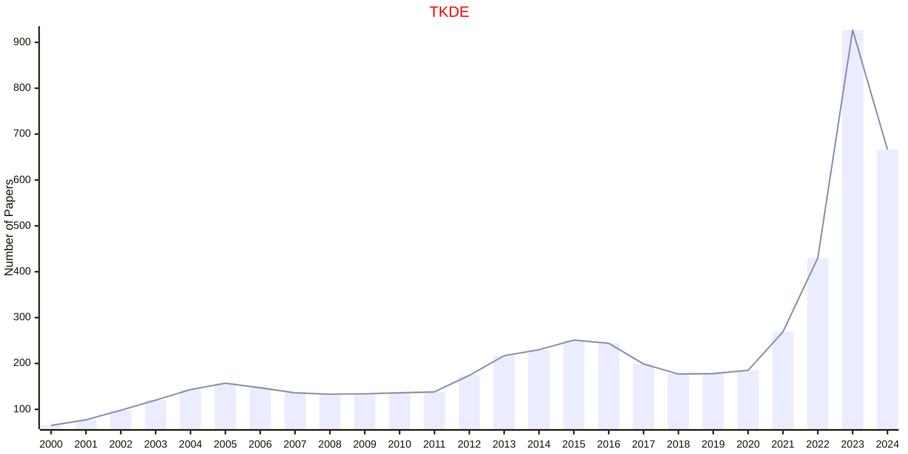
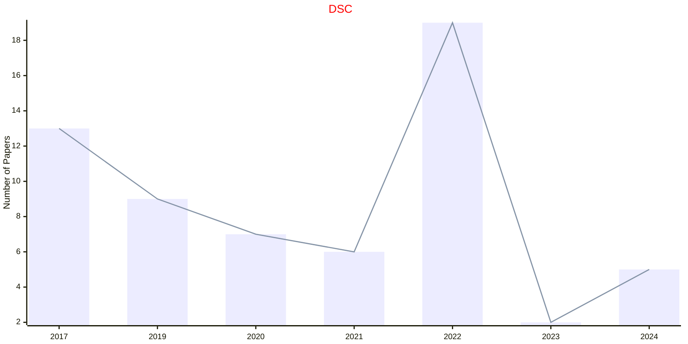
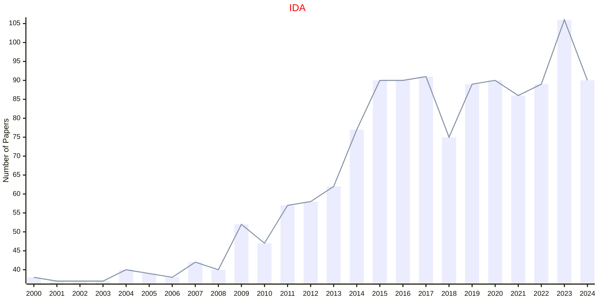
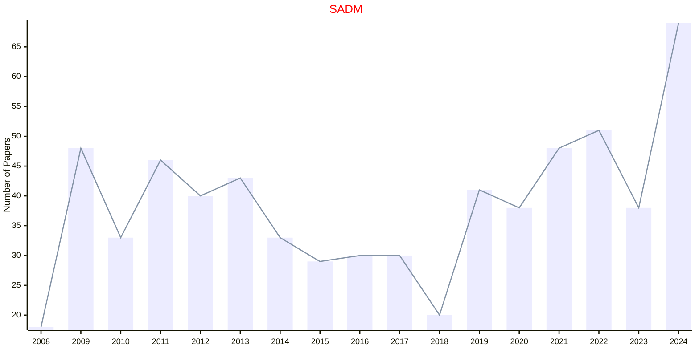
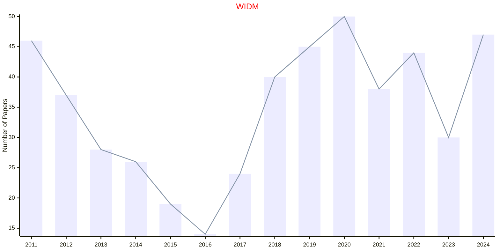

# Data Mining

## TKDD

|Publishers|Full/Homepage|Abbr/About|Acronym/Issues|Period/DBLP|Top/Early|CCF|CAS|JCR|IF|Keywords/Google|
|-         |-            |-         |-             |-          |-        |-  |-  |-  |- |-              |
|[ACM](https://www.acm.org/)|[ACM Transactions on Knowledge Discovery from Data](https://dl.acm.org/journal/tkdd)|[ACM Trans. knowl. Discov. Data](https://dl.acm.org/journal/tkdd/about)|[TKDD](https://dl.acm.org/loi/tkdd)|[2007 -](https://dblp.org/db/journals/tkdd/index.html)|False|B|3|Q1|4.9|[Data Mining](https://www.google.com/search?q=Data+Mining); [Knowledge Discovery](https://www.google.com/search?q=Knowledge+Discovery)|

## FDATA

|Publishers|Full/Homepage|Abbr/About|Acronym/Issues|Period/DBLP|Top/Early|CCF|CAS|JCR|IF|Keywords/Google|
|-         |-            |-         |-             |-          |-        |-  |-  |-  |- |-              |
|[FRONTIERS](https://www.frontiersin.org/)|[Frontiers in Big Data](https://www.frontiersin.org/journals/big-data)|[Front. Big Data](https://www.frontiersin.org/journals/big-data/about)|[FDATA](https://www.frontiersin.org/journals/big-data/volumes)|2018 -|False||4||3.5|[Data Mining](https://www.google.com/search?q=Data+Mining)|

## TBD

|Publishers|Full/Homepage|Abbr/About|Acronym/Issues|Period/DBLP|Top/Early|CCF|CAS|JCR|IF|Keywords/Google|
|-         |-            |-         |-             |-          |-        |-  |-  |-  |- |-              |
|[IEEE](https://ieeexplore.ieee.org/)|[IEEE Transactions on Transactions on Big Data](https://ieeexplore.ieee.org/xpl/RecentIssue.jsp?punumber=6687317)|[IEEE Trans. Big Data](https://ieeexplore.ieee.org/xpl/aboutJournal.jsp?punumber=6687317)|[TBD](https://ieeexplore.ieee.org/xpl/issues?punumber=6687317&isnumber=10595994)|2015 -|[False](https://ieeexplore.ieee.org/xpl/tocresult.jsp?isnumber=7153538)|||||[Data Mining](https://www.google.com/search?q=Data+Mining)|

## TKDE

|Publishers|Full/Homepage|Abbr/About|Acronym/Issues|Period/DBLP|Top/Early|CCF|CAS|JCR|IF|Keywords/Google|
|-         |-            |-         |-             |-          |-        |-  |-  |-  |- |-              |
|[IEEE](https://ieeexplore.ieee.org/)|[IEEE Transactions on Knowledge and Data Engineering](https://ieeexplore.ieee.org/xpl/RecentIssue.jsp?punumber=69)|[IEEE Trans. Knowl. Data Eng.](https://ieeexplore.ieee.org/xpl/aboutJournal.jsp?punumber=69)|[TKDE](https://ieeexplore.ieee.org/xpl/issues?punumber=69&isnumber=10210449)|1989 -|[True](https://ieeexplore.ieee.org/xpl/tocresult.jsp?isnumber=4358933)|A|1|Q1|9.6|[Data Mining](https://www.google.com/search?q=Data+Mining)|

## DSC

|Publishers|Full/Homepage|Abbr/About|Acronym/Issues|Period/DBLP|Top/Early|CCF|CAS|JCR|IF|Keywords/Google|
|-         |-            |-         |-             |-          |-        |-  |-  |-  |- |-              |
|[SAGE](https://www.sagepub.com/)|[Data Science](https://journals.sagepub.com/home/dsca)|[Data Sci.](https://journals.sagepub.com/overview-metric/DSC?)|[DSC](https://journals.sagepub.com/loi/dsca)|2017 -|False|||||[Data Mining](https://www.google.com/search?q=Data+Mining)|

## IDA

|Publishers|Full/Homepage|Abbr/About|Acronym/Issues|Period/DBLP|Top/Early|CCF|CAS|JCR|IF|Keywords/Google|
|-         |-            |-         |-             |-          |-        |-  |-  |-  |- |-              |
|[SAGE](https://www.sagepub.com/)|[Intelligent Data Analysis](https://journals.sagepub.com/home/ida)|[Intell. Data Anal.](https://journals.sagepub.com/overview-metric/IDA?)|[IDA](https://journals.sagepub.com/loi/ida)|1997 -|False|C|4|Q4|0.9|[Artificial Intelligence](https://www.google.com/search?q=Artificial+Intelligence); [Data Mining](https://www.google.com/search?q=Data+Mining); [Evolutionary Computation](https://www.google.com/search?q=Evolutionary+Computation)|

## SADM

|Publishers|Full/Homepage|Abbr/About|Acronym/Issues|Period/DBLP|Top/Early|CCF|CAS|JCR|IF|Keywords/Google|
|-         |-            |-         |-             |-          |-        |-  |-  |-  |- |-              |
|[WILEY](https://www.wiley.com/)|[Statistical Analysis and Data Mining](https://onlinelibrary.wiley.com/journal/19321872)|[Stat. Anal. Data Mining](https://onlinelibrary.wiley.com/page/journal/19321872/homepage/productinformation.html)|[SADM](https://onlinelibrary.wiley.com/loi/19321872)|2008 -|False||4|||[Data Mining](https://www.google.com/search?q=Data+Mining); [Statistical Analysis](https://www.google.com/search?q=Statistical+Analysis)|

## WIDM

|Publishers|Full/Homepage|Abbr/About|Acronym/Issues|Period/DBLP|Top/Early|CCF|CAS|JCR|IF|Keywords/Google|
|-         |-            |-         |-             |-          |-        |-  |-  |-  |- |-              |
|[WILEY](https://www.wiley.com/)|[WIREs Data Mining and Knowledge Discovery](https://onlinelibrary.wiley.com/journal/19424795)|[WIREs Data Mining Knowl. Discov.](https://wires.onlinelibrary.wiley.com/hub/journal/19424795/about/productinformation)|[WIDM](https://wires.onlinelibrary.wiley.com/loi/19424795)|2011 -|False|||||[Data Mining](https://www.google.com/search?q=Data+Mining); [Knowledge Discovery](https://www.google.com/search?q=Knowledge+Discovery)|

