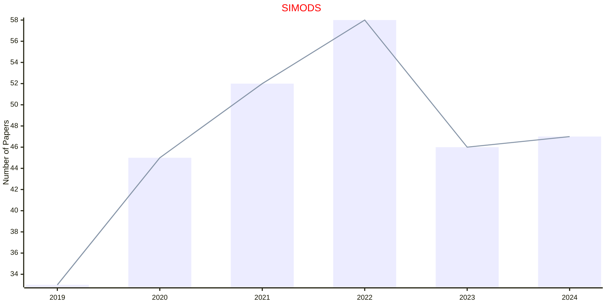
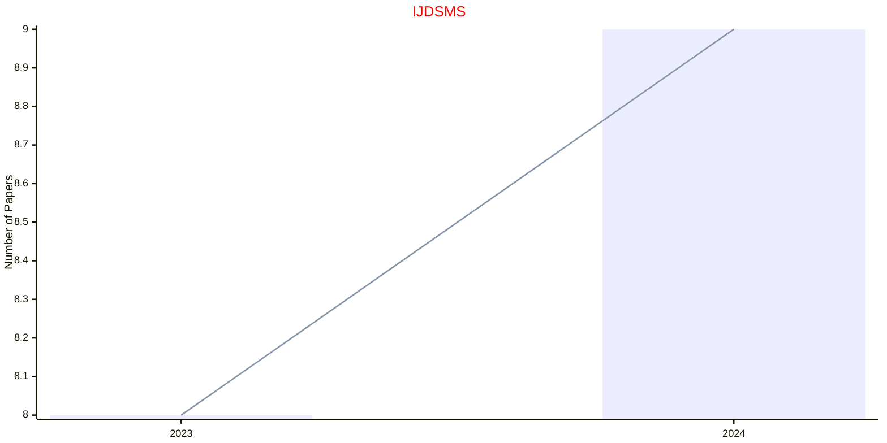

# Data Science

## SIMODS

|Publishers|Full/Homepage|Abbr/About|Acronym/Issues|Period/DBLP|Top/Early|CCF|CAS|JCR|IF|Keywords/Google|
|-         |-            |-         |-             |-          |-        |-  |-  |-  |- |-              |
|[SIAM](https://epubs.siam.org)|[SIAM Journal on Mathematics of Data Science](https://epubs.siam.org/journal/sjmdaq)|[SIAM J. Math. Data Sci.](https://epubs.siam.org/journal/simods/about)|[SIMODS](https://epubs.siam.org/loi/sjmdaq)|2019 -|False||3|Q1|3.5|[Data Science](https://www.google.com/search?q=Data+Science)|

## IJDSMS

|Publishers|Full/Homepage|Abbr/About|Acronym/Issues|Period/DBLP|Top/Early|CCF|CAS|JCR|IF|Keywords/Google|
|-         |-            |-         |-             |-          |-        |-  |-  |-  |- |-              |
|[WS](https://worldscientific.com/)|[International Journal of Data Science in the Mathematical Sciences](https://worldscientific.com/worldscinet/ijdsms)|[Int. J. Data Sci. Math. Sci.](https://worldscientific.com/page/ijdsms/aims-scope)|[IJDSMS](https://worldscientific.com/loi/ijdsms)|2023 -|False|||||[Data Science](https://www.google.com/search?q=Data+Science); [Mathematics](https://www.google.com/search?q=Mathematics)|

