# Data and Knowledge

## TKDD

|Publishers|Full/Homepage|Abbr/About|Acronym/Issues|Period/DBLP|Top/Early|CCF|CAS|JCR|IF|Keywords/Google|
|-         |-            |-         |-             |-          |-        |-  |-  |-  |- |-              |
|[ACM](https://www.acm.org/)|[ACM Transactions on Knowledge Discovery from Data](https://dl.acm.org/journal/tkdd)|[ACM Trans. knowl. Discov. Data](https://dl.acm.org/journal/tkdd/about)|[TKDD](https://dl.acm.org/loi/tkdd)|[2007 -](https://dblp.org/db/journals/tkdd/index.html)|False|B|3|Q1|4.9|[Data Mining](https://www.google.com/search?q=Data+Mining); [Knowledge Discovery](https://www.google.com/search?q=Knowledge+Discovery)|

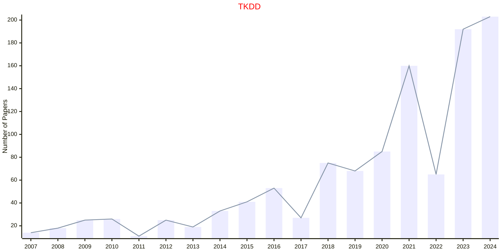

## DKE

|Publishers|Full/Homepage|Abbr/About|Acronym/Issues|Period/DBLP|Top/Early|CCF|CAS|JCR|IF|Keywords/Google|
|-         |-            |-         |-             |-          |-        |-  |-  |-  |- |-              |
|[ELSEVIER](https://www.sciencedirect.com/)|[Data & Knowledge Engineering](https://www.sciencedirect.com/journal/data-and-knowledge-engineering)|[Data Knowl. Eng.](https://www.sciencedirect.com/journal/data-and-knowledge-engineering/about/aims-and-scope)|[DKE](https://www.sciencedirect.com/journal/data-and-knowledge-engineering/issues)|1985 -|False|B|3|Q3|2.3|[Data and Knowledge](https://www.google.com/search?q=Data+and+Knowledge)|

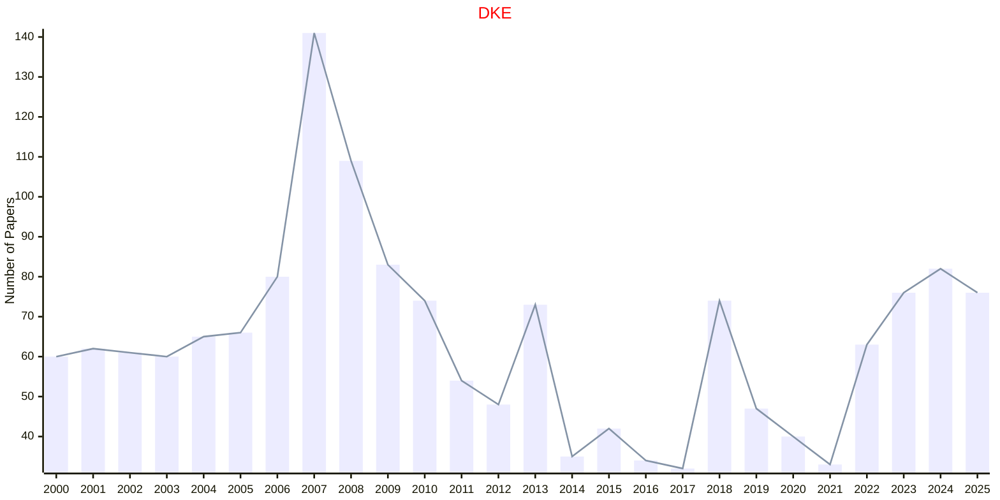

## KBS

|Publishers|Full/Homepage|Abbr/About|Acronym/Issues|Period/DBLP|Top/Early|CCF|CAS|JCR|IF|Keywords/Google|
|-         |-            |-         |-             |-          |-        |-  |-  |-  |- |-              |
|[ELSEVIER](https://www.sciencedirect.com/)|[Knowledge-Based Systems](https://www.sciencedirect.com/journal/knowledge-based-systems)|[Knowl. Based Syst.](https://www.sciencedirect.com/journal/knowledge-based-systems/about/aims-and-scope)|[KBS](https://www.sciencedirect.com/journal/knowledge-based-systems/issues)|1987 -|True|C|1|Q1|7.6|[Knowledge Based Systems](https://www.google.com/search?q=Knowledge+Based+Systems)|

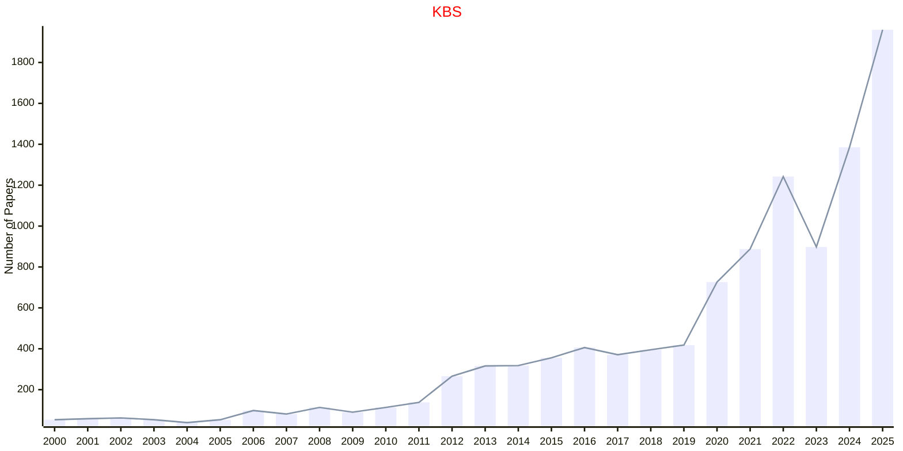

## FDATA

|Publishers|Full/Homepage|Abbr/About|Acronym/Issues|Period/DBLP|Top/Early|CCF|CAS|JCR|IF|Keywords/Google|
|-         |-            |-         |-             |-          |-        |-  |-  |-  |- |-              |
|[FRONTIERS](https://www.frontiersin.org/)|[Frontiers in Big Data](https://www.frontiersin.org/journals/big-data)|[Front. Big Data](https://www.frontiersin.org/journals/big-data/about)|[FDATA](https://www.frontiersin.org/journals/big-data/volumes)|2018 -|False||4||3.5|[Data Mining](https://www.google.com/search?q=Data+Mining)|

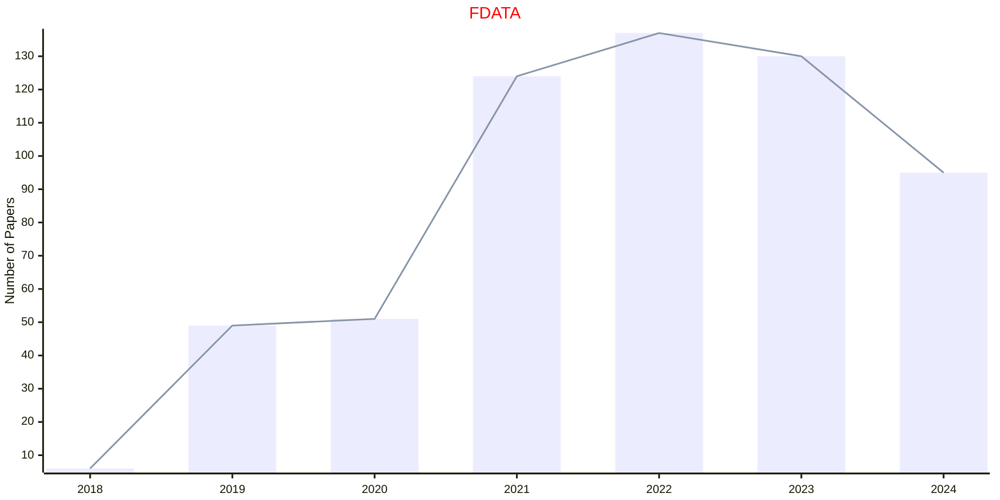

## TBD

|Publishers|Full/Homepage|Abbr/About|Acronym/Issues|Period/DBLP|Top/Early|CCF|CAS|JCR|IF|Keywords/Google|
|-         |-            |-         |-             |-          |-        |-  |-  |-  |- |-              |
|[IEEE](https://ieeexplore.ieee.org/)|[IEEE Transactions on Big Data](https://ieeexplore.ieee.org/xpl/RecentIssue.jsp?punumber=6687317)|[IEEE Trans. Big Data](https://ieeexplore.ieee.org/xpl/aboutJournal.jsp?punumber=6687317)|[TBD](https://ieeexplore.ieee.org/xpl/issues?punumber=6687317&isnumber=10595994)|2015 -|[False](https://ieeexplore.ieee.org/xpl/tocresult.jsp?isnumber=7153538)|C|2|Q1|5.7|[Data Mining](https://www.google.com/search?q=Data+Mining)|

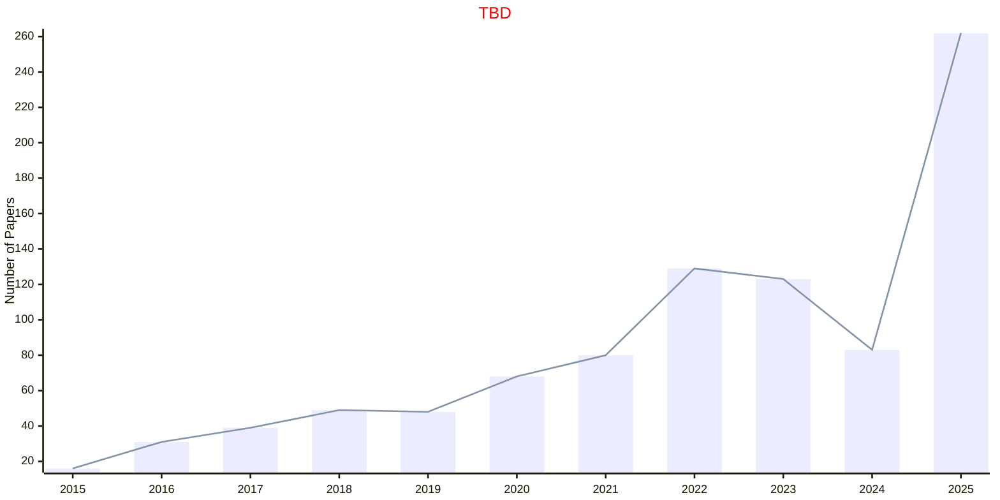

## TKDE

|Publishers|Full/Homepage|Abbr/About|Acronym/Issues|Period/DBLP|Top/Early|CCF|CAS|JCR|IF|Keywords/Google|
|-         |-            |-         |-             |-          |-        |-  |-  |-  |- |-              |
|[IEEE](https://ieeexplore.ieee.org/)|[IEEE Transactions on Knowledge and Data Engineering](https://ieeexplore.ieee.org/xpl/RecentIssue.jsp?punumber=69)|[IEEE Trans. Knowl. Data Eng.](https://ieeexplore.ieee.org/xpl/aboutJournal.jsp?punumber=69)|[TKDE](https://ieeexplore.ieee.org/xpl/issues?punumber=69&isnumber=10210449)|1989 -|[True](https://ieeexplore.ieee.org/xpl/tocresult.jsp?isnumber=4358933)|A|1|Q1|9.6|[Data Mining](https://www.google.com/search?q=Data+Mining)|

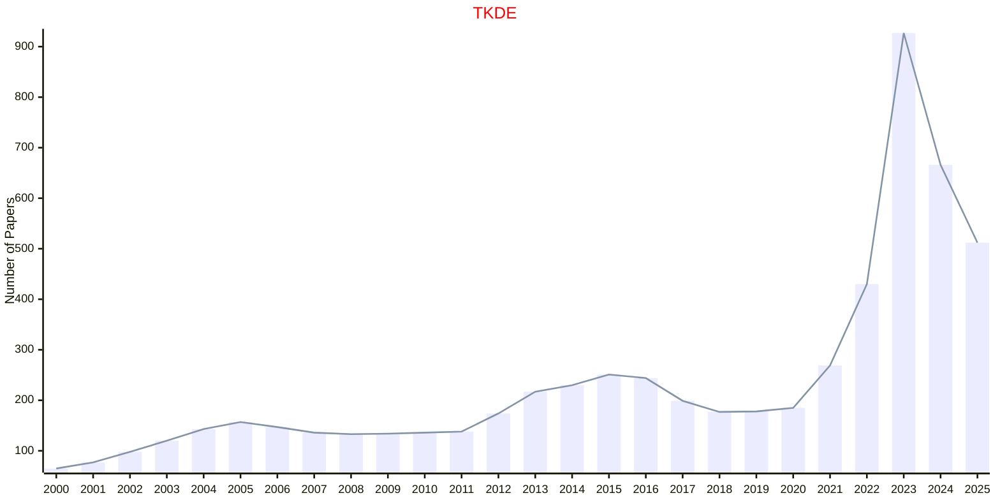

## DSC

|Publishers|Full/Homepage|Abbr/About|Acronym/Issues|Period/DBLP|Top/Early|CCF|CAS|JCR|IF|Keywords/Google|
|-         |-            |-         |-             |-          |-        |-  |-  |-  |- |-              |
|[SAGE](https://www.sagepub.com/)|[Data Science](https://journals.sagepub.com/home/dsca)|[Data Sci.](https://journals.sagepub.com/overview-metric/DSC?)|[DSC](https://journals.sagepub.com/loi/dsca)|2017 -|False|||||[Data Mining](https://www.google.com/search?q=Data+Mining)|

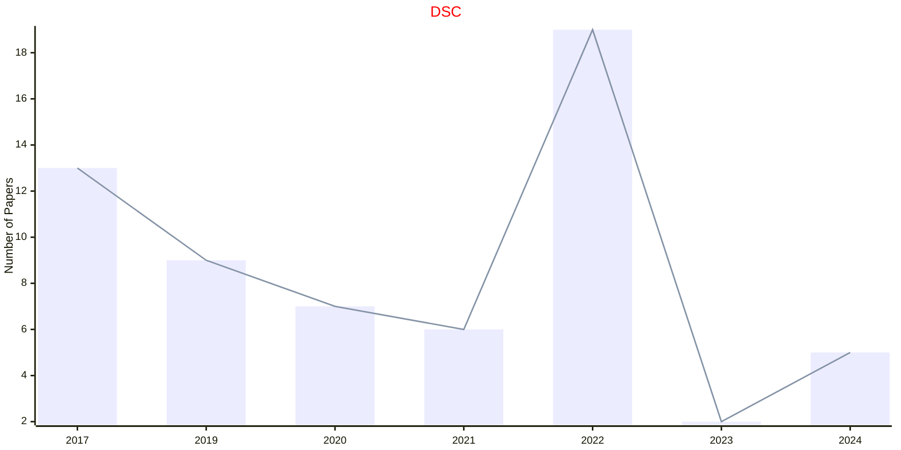

## IDA

|Publishers|Full/Homepage|Abbr/About|Acronym/Issues|Period/DBLP|Top/Early|CCF|CAS|JCR|IF|Keywords/Google|
|-         |-            |-         |-             |-          |-        |-  |-  |-  |- |-              |
|[SAGE](https://www.sagepub.com/)|[Intelligent Data Analysis](https://journals.sagepub.com/home/ida)|[Intell. Data Anal.](https://journals.sagepub.com/overview-metric/IDA?)|[IDA](https://journals.sagepub.com/loi/ida)|1997 -|False|C|4|Q4|0.9|[Artificial Intelligence](https://www.google.com/search?q=Artificial+Intelligence); [Data Mining](https://www.google.com/search?q=Data+Mining); [Evolutionary Computation](https://www.google.com/search?q=Evolutionary+Computation)|

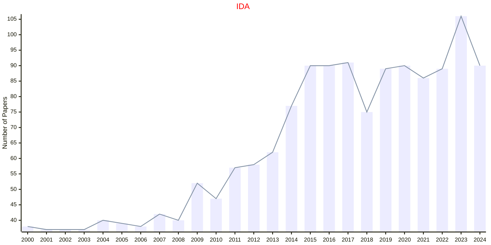

## DMKD

|Publishers|Full/Homepage|Abbr/About|Acronym/Issues|Period/DBLP|Top/Early|CCF|CAS|JCR|IF|Keywords/Google|
|-         |-            |-         |-             |-          |-        |-  |-  |-  |- |-              |
|[SPRINGER](https://www.springer.com/)|[Data Mining and Knowledge Discovery](https://www.springer.com/journal/10618)|[Data Mining Knowl. Discov.](https://www.springer.com/journal/10618/aims-and-scope)|[DMKD](https://link.springer.com/journal/10618/volumes-and-issues)|1997 -|False|B|3|Q2|6.4|[Data and Knowledge](https://www.google.com/search?q=Data+and+Knowledge)|

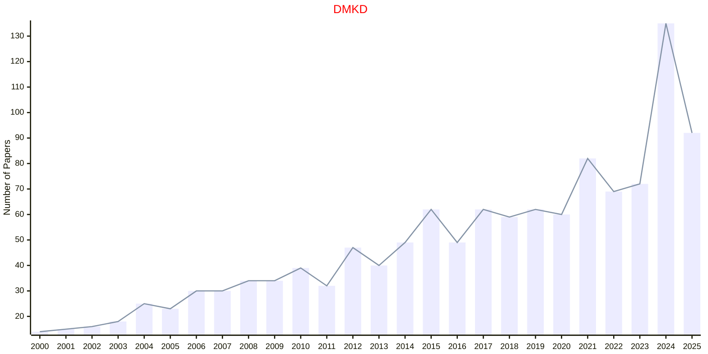

## EXSY

|Publishers|Full/Homepage|Abbr/About|Acronym/Issues|Period/DBLP|Top/Early|CCF|CAS|JCR|IF|Keywords/Google|
|-         |-            |-         |-             |-          |-        |-  |-  |-  |- |-              |
|[WILEY](https://www.wiley.com/)|[Expert Systems](https://onlinelibrary.wiley.com/journal/14680394)|[Expert Syst.](https://onlinelibrary.wiley.com/page/journal/14680394/homepage/productinformation.html)|[EXSY](https://onlinelibrary.wiley.com/loi/14680394)|1984 -|False|C|4|Q2|2.7|[Knowledge Engineering](https://www.google.com/search?q=Knowledge+Engineering)|

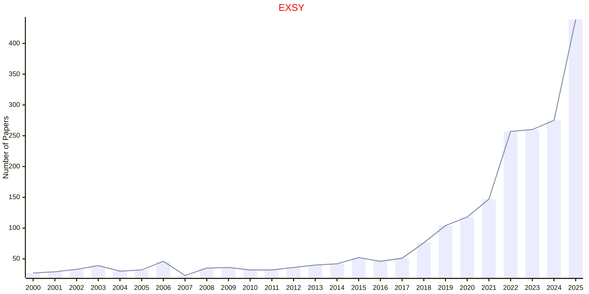

## SADM

|Publishers|Full/Homepage|Abbr/About|Acronym/Issues|Period/DBLP|Top/Early|CCF|CAS|JCR|IF|Keywords/Google|
|-         |-            |-         |-             |-          |-        |-  |-  |-  |- |-              |
|[WILEY](https://www.wiley.com/)|[Statistical Analysis and Data Mining](https://onlinelibrary.wiley.com/journal/19321872)|[Stat. Anal. Data Mining](https://onlinelibrary.wiley.com/page/journal/19321872/homepage/productinformation.html)|[SADM](https://onlinelibrary.wiley.com/loi/19321872)|2008 -|False||4|||[Data Mining](https://www.google.com/search?q=Data+Mining); [Statistical Analysis](https://www.google.com/search?q=Statistical+Analysis)|

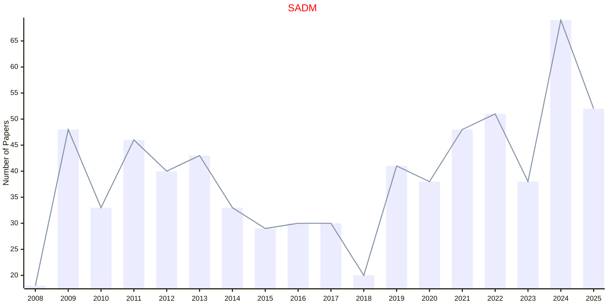

## WIDM

|Publishers|Full/Homepage|Abbr/About|Acronym/Issues|Period/DBLP|Top/Early|CCF|CAS|JCR|IF|Keywords/Google|
|-         |-            |-         |-             |-          |-        |-  |-  |-  |- |-              |
|[WILEY](https://www.wiley.com/)|[WIREs Data Mining and Knowledge Discovery](https://onlinelibrary.wiley.com/journal/19424795)|[WIREs Data Mining Knowl. Discov.](https://wires.onlinelibrary.wiley.com/hub/journal/19424795/about/productinformation)|[WIDM](https://wires.onlinelibrary.wiley.com/loi/19424795)|2011 -|False|||||[Data Mining](https://www.google.com/search?q=Data+Mining); [Knowledge Discovery](https://www.google.com/search?q=Knowledge+Discovery)|

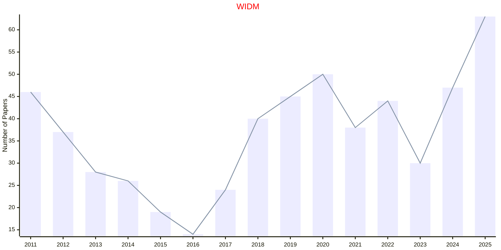

## IJDSMS

|Publishers|Full/Homepage|Abbr/About|Acronym/Issues|Period/DBLP|Top/Early|CCF|CAS|JCR|IF|Keywords/Google|
|-         |-            |-         |-             |-          |-        |-  |-  |-  |- |-              |
|[WS](https://worldscientific.com/)|[International Journal of Data Science in the Mathematical Sciences](https://worldscientific.com/worldscinet/ijdsms)|[Int. J. Data Sci. Math. Sci.](https://worldscientific.com/page/ijdsms/aims-scope)|[IJDSMS](https://worldscientific.com/loi/ijdsms)|2023 -|False|||||[Data Science](https://www.google.com/search?q=Data+Science); [Mathematics](https://www.google.com/search?q=Mathematics)|

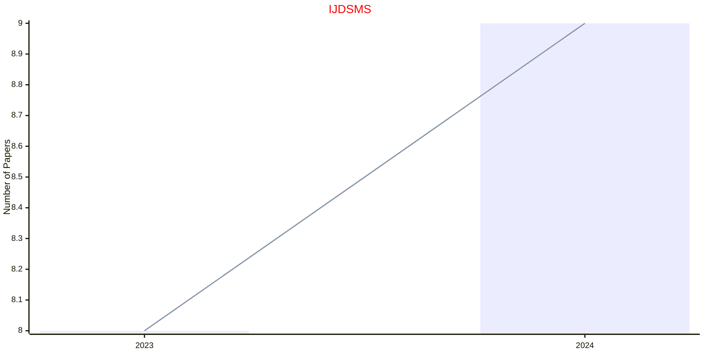

## IJUFKS

|Publishers|Full/Homepage|Abbr/About|Acronym/Issues|Period/DBLP|Top/Early|CCF|CAS|JCR|IF|Keywords/Google|
|-         |-            |-         |-             |-          |-        |-  |-  |-  |- |-              |
|[WS](https://worldscientific.com/)|[International Journal of Uncertainty, Fuzziness and Knowledge-Based Systems](https://worldscientific.com/worldscinet/ijufks)|[Int. J. Uncertain. Fuzziness Knowl.-Based. Syst.](https://worldscientific.com/page/ijufks/aims-scope)|[IJUFKS](https://worldscientific.com/loi/ijufks)|1993 -|False||4|Q4|1.0|[Fuzzy Systems](https://www.google.com/search?q=Fuzzy+Systems); [Knowledge-Based Systems](https://www.google.com/search?q=Knowledge-Based+Systems)|

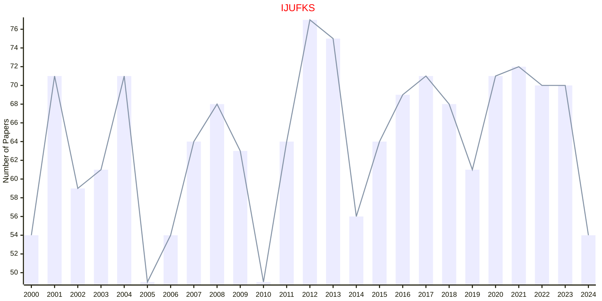

