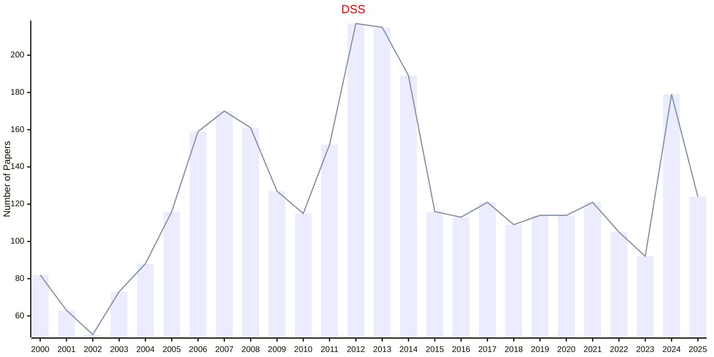

# Decision Making

## DSS

|Publishers|Full/Homepage|Abbr/About|Acronym/Issues|Period/DBLP|Top/Early|CCF|CAS|JCR|IF|Keywords/Google|
|-         |-            |-         |-             |-          |-        |-  |-  |-  |- |-              |
|[ELSEVIER](https://www.sciencedirect.com/)|[Decision Support Systems](https://www.sciencedirect.com/journal/decision-support-systems)|[Decis. Supp. Syst.](https://www.sciencedirect.com/journal/decision-support-systems/about/aims-and-scope)|[DSS](https://www.sciencedirect.com/journal/decision-support-systems/issues)|1985 -|True|C|2|Q1|8.2|[Decision Making](https://www.google.com/search?q=Decision+Making)|

