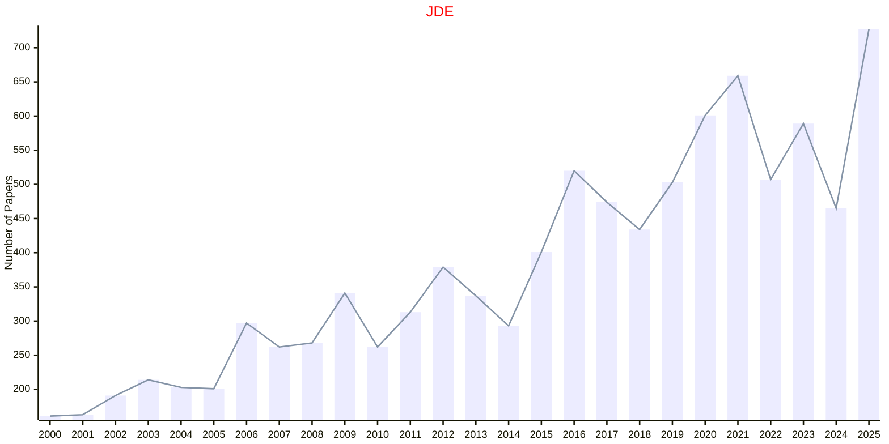

# Differential Equations

## JDE

|Publishers|Full/Homepage|Abbr/About|Acronym/Issues|Period/DBLP|Top/Early|CCF|CAS|JCR|IF|Keywords/Google|
|-         |-            |-         |-             |-          |-        |-  |-  |-  |- |-              |
|[ELSEVIER](https://www.sciencedirect.com/)|[Journal of Differential Equations](https://www.sciencedirect.com/journal/journal-of-differential-equations)|[J. Diff. Equ.](https://www.sciencedirect.com/journal/journal-of-differential-equations/about/aims-and-scope)|[JDE](https://www.sciencedirect.com/journal/journal-of-differential-equations/issues)|1965 -|True||1|Q1|2.5|[Differential Equations](https://www.google.com/search?q=Differential+Equations)|

