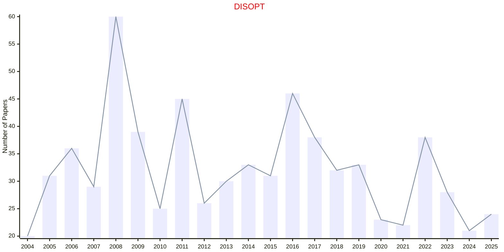

# Discrete Optimization

## DISOPT

|Publishers|Full/Homepage|Abbr/About|Acronym/Issues|Period/DBLP|Top/Early|CCF|CAS|JCR|IF|Keywords/Google|
|-         |-            |-         |-             |-          |-        |-  |-  |-  |- |-              |
|[ELSEVIER](https://www.sciencedirect.com/)|[Discrete Optimization](https://www.sciencedirect.com/journal/discrete-optimization)|[Discret. Optim.](https://www.sciencedirect.com/journal/discrete-optimization/about/aims-and-scope)|[DISOPT](https://www.sciencedirect.com/journal/discrete-optimization/issues)|2004 -|False||4|Q2|1.2|[Discrete Optimization](https://www.google.com/search?q=Discrete+Optimization)|

