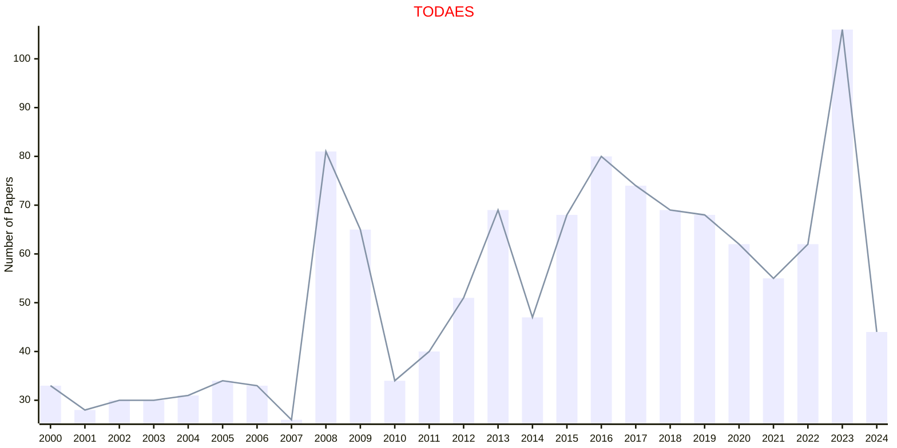

# Electronic Systems

## TODAES

|Publishers|Full/Homepage|Abbr/About|Acronym/Issues|Period/DBLP|Top/Early|CCF|CAS|JCR|IF|Keywords/Google|
|-         |-            |-         |-             |-          |-        |-  |-  |-  |- |-              |
|[ACM](https://www.acm.org/)|[ACM Transactions on Design Automation of Electronic Systems](https://dl.acm.org/journal/todaes)|[ACM Trans. Des. Autom. Electron. Syst.](https://dl.acm.org/journal/todaes/about)|[TODAES](https://dl.acm.org/loi/todaes)|[1996 -](https://dblp.org/db/journals/todaes/index.html)|False|B|4|Q3|1.9|[Electronic Systems](https://www.google.com/search?q=Electronic+Systems)|

