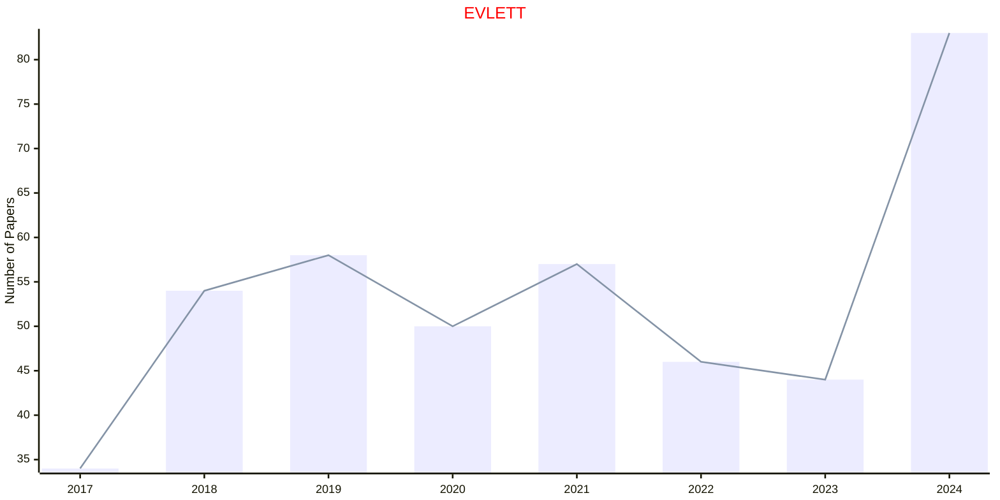

# Evolutionary Biology

## EVLETT

|Publishers|Full/Homepage|Abbr/About|Acronym/Issues|Period/DBLP|Top/Early|CCF|CAS|JCR|IF|Keywords/Google|
|-         |-            |-         |-             |-          |-        |-  |-  |-  |- |-              |
|[OXFORD](https://academic.oup.com/)|[Evolution Letters](https://academic.oup.com/evlett)|[Evol. Lett.](https://academic.oup.com/evlett/pages/about)|[EVLETT](https://academic.oup.com/evlett/issue)|2017 -|True||1|Q1|4.5|[Evolutionary Biology](https://www.google.com/search?q=Evolutionary+Biology)|

