# Evolutionary Computation

## TELO

|Publishers|Full/Homepage|Abbr/About|Acronym/Issues|Period/DBLP|Top/Early|CCF|CAS|JCR|IF|Keywords/Google|
|-         |-            |-         |-             |-          |-        |-  |-  |-  |- |-              |
|[ACM](https://www.acm.org/)|[ACM Transactions on Evolutionary Learning and Optimization](https://dlnext.acm.org/journal/telo)|[ACM Trans. Evol. Learn. Optim.](https://dlnext.acm.org/journal/telo/about)|[TELO](https://dl.acm.org/loi/telo)|[2021 -](https://dblp.org/db/journals/telo/index.html)|False|||||[Evolutionary Computation](https://www.google.com/search?q=Evolutionary+Computation); [Machine Learning](https://www.google.com/search?q=Machine+Learning)|

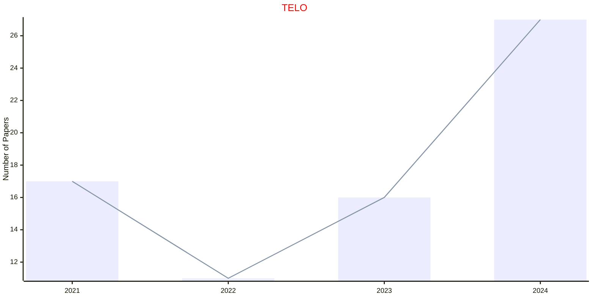

## ASOC

|Publishers|Full/Homepage|Abbr/About|Acronym/Issues|Period/DBLP|Top/Early|CCF|CAS|JCR|IF|Keywords/Google|
|-         |-            |-         |-             |-          |-        |-  |-  |-  |- |-              |
|[ELSEVIER](https://www.sciencedirect.com/)|[Applied Soft Computing](https://www.sciencedirect.com/journal/applied-soft-computing)|[Appl. Soft Comput.](https://www.sciencedirect.com/journal/applied-soft-computing/about/aims-and-scope)|[ASOC](https://www.sciencedirect.com/journal/applied-soft-computing/issues)|2001 -|True||2|Q1|6.9|[Artificial Intelligence](https://www.google.com/search?q=Artificial+Intelligence); [Evolutionary Computation](https://www.google.com/search?q=Evolutionary+Computation)|

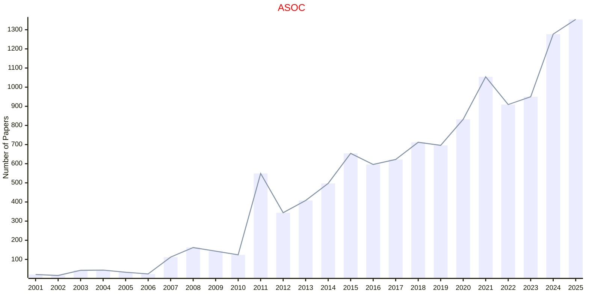

## SWEVO

|Publishers|Full/Homepage|Abbr/About|Acronym/Issues|Period/DBLP|Top/Early|CCF|CAS|JCR|IF|Keywords/Google|
|-         |-            |-         |-             |-          |-        |-  |-  |-  |- |-              |
|[ELSEVIER](https://www.sciencedirect.com/)|[Swarm and Evolutionary Computation](https://www.sciencedirect.com/journal/swarm-and-evolutionary-computation)|[Swarm Evol. Comput.](https://www.sciencedirect.com/journal/swarm-and-evolutionary-computation/about/aims-and-scope)|[SWEVO](https://www.sciencedirect.com/journal/swarm-and-evolutionary-computation/issues)|2011 -|False||2|Q1|8.8|[Evolutionary Computation](https://www.google.com/search?q=Evolutionary+Computation); [Swarm Intelligence](https://www.google.com/search?q=Swarm+Intelligence)|

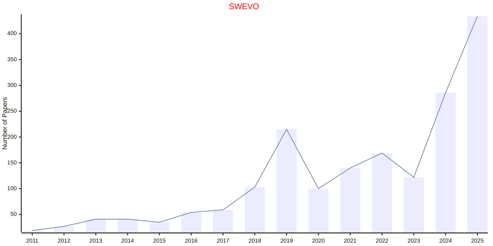

## TCYB

|Publishers|Full/Homepage|Abbr/About|Acronym/Issues|Period/DBLP|Top/Early|CCF|CAS|JCR|IF|Keywords/Google|
|-         |-            |-         |-             |-          |-        |-  |-  |-  |- |-              |
|[IEEE](https://ieeexplore.ieee.org/)|[IEEE Transactions on Cybernetics](https://ieeexplore.ieee.org/xpl/RecentIssue.jsp?punumber=6221036)|[IEEE Trans. Cybern.](https://ieeexplore.ieee.org/xpl/aboutJournal.jsp?punumber=6221036)|[TCYB](https://ieeexplore.ieee.org/xpl/issues?punumber=6221036&isnumber=10223305)|2013 -|[True](https://ieeexplore.ieee.org/xpl/tocresult.jsp?isnumber=6352949)|B|1|Q1|11.6|[Artificial Intelligence](https://www.google.com/search?q=Artificial+Intelligence); [Evolutionary Computation](https://www.google.com/search?q=Evolutionary+Computation)|

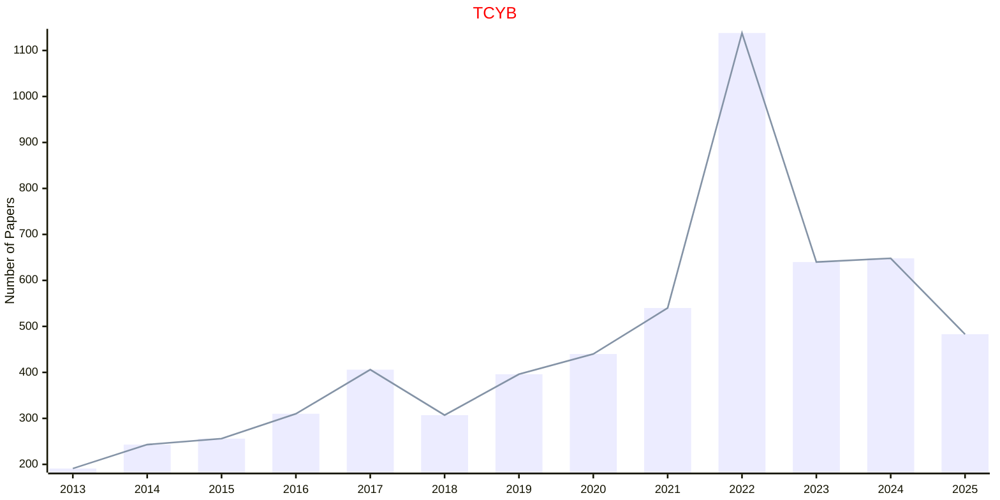

## TEVC

|Publishers|Full/Homepage|Abbr/About|Acronym/Issues|Period/DBLP|Top/Early|CCF|CAS|JCR|IF|Keywords/Google|
|-         |-            |-         |-             |-          |-        |-  |-  |-  |- |-              |
|[IEEE](https://ieeexplore.ieee.org/)|[IEEE Transactions on Evolutionary Computation](https://ieeexplore.ieee.org/xpl/RecentIssue.jsp?punumber=4235)|[IEEE Trans. Evol. Comput.](https://ieeexplore.ieee.org/xpl/aboutJournal.jsp?punumber=4235)|[TEVC](https://ieeexplore.ieee.org/xpl/issues?punumber=4235&isnumber=10198499)|1997 -|[True](https://ieeexplore.ieee.org/xpl/tocresult.jsp?isnumber=4358751)|B|1|Q1|14.5|[Evolutionary Computation](https://www.google.com/search?q=Evolutionary+Computation)|

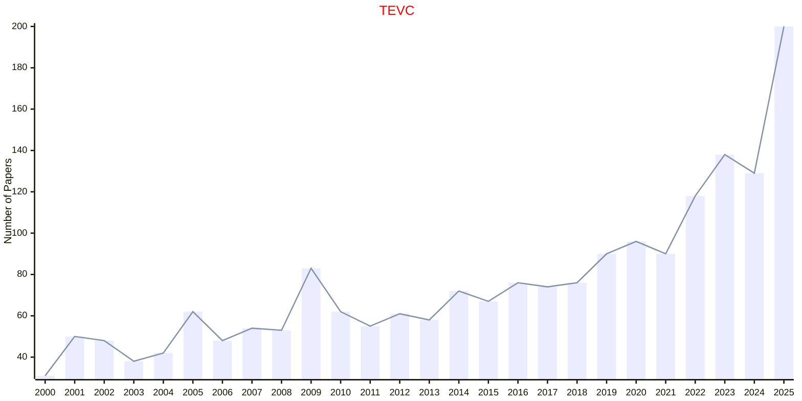

## ECJ

|Publishers|Full/Homepage|Abbr/About|Acronym/Issues|Period/DBLP|Top/Early|CCF|CAS|JCR|IF|Keywords/Google|
|-         |-            |-         |-             |-          |-        |-  |-  |-  |- |-              |
|[MIT](https://direct.mit.edu/)|[Evolutionary Computation](https://direct.mit.edu/evco)|Evol. Comput.|[ECJ](https://direct.mit.edu/evco/issue)|1993 -|[False](https://direct.mit.edu/evco/online-early)|B|3|Q2|5.1|[Evolutionary Computation](https://www.google.com/search?q=Evolutionary+Computation)|

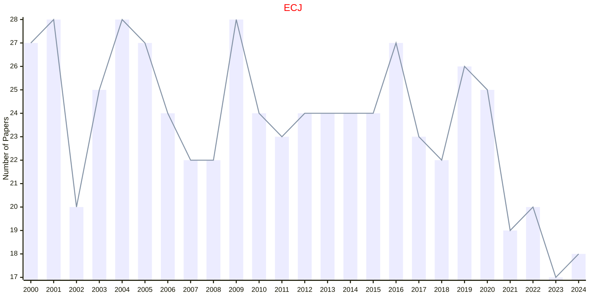

## ICAE

|Publishers|Full/Homepage|Abbr/About|Acronym/Issues|Period/DBLP|Top/Early|CCF|CAS|JCR|IF|Keywords/Google|
|-         |-            |-         |-             |-          |-        |-  |-  |-  |- |-              |
|[SAGE](https://www.sagepub.com/)|[Integrated Computer-Aided Engineering](https://journals.sagepub.com/home/ico)|[Integrated Computer-Aided Engineering](https://journals.sagepub.com/overview-metric/ICO?)|[ICAE](https://journals.sagepub.com/loi/ico)|1993 -|False||2|Q1|3.4|[Evolutionary Computation](https://www.google.com/search?q=Evolutionary+Computation)|

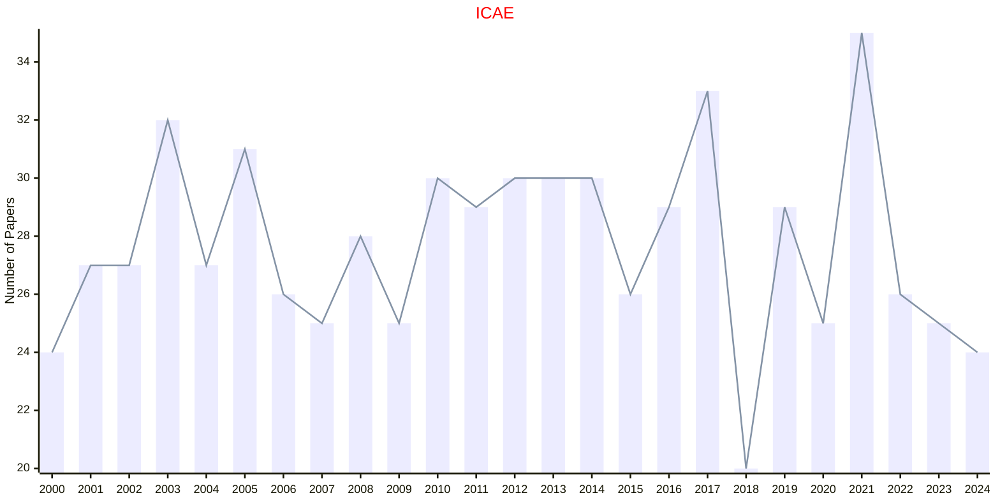

## IDA

|Publishers|Full/Homepage|Abbr/About|Acronym/Issues|Period/DBLP|Top/Early|CCF|CAS|JCR|IF|Keywords/Google|
|-         |-            |-         |-             |-          |-        |-  |-  |-  |- |-              |
|[SAGE](https://www.sagepub.com/)|[Intelligent Data Analysis](https://journals.sagepub.com/home/ida)|[Intell. Data Anal.](https://journals.sagepub.com/overview-metric/IDA?)|[IDA](https://journals.sagepub.com/loi/ida)|1997 -|False|C|4|Q4|0.9|[Artificial Intelligence](https://www.google.com/search?q=Artificial+Intelligence); [Data Mining](https://www.google.com/search?q=Data+Mining); [Evolutionary Computation](https://www.google.com/search?q=Evolutionary+Computation)|

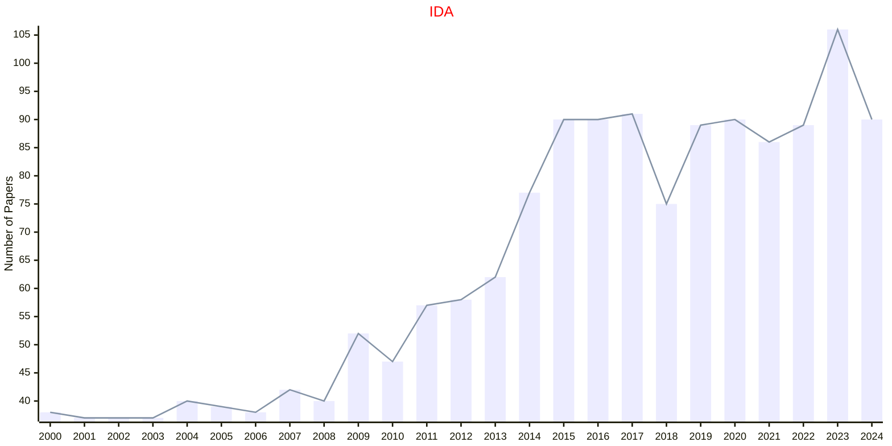

## EI

|Publishers|Full/Homepage|Abbr/About|Acronym/Issues|Period/DBLP|Top/Early|CCF|CAS|JCR|IF|Keywords/Google|
|-         |-            |-         |-             |-          |-        |-  |-  |-  |- |-              |
|[SPRINGER](https://www.springer.com/)|[Evolutionary Intelligence](https://www.springer.com/journal/12065)|[Evol. Intell.](https://www.springer.com/journal/12065/aims-and-scope)|[EI](https://link.springer.com/journal/12065/volumes-and-issues)|2008 -|False||4||2.6|[Evolutionary Computation](https://www.google.com/search?q=Evolutionary+Computation)|

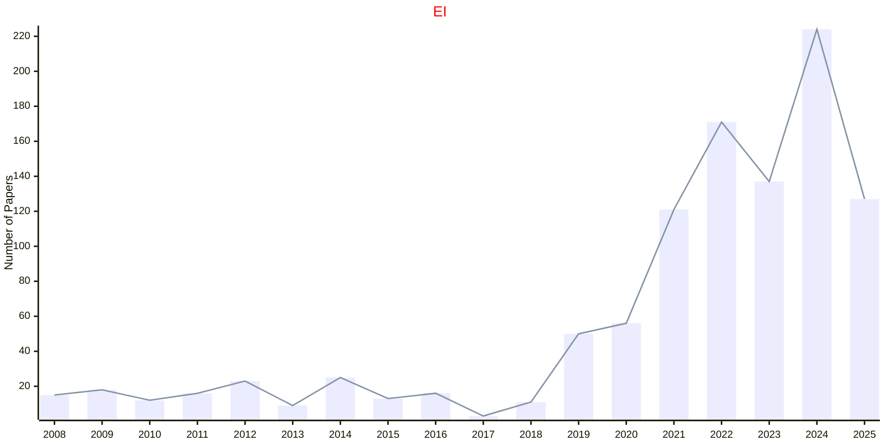

## GPEM

|Publishers|Full/Homepage|Abbr/About|Acronym/Issues|Period/DBLP|Top/Early|CCF|CAS|JCR|IF|Keywords/Google|
|-         |-            |-         |-             |-          |-        |-  |-  |-  |- |-              |
|[SPRINGER](https://www.springer.com/)|[Genetic Programming and Evolvable Machines](https://www.springer.com/journal/10710)|[Genet. Program. Evol. Mach.](https://www.springer.com/journal/10710/aims-and-scope)|[GPEM](https://link.springer.com/journal/10710/volumes-and-issues)|2000 -|False||4|Q3|2.2|[Evolutionary Computation](https://www.google.com/search?q=Evolutionary+Computation)|

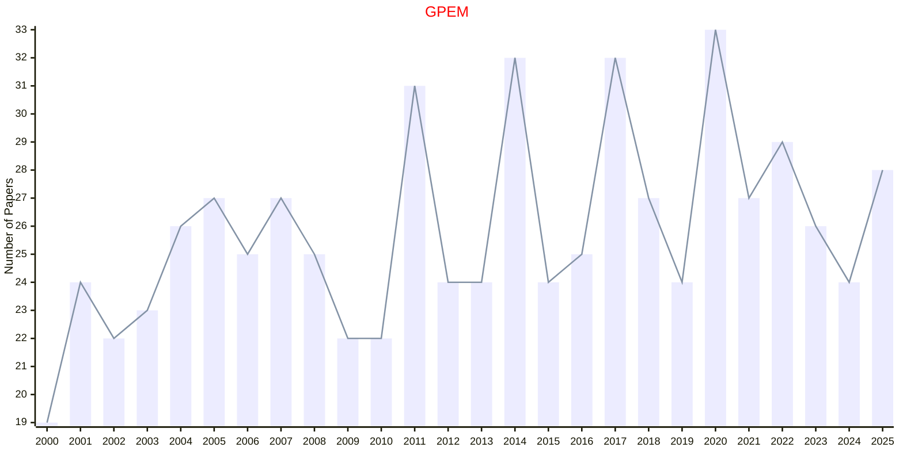

## MECO

|Publishers|Full/Homepage|Abbr/About|Acronym/Issues|Period/DBLP|Top/Early|CCF|CAS|JCR|IF|Keywords/Google|
|-         |-            |-         |-             |-          |-        |-  |-  |-  |- |-              |
|[SPRINGER](https://www.springer.com/)|[Memetic Computing](https://www.springer.com/journal/12293)|[Memet. Comput.](https://www.springer.com/journal/12293/aims-and-scope)|[MECO](https://link.springer.com/journal/12293/volumes-and-issues)|2009 -|False||3|Q2|2.6|[Evolutionary Computation](https://www.google.com/search?q=Evolutionary+Computation)|

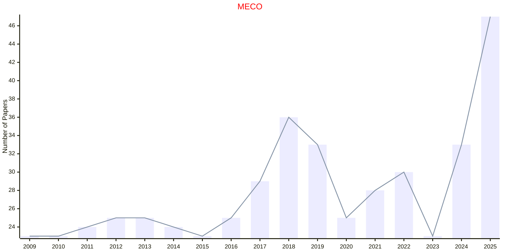

## MIR

|Publishers|Full/Homepage|Abbr/About|Acronym/Issues|Period/DBLP|Top/Early|CCF|CAS|JCR|IF|Keywords/Google|
|-         |-            |-         |-             |-          |-        |-  |-  |-  |- |-              |
|[SPRINGER](https://www.springer.com/)|[Machine Intelligence Research](https://www.springer.com/journal/11633)|[Mach. Intell. Res.](https://www.springer.com/journal/11633/aims-and-scope)|[MIR](https://link.springer.com/journal/11633/volumes-and-issues)|2004 -|False||2||8.7|[Evolutionary Computation](https://www.google.com/search?q=Evolutionary+Computation); [Swarm Intelligence](https://www.google.com/search?q=Swarm+Intelligence)|

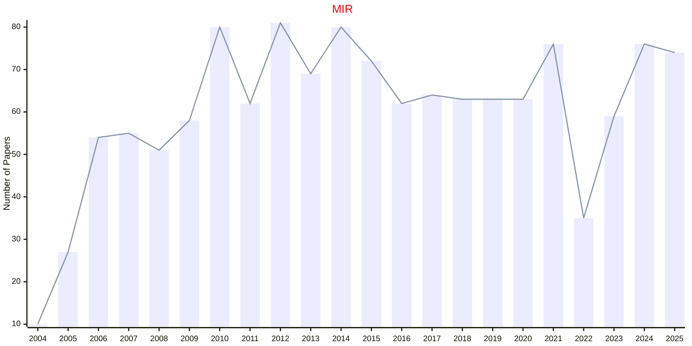

## SOCO

|Publishers|Full/Homepage|Abbr/About|Acronym/Issues|Period/DBLP|Top/Early|CCF|CAS|JCR|IF|Keywords/Google|
|-         |-            |-         |-             |-          |-        |-  |-  |-  |- |-              |
|[SPRINGER](https://www.springer.com/)|[Soft Computing](https://www.springer.com/journal/500)|[Soft Comput.](https://www.springer.com/journal/500/aims-and-scope)|[SOCO](https://link.springer.com/journal/500/volumes-and-issues)|1997 -|False|C|4|Q3|2.7|[Evolutionary Computation](https://www.google.com/search?q=Evolutionary+Computation); [Swarm Intelligence](https://www.google.com/search?q=Swarm+Intelligence)|

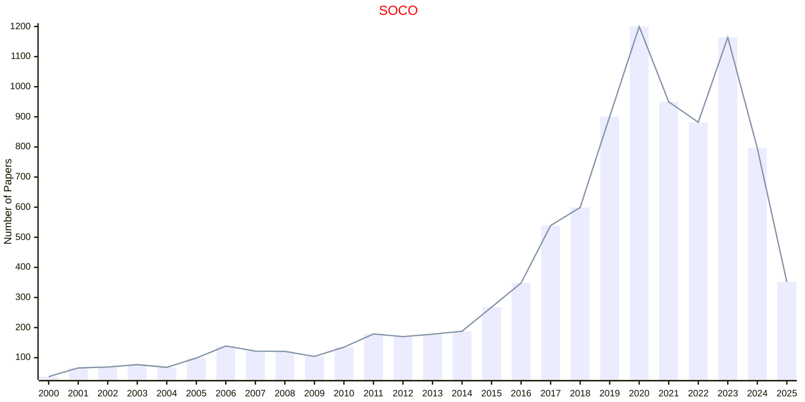

## CSCI

|Publishers|Full/Homepage|Abbr/About|Acronym/Issues|Period/DBLP|Top/Early|CCF|CAS|JCR|IF|Keywords/Google|
|-         |-            |-         |-             |-          |-        |-  |-  |-  |- |-              |
|[TAYLOR](https://www.tandfonline.com/)|[Connection Science](https://www.tandfonline.com/journals/ccos20)|[Connect. Sci.](https://www.tandfonline.com/journals/ccos20/about-this-journal#aims-and-scope)|[CSCI](https://www.tandfonline.com/loi/ccos20)|1989 -|False|C|3|Q2|3.3|[Artificial Intelligence](https://www.google.com/search?q=Artificial+Intelligence); [Evolutionary Computation](https://www.google.com/search?q=Evolutionary+Computation)|

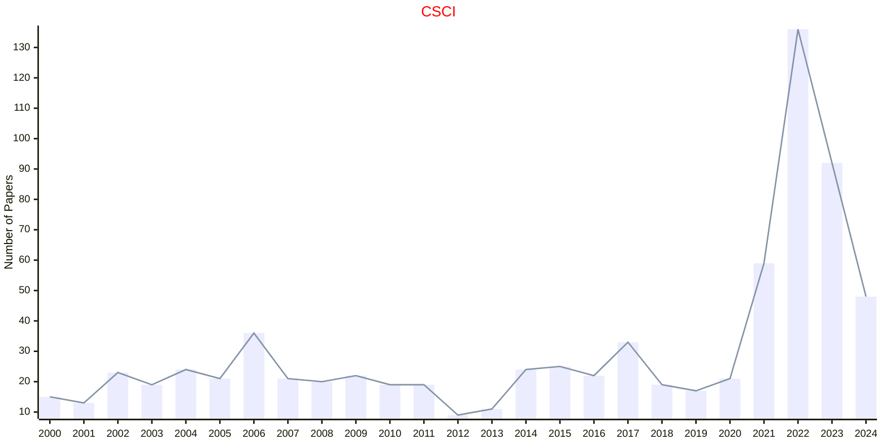

## IJCIA

|Publishers|Full/Homepage|Abbr/About|Acronym/Issues|Period/DBLP|Top/Early|CCF|CAS|JCR|IF|Keywords/Google|
|-         |-            |-         |-             |-          |-        |-  |-  |-  |- |-              |
|[WS](https://worldscientific.com/)|[International Journal of Computational Intelligence and Applications](https://worldscientific.com/worldscinet/ijcia)|[Int. J. Comput. Intell. Appl.](https://worldscientific.com/page/ijcia/aims-scope)|[IJCIA](https://worldscientific.com/loi/ijcia)|2001 -|False|C|4||1.5|[Computational Intelligence](https://www.google.com/search?q=Computational+Intelligence); [Evolutionary Computation](https://www.google.com/search?q=Evolutionary+Computation)|

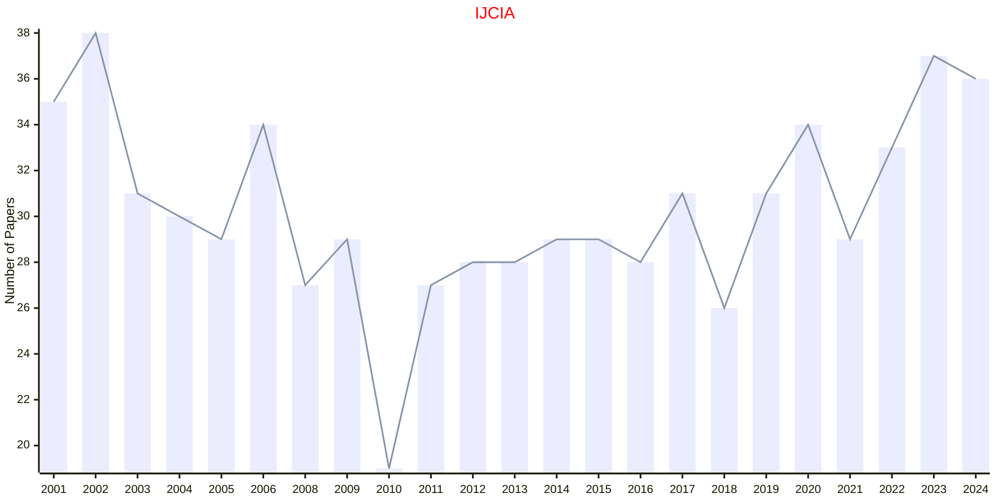

