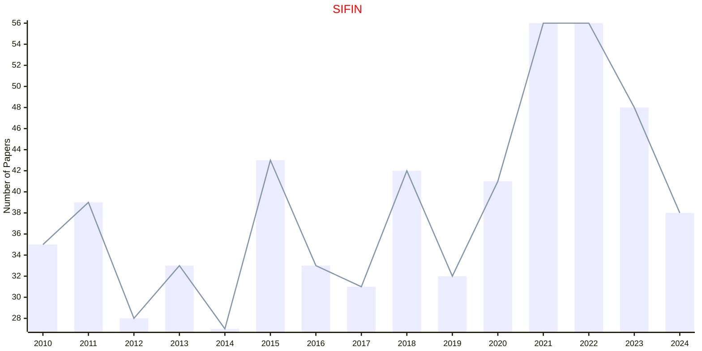

# Financial Mathematics

## SIFIN

|Publishers|Full/Homepage|Abbr/About|Acronym/Issues|Period/DBLP|Top/Early|CCF|CAS|JCR|IF|Keywords/Google|
|-         |-            |-         |-             |-          |-        |-  |-  |-  |- |-              |
|[SIAM](https://epubs.siam.org)|[SIAM Journal on Financial Mathematics](https://epubs.siam.org/journal/sjfmbj)|[SIAM J. Financ. Math.](https://epubs.siam.org/journal/sifin/about)|[SIFIN](https://epubs.siam.org/loi/sjfmbj)|2010 -|False||3|Q2|1.7|[Financial Mathematics](https://www.google.com/search?q=Financial+Mathematics)|

